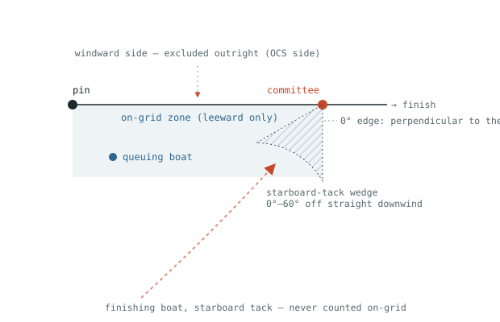
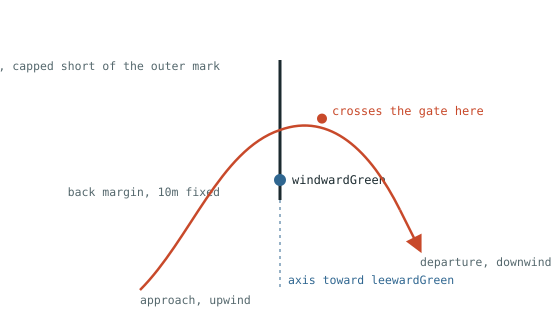

# Race Tracker — Boat Agent + Base Station

Reports GPS position from a boat (Pi Zero 2 W + simpleRTK2B LR) to a shore/
committee base station over a long-range telemetry radio (>2 mi), with
logging to microSD as a durable backup.

## Architecture

```
[simpleRTK2B LR]--UART-->[Pi Zero 2 W]--UART-->[Telemetry radio]==RF==>[Telemetry radio]--UART-->[Base station]--> race software
                              |
                              v
                    microSD (CSV, same fixes sent over radio)
```

- **GPS**: ZED-F9P emits `UBX-NAV-PVT` binary messages (position, speed,
  heading, fix type, RTK carrier solution, satellite count) — parsed directly,
  no NMEA needed.
- **Radio**: assumed to be a transparent-serial telemetry radio (RFD900x,
  SiK, etc). Bytes written to the boat-side UART come out the base-side UART.
  A compact 23-byte binary frame (`src/protocol.js`) is used to minimize
  airtime.
- **SD log**: a fix is logged to CSV exactly when it also clears the
  `TX_DISTANCE_M` threshold (same gate as the radio send, see below) - the
  SD record mirrors what actually got transmitted rather than keeping an
  independent full-rate trace, so a dropped radio link never loses data
  the boat itself considered worth sending - only live tracking is
  affected, not the durable record.

## Wiring notes

Default config assumes GPS over the Pi's own dedicated hardware UART
(`/dev/ttyAMA0`, GPIO 14/15 - avoid the mini-UART, its clock is tied to the
core clock and can glitch), leaving the Pi's one USB/OTG port free for the
telemetry radio alone - no hub needed.

```
sudo raspi-config   # Interface Options -> Serial Port
                     # "login shell over serial" = No
                     # "serial port hardware enabled" = Yes
```
This frees `/dev/ttyAMA0` for the GPS instead of the console.

If you'd rather use the simpleRTK2B LR's own USB port for GPS instead
(shows up as `/dev/ttyACM0`) - e.g. simpler wiring, at the cost of needing
a USB hub since the radio then also needs its own USB-to-serial adapter -
override `GPS_PORT=/dev/ttyACM0` (and `GPS_BAUD` to match whatever that
port is actually running at, likely different from the GPIO UART's).

On any Pi with onboard Bluetooth (Zero 2 W, 3A+/3B+, 4, etc.), the step
above alone isn't enough - GPIO14/15 default to the **mini-UART**
(`ttyS0`), not the real hardware UART, because Bluetooth occupies the real
one. Disable Bluetooth to free it up:
```
# add to /boot/firmware/config.txt (Bookworm+) or /boot/config.txt (older)
dtoverlay=disable-bt
```
then disable the `hciuart`/`bluetooth` services and reboot. Without this,
`/dev/ttyAMA0` either won't exist or will silently be the glitch-prone
mini-UART instead.

Which physical UART on the module (UART1 vs UART2) your wiring actually
reaches depends on the board/breakout used - ArduSimple's simpleRTK2B
routes UART2 to the XBee socket (used for RTCM correction radios, a
separate concern from this app entirely - see below), so a direct wire to
a general breakout pin is more likely UART1, but don't assume it - see
"Verifying the connection" below for a way to prove it rather than guess.

## GPS configuration (one-time, via u-center or ubxtool)

Don't assume the UART your wiring reaches is already at this app's
`GPS_BAUD` default or already NMEA-free just because the module's USB port
is - each UART is configured independently, and in practice a GPIO-wired
UART may still be sitting at factory defaults (NMEA on, UBX off, and not
necessarily the same baud as USB) even after the USB port's been fully
configured. Verify directly instead of assuming:

```
stty -F /dev/ttyAMA0 <baud> raw -echo
cat /dev/ttyAMA0        # Ctrl-C to stop
```
Try common bauds (9600, 19200, 38400, 57600, 115200) until you get clean,
complete `$GNGGA`/`$GNRMC`/... text - that confirms both the wiring
(TX/RX/GND all correctly connected) and the real baud in one step, since a
wiring fault or wrong baud both just produce silence or garbage.

Install `ubxtool` if it's not already there (Raspberry Pi OS, via `gpsd`'s
client tools):
```
sudo apt update
sudo apt install -y gpsd gpsd-clients python3-gps
sudo systemctl disable --now gpsd.socket gpsd   # stop it grabbing the port itself
```

Then, at the baud you just confirmed, enable `UBX-NAV-PVT` and disable NMEA
on whichever UART number your wiring reaches (try `UART1` first; if
nothing changes, undo it and try `UART2` instead - see "Verifying the
connection" below for how to tell which one actually took effect):
```
ubxtool -f /dev/ttyAMA0 -s 115200 -P 27.11 -z CFG-MSGOUT-UBX_NAV_PVT_UART1,1,7
ubxtool -f /dev/ttyAMA0 -s 115200 -P 27.11 -z CFG-UART1OUTPROT-NMEA,0,7
ubxtool -f /dev/ttyAMA0 -s 115200 -P 27.11 -z CFG-RATE-MEAS,1000,7   # 1Hz; raise if you want faster fixes
```
The trailing `,7` is a layer bitmask (`RAM=1, BBR=2, Flash=4`) - `7` writes
to all three at once, so the change takes effect immediately *and*
survives a power cycle. Omit NMEA's disable step if you'd rather leave it
on - the app's own UBX parser isn't confused by NMEA sharing the line (it
scans for UBX's own sync bytes and reads each frame's declared length, so
interleaved NMEA text is simply skipped over), it's purely about not
wasting bandwidth on unneeded chatter.

### Verifying the connection

Raw serial first - after the NMEA-disable step above, expect quiet gaps
with a short unreadable binary burst about once a second (the UBX-NAV-PVT
frame), not readable text:
```
stty -F /dev/ttyAMA0 115200 raw -echo
cat /dev/ttyAMA0
```

Then confirm this app itself decodes it - this is the check that actually
matters, since raw bytes "looking" correct doesn't guarantee this app's
parser agrees:
```
GPS_PORT=/dev/ttyAMA0 GPS_BAUD=115200 npm run boat
```
Watch for `[gps]` lines with real `fixType`/`numSV` values (see `GPS_LOG`
in "Tuning knobs" below if you want to silence this once confirmed
working). If you enabled `UBX-NAV-PVT` on the wrong UART number, this
simply stays silent - undo that one (`CFG-MSGOUT-UBX_NAV_PVT_UARTx,0,7`)
and try the other.

The simpleRTK2B LR's onboard LoRa radio is a **separate concern** — that's
normally used for RTCM3 correction data between your RTK base and this
rover, not for the position telemetry this app sends. Nothing here touches
that link.

### Base station: enabling the survey-in status card (optional)

If the base's admin dashboard's "Base GPS survey-in" card (see "Admin
dashboard" below) is showing "no base GPS, or not polled yet" even with
`GPS_PORT` set and TMODE3 actually configured for survey-in, it's usually
because `UBX-NAV-SVIN` isn't enabled as an output message - unlike
`UBX-CFG-TMODE3` (which this app polls for itself), NAV-SVIN only streams
if the receiver's been told to send it:
```
ubxtool -f /dev/ttyAMA0 -s 115200 -P 27.11 -z CFG-MSGOUT-UBX_NAV_SVIN_UART1,1,7
```
Configuring TMODE3 itself for survey-in (as opposed to just reading it) is
a separate one-time step, typically done once via u-center when the base
station is first set up at a fixed location - see u-blox's own ZED-F9P
integration manual for the full survey-in setup (minimum duration,
required accuracy, etc.), since that part is receiver setup rather than
anything this app configures.

## Radio configuration

Pair every radio (boat + base) on the same netid/frequency/baud, in
transparent-serial mode. `RADIO_BAUD` defaults to **115200**, not the
radio's factory default (9600 for XBee, 57600 for RFD900x/SiK) - at fleet
sizes beyond a couple boats, the serial link between the base station and
its own radio becomes the bottleneck (every boat's frames funnel through
that one port), well below the radio's actual RF capacity. Before running
with this default, reconfigure **every** radio's serial baud to 115200 via
XCTU (XBee) or RFD Modem Tools/Mission Planner (RFD900x) - a mismatch
between this setting and what the radio's actually set to just means the
port opens but nothing decodes. Also confirm all radios share the same
Network ID (XBee `ID`, via XCTU).

If you're running only 1-2 boats, the extra baud doesn't buy you much and
you can leave everything at factory defaults - just set `RADIO_BAUD` to
match (9600 for XBee, 57600 for RFD900x). Higher baud = faster frame
delivery but shorter range/reliability at a given power — this is a
real-world tuning step you'll need to do on the water. **Antenna height
matters a lot for going over water at >2mi; get both ends as high as
practical.**

### Bench-testing the radios

```
RADIO_TEST_MODE=send   RADIO_PORT=/dev/cu.usbserial-A npm run radio-test
RADIO_TEST_MODE=listen RADIO_PORT=/dev/cu.usbserial-B npm run radio-test
```

`src/radioTest.js` exercises the real radio link directly - no GPS, no
Redis, no simulated anything - using the exact same `RadioLink`/`protocol.js`
code `boatAgent.js`/`baseStation.js` use in production, so a clean result
here is a real signal about the actual RF link (framing, checksum
integrity, range), not just "can bytes get through at all." Run one
instance per radio: `ls /dev/cu.*` before/after plugging in each one to
find its device path (on macOS; use whatever your OS calls serial devices).
`RADIO_BAUD` must match what's actually configured on both radios (see
"Radio configuration" above) - and for XBee, confirm both share the same
Network ID (`ATID`) via XCTU first, or the listener will just see nothing.

The sender transmits one frame every `RADIO_TEST_INTERVAL_MS` (default
500ms) with a sequence number piggybacked on the frame's timestamp field
(a test-only convention, not a real GPS time). The listener logs each
received frame and prints a running summary every 10s - received count,
estimated missed count, and loss %. Start with both radios close together
to confirm basic connectivity, then physically separate them to find where
the link actually starts to degrade - that's the number that matters for
real racing distance.

## Running

Boat (Pi Zero 2 W):
```
cd race-tracker
npm install
RADIO_PORT=/dev/ttyUSB0 BOAT_ID=1 npm run boat
```
(GPS defaults to the Pi's hardware UART, `/dev/ttyAMA0` - add
`GPS_PORT=/dev/ttyACM0` if you've wired the simpleRTK2B LR's own USB port
instead, see "Wiring notes" above.)

Base station (another Pi, or a laptop with a USB radio):
```
RADIO_PORT=/dev/ttyUSB0 npm run base
```

On macOS, device paths look different - a USB-to-serial radio adapter
(FTDI/CP210x-style) shows up as `/dev/cu.usbserial-XXXX`, and a GPS
module's native USB (like the simpleRTK2B's own CDC-ACM port) as
`/dev/cu.usbmodemXXXX`, e.g.:
```
RADIO_PORT=/dev/cu.usbserial-0001 GPS_PORT=/dev/cu.usbmodem1101 npm run base
```
The exact suffix isn't fixed - it depends on the specific adapter and
sometimes which USB port it's plugged into. Run `ls /dev/cu.*` before and
after plugging in each device to see which path just appeared.

Auto-start on boat boot:
```
sudo cp systemd/boat-agent.service /etc/systemd/system/
sudo systemctl enable --now boat-agent
```

## Simulation mode (no hardware)

Set `SIMULATE=1` to run `boat` and `base` with no GPS or radio hardware
attached. In this mode:
- `src/simGps.js` generates fake GPS fixes for a landsailer racing a
  windward-leeward course around a configurable center point - beating
  upwind on alternating tacks, running downwind on alternating gybes, with
  randomized leg lengths so no two laps look the same - in place of the real
  UBX-NAV-PVT parser. Always races the green (short-course) marks - see
  "Changing the course" below.
- `src/simRadioLink.js` replaces the serial radio link with a shared UDP
  broadcast socket carrying the exact same frames (`src/protocol.js`), so
  the real encode/decode/checksum path is still exercised end to end — just
  without serial ports. Every simulated boat and the base broadcast on and
  listen to the same port (`SIM_PORT`), mirroring how every radio shares
  one RF channel on real hardware — no per-boat address to configure, and
  it works the same way across a real LAN as it does on localhost.

Run both in separate terminals, on the same machine or over a LAN:
```
# terminal 1 - base station
SIMULATE=1 npm run base

# terminal 2 - boat agent
SIMULATE=1 BOAT_ID=1 npm run boat
```
For multiple simulated boats, run more `npm run boat` instances with
different `BOAT_ID` values pointed at the same base station.

### Simulated GPS with real radio hardware

`SIMULATE_GPS=1` fakes just the GPS track, while using the real radio on
both ends - useful for bench-testing actual radios (range, packet loss,
antenna placement) without needing a real GPS fix or being outdoors.
`SIMULATE=1` implies this too; use `SIMULATE_GPS=1` on its own when you
specifically want simulated positions over real hardware radios:

```
# terminal 1 - base station, real radio
RADIO_PORT=/dev/cu.usbserial-A npm run base

# terminal 2 - boat agent, fake GPS + real radio
SIMULATE_GPS=1 RADIO_PORT=/dev/cu.usbserial-B BOAT_ID=1 npm run boat
```

(See "Bench-testing the radios" above for a more focused radio-only test
that doesn't involve GPS, Redis, or course logic at all.)

The boat has no Redis access at all (see "Broadcasting marks to the
rovers" above) - its simulated GPS won't start until the base actually
broadcasts marks to it, which means the base needs marks to broadcast in
the first place. With real radio hardware and no `SIMULATE=1` on the base,
that means Redis needs marks already published (by a real race operator,
or an earlier `SIMULATE=1` session) before this will do anything; the base
station's own real-hardware path only reads marks, it won't invent a
course (see "Connecting to your race committee software" below).

CSV logs land in `./race-logs` (relative to the package, regardless of mode)
unless you override `LOG_DIR`, and the base station's console/CSV/UDP GGA
output all work exactly as they would with real hardware.

| Var | Default | Purpose |
|---|---|---|
| `SIM_PORT` | `41234` | Shared port every simulated boat and the base broadcast on and listen to - see "Broadcasting marks to the rovers" above |
| `SIM_GPS_HZ` | 2 | Fake GPS fix rate |
| `SIM_UPWIND_SPEED_KN` / `SIM_DOWNWIND_SPEED_KN` | 30 / 55 | Simulated landsailer speed beating vs. running - much faster downwind than up, unlike a water boat, since low rolling resistance lets apparent wind build well past true wind speed on a reach/run |
| `SIM_CENTER_LAT` / `SIM_CENTER_LON` | `40.8898` / `-118.3821` | Center point of the simulated racecourse - setting either clears any already-published course marks on startup so the new center actually takes effect (see "Changing the course" below), same as `SIM_COURSE_LENGTH_NM` below |
| `SIM_PACKET_LOSS` | 0 | % chance (0-100) each radio frame is dropped, to simulate range dropouts |
| `SIM_COURSE_LENGTH_NM` | 1 | leewardGreen-to-windwardGreen distance in nautical miles (the short course - see "Changing the course" below for the green/black mark pairs) - shorten this (e.g. `0.05`) to quickly test laps without waiting through a full-length beat/run each time. Setting it clears any already-published course marks on startup so the new length actually takes effect |
| `SIM_LONG_COURSE_EXTRA_NM` | 0.25 | How much further out the black (long-course) windward/leeward marks sit beyond the green ones, on each end - reference only, the simulator never races them. Setting it clears any already-published course marks on startup, same as `SIM_COURSE_LENGTH_NM` |
| `SIM_LAP_COUNT` | 2 | How many laps a simulated boat sails before it stops |
| `SIM_START_ONLY` | unset | Set to `1` to skip the simulated race entirely - the boat sits forever at its normal fleet-spread start position (same per-slot placement along the pin↔committee line as a real start, just never departing), emitting a stationary but otherwise normal fix stream (fresh timestamp every tick, real fix-quality fields), instead of sailing off seconds after startup. Every slot lands reliably within on-grid range - see "On-grid detection -> RegattaUp" above for the margin that makes that robust to real-world/projection noise, not just this app's own idealized math |
| `SIM_PRESTART_DWELL_S` | 15 | How long (seconds) a normal, non-`SIM_START_ONLY` simulated race sits at its start position before actually departing upwind - gives on-grid detection a real window to observe in an ordinary test race. `0` departs immediately (the pre-dwell behavior) - see "On-grid detection -> RegattaUp" above |

Once `SIM_LAP_COUNT` laps complete, the simulated GPS stops producing fixes,
but the `boat` process itself keeps running rather than exiting - so its
upload client (see "Uploading boat logs to the base over WiFi" above)
still gets a chance to send off any pending log chunk instead of the
process disappearing the instant the simulated race ends. Stop it with
Ctrl+C once you're done, same as any other run.

## Connecting to your race committee software

`src/baseStation.js` currently:
1. Logs every decoded fix to console + CSV
2. Records every decoded fix to Redis (see below) for querying tracks later
3. Broadcasts a synthesized `$GPGGA` NMEA sentence over UDP (port 10110,
   the conventional NMEA-over-UDP port) — some tracking tools can ingest
   this directly

Once you pick your race software (TracTrac, YB Tracking, RaceQs, Predict
Wind, or in-house), the `outputFrame()` function is the one place to change
— swap it for whatever that software actually expects (an HTTP POST to a
cloud ingestion API is common for the commercial platforms; check their
integration docs since most of them expect a per-boat auth token). Happy to
build that adapter once you know the target.

## Lap events -> RegattaUp

Lap detection lives entirely on the base station, not the boat: a real
rover has no Redis access to resolve course marks itself, so it only ever
sends its raw position (the regular 23-byte position frame, unchanged) -
`src/finishLineWatcher.js`, running inside `baseStation.js`, watches every
incoming fix - real hardware or simulated, it makes no difference - against
the committee/finish marks published in Redis, and detects a lap the same
way a real race committee would: the boat's path actually crossing the
committee<->finish segment (not just anywhere on the line) while heading
upwind (committee to port, finish to starboard - see the module for the
geometry). One `FinishLineWatcher` is kept per boat ID, since each needs its
own independent crossing-state and lap counter. This works "as long as the
finish line is set" - if the base station can't find committee/finish marks
in Redis at startup, lap detection is just unavailable for that run, logged
once, not retried.

Whenever a crossing is detected, the base station queues it (see below) and
POSTs to RegattaUp's lap webhook so the crossing counts as a lap there:

```json
{
  "decoded": {
    "tranCode": "51",
    "rtcTime": 1785337740000000,
    "strength": 2
  },
  "receivedAt": "2026-07-29T15:09:00.604Z"
}
```

- `tranCode` — the boat's ID (as a string), matched against that boat's
  transponder code configured in RegattaUp
- `rtcTime` — the lap's own timestamp, converted from milliseconds to
  microseconds (the unit RegattaUp's webhook expects)
- `strength` — the fix's `carrSoln` (RTK solution quality) at the moment of
  crossing, standing in for signal strength
- `receivedAt` — the base station's wall-clock time, sent as the fallback
  timestamp

### Durable retry queue

A failed webhook POST doesn't just get logged and dropped - `src/lapWebhookQueue.js`
durably records every lap (in a small sqlite file, via `sql.js` - a WASM
build, so it needs no native compilation on whatever machine or Raspberry Pi
this runs on) *before* the first send attempt, and only removes it once
RegattaUp actually accepts it. A background loop retries whatever's still
queued with capped exponential backoff (2s, 4s, 8s, ... up to
`REGATTAUP_MAX_BACKOFF_MS`), indefinitely - this also means a lap survives a
base station restart mid-retry, since the queue is a file on disk, not just
in-memory state.

| Var | Default | Purpose |
|---|---|---|
| `REGATTAUP_WEBHOOK_URL` | `https://regattaup.com/api/functions/mylapsWebhook` | Override to point at a mock endpoint for testing |
| `REGATTAUP_WEBHOOK_DISABLED` | unset | Set to `1` to skip sending entirely (crossings are still detected and logged) |
| `REGATTAUP_QUEUE_DB` | `<LOG_DIR>/lap_webhook_queue.sqlite` | Where the retry queue's sqlite file lives |
| `REGATTAUP_RETRY_INTERVAL_MS` | 15000 | How often the retry loop checks for due-for-retry laps |
| `REGATTAUP_MAX_BACKOFF_MS` | 300000 (5 min) | Cap on the exponential backoff between retries for a single lap |

### Testing the lap -> webhook path

```
TEST_LAP_NUMBER=3 npm run base
```

`TEST_LAP_NUMBER` doubles as both the on/off switch for this test mode
and part of the payload: `0` (the default) means off - a normal run.
Anything positive sends one synthetic lap straight into the webhook
queue, reported as that lap number, and exits immediately - no radio, no
GPS, no finish-line detection involved, just checking the queue ->
RegattaUp path in isolation. It's not a count of how many laps to send
(always exactly one, regardless of the number chosen) or how many laps a
race has - just the "lap" field on that one synthetic event.
`TEST_LAP_BOAT_ID` (default 1) is the other half of that payload - which
boat the fake lap is attributed to - and only matters alongside a
positive `TEST_LAP_NUMBER`.

## On-grid detection -> RegattaUp

Separate from lap detection above: `src/onGridWatcher.js`, one instance
per boat (same lazy-build-per-boat pattern as `FinishLineWatcher`), watches
every incoming fix against the **start** side of the course - the
pin<->committee segment, not committee<->finish.



A boat counts as on-grid when it's all of:

- Between the pin and committee marks (not just close to the line's
  infinite extension past either mark) - with 1m of slack right at either
  end, so a boat genuinely sitting at a mark isn't excluded by
  floating-point/projection noise between whatever produced the fix (real
  GPS, or the simulator's own independent lat/lon math) and this watcher's
  own, and
- Within `REGATTAUP_ONGRID_ZONE_M` (default 10m) of the line itself
- **On the leeward side of the line only**, not the windward/course side -
  a genuine pre-start boat sits behind the line (crossing early would be
  OCS). "Leeward" is derived from the real windwardGreen<->leewardGreen
  bearing (the only wind direction this app can know at all for real
  racing - there's no live wind sensor anywhere in this codebase),
  assuming the line was laid square to it, the standard practice.
- **Not** inside the starboard-tack final-approach wedge into committee -
  a boat finishing upwind on starboard tack near the committee end
  approaches from the southwest, briefly on the geometric "pin side" of
  committee while still south of the line, before crossing just past
  committee. That point is unambiguously in the start zone by the checks
  above (between pin and committee, within the zone, on the leeward side),
  yet it's a finish approach, not pre-start queuing. `_inApproachWedge`
  excludes a wedge from committee spanning 0 to `WEDGE_OUTER_ANGLE_DEG`
  (60 degrees: the assumed 40-degree close-hauled bearing plus a 20-degree
  fudge factor) off straight downwind, on the side that leans toward pin.
  The near edge sits at 0 degrees - straight downwind, exactly
  perpendicular to the start line - not offset from it: anywhere between
  committee and that whole perpendicular is already ambiguous (a boat
  could be crossing there instead of queuing - the pin<->committee and
  committee<->finish segments share the committee endpoint and are
  collinear by default), so one wedge covers both, rather than a separate
  narrow exclusion right at committee stacked on top of it.

  An *angular* tolerance, not a fixed-width corridor, because the real
  approach scatters around the assumed bearing (free-tacking before the
  final precision tack, plus normal heading jitter) by an amount that
  grows the farther the boat is from committee, the same way an angular
  tolerance naturally does and a fixed linear width can't - verified
  empirically (see `src/onGridWatcher.js`'s own comments) that a
  fixed-width version wide enough to catch a real approach's scatter far
  from committee also excluded genuine start positions close to committee,
  while the wedge catches the same real approaches without doing that.

POSTs to the same RegattaUp webhook laps use, with its own payload shape:

```json
{ "mode": "ongrid", "decoded": { "tranCode": "51", "rtcTime": 1785337740000000 } }
```
```json
{ "mode": "offgrid", "decoded": { "tranCode": "51", "rtcTime": 1785337745000000 } }
```

- `tranCode` — the boat's ID (as a string), same convention as laps
- `rtcTime` — the fix's own timestamp, converted from milliseconds to
  microseconds

`ongrid` re-fires on **every** incoming fix for as long as the boat stays
in the zone (not just the moment it enters) - so RegattaUp sees a live
signal tied to real position updates arriving, rather than one stale
event for however long the boat sits there. `offgrid` still only fires
once, on the transition out - there's no reason to keep affirming "still
not there." Since this rides on actual fixes rather than a wall-clock
timer, how often it re-fires for a given boat follows `TX_DISTANCE_M`
(the boat only transmits once it's moved that far - see "Running" above)
- a boat that's genuinely dead-still (e.g. `SIM_START_ONLY`, which reports
zero speed) will only send its very first frame and never trigger a
re-fire at all, since it never clears that gate again. A boat with any
real drift (wind, waves, GPS noise) will re-fire every time it moves
`TX_DISTANCE_M`.

Uses the exact same durable-queue-plus-retry mechanics as laps (see
"Durable retry queue" above) - `src/onGridWebhookQueue.js`, same
capped-exponential-backoff loop, same `REGATTAUP_RETRY_INTERVAL_MS`/
`REGATTAUP_MAX_BACKOFF_MS` settings - just its own separate sqlite file
(`REGATTAUP_ONGRID_QUEUE_DB`), since `sql.js` overwrites its whole file on
every save and two independent queue instances can't safely share one.
`REGATTAUP_WEBHOOK_DISABLED` disables both lap and on-grid webhooks
together - there's no separate on/off switch for on-grid alone. Editing
the pin or committee mark from the map (see "Editing mark positions from
the map" above) clears every boat's on-grid watcher, same as it already
does for finish-line watchers, so a corrected mark position doesn't leave
stale gate geometry active for the rest of the race.

For testing without a boat sailing off the line seconds after startup,
`SIM_START_ONLY=1` (see "Simulation mode" above) parks a simulated boat
on the start line indefinitely:
```
SIM_START_ONLY=1 SIMULATE=1 BOAT_ID=1 npm run boat
```

An ordinary (non-`SIM_START_ONLY`) simulated race also sits at its start
position for `SIM_PRESTART_DWELL_S` seconds (default 15) before actually
departing, rather than launching upwind on its very first tick - without
that dwell, on-grid never gets a real window to observe: the boat's very
first transmitted fix would already reflect a full tick of movement past
the line, and whether that lands inside or outside the zone is basically
down to luck (initial tack side, timing), not something worth relying on
for testing. Set `SIM_PRESTART_DWELL_S=0` to go back to departing
immediately.

## Mark-rounding detection -> RegattaUp

Off by default - set `REGATTAUP_MARK_ROUNDING_ENABLED=1` to turn it on.
Unlike laps and on-grid, this is a new event type RegattaUp's webhook
endpoint hasn't necessarily been confirmed to accept yet, so it has its
own switch rather than riding on `REGATTAUP_WEBHOOK_DISABLED` alone
(both still have to allow it - `REGATTAUP_WEBHOOK_DISABLED=1` still turns
everything off, laps and on-grid included).



`src/markRoundingWatcher.js`, one instance per boat per mark (windward and
leeward have no second physical mark between them to form a gate the way
the finish line does, so it's watched per-mark rather than per-line). The
gate is synthesized: extend the line from the *other* mark - leeward, for
a windward rounding, and vice versa - straight through the mark being
watched by `REGATTAUP_MARK_ROUNDING_EXTENSION_M` (default 50m) beyond it,
and 10m short of it (a fixed margin, not configurable - absorbs a fix
landing a couple meters short of the mark's own position purely from
tick-rate granularity, real GPS included, not because the boat didn't
round it), and treat that stretch as a one-shot crossing line - the same
segment-intersection test `finishLineWatcher.js` uses for the finish gate.

That gate is deliberately colinear with the course axis (not perpendicular
to it, and not just "within Xm of the mark" the way on-grid works): since
it only exists near/beyond the mark along the axis, a normal tack while
still well short of the mark never comes near it - the segment isn't there
yet at that point along the course - so it doesn't fire on ordinary
tacking-through-the-centerline upwind. Only a boat that's actually reached
the mark can cross it. Watched for all four windward/leeward marks
(`windwardGreen`/`windwardBlack` against `leewardGreen`, `leewardGreen`/
`leewardBlack` against `windwardGreen`) regardless of which course
(green/black) is actually being sailed - whichever pair a boat is nowhere
near just never fires.

However `REGATTAUP_MARK_ROUNDING_EXTENSION_M` is configured, the green
(inner) marks' gates never reach anywhere near the corresponding black
(outer) mark - capped to half the actual green<->black distance
(`OUTER_MARK_SAFETY_FRACTION` in `baseStation.js`), measured fresh off
the real published marks each time a watcher is built, not assumed from
`SIM_LONG_COURSE_EXTRA_NM`. Half rather than the full distance leaves a
solid buffer on both sides, so a boat actually rounding the black mark
stays clearly clear of the green gate's far end too, rather than the two
meeting exactly at the boundary. Only applies to the green marks -
windwardBlack/leewardBlack are the outermost marks on the course, nothing
sits beyond them for their own gates to reach.

POSTs to the same RegattaUp webhook laps and on-grid use, with its own
payload shape:

```json
{ "mode": "mark", "mark": "windwardGreen", "decoded": { "tranCode": "51", "rtcTime": 1785337740000000 } }
```

- `mark` — which mark was rounded (`windwardGreen`, `windwardBlack`,
  `leewardGreen`, or `leewardBlack`)
- `tranCode` — the boat's ID (as a string), same convention as laps/on-grid
- `rtcTime` — the interpolated crossing instant (same upsampling
  finish-line laps use, not just the later fix's own timestamp), converted
  from milliseconds to microseconds

Uses the exact same durable-queue-plus-retry mechanics as laps/on-grid
(see "Durable retry queue" above) - `src/markRoundingWebhookQueue.js`, same
capped-exponential-backoff loop, same `REGATTAUP_RETRY_INTERVAL_MS`/
`REGATTAUP_MAX_BACKOFF_MS` settings, its own separate sqlite file
(`REGATTAUP_MARK_ROUNDING_QUEUE_DB`). Editing any mark from the map (see
"Editing mark positions from the map" above) clears every boat's
mark-rounding watchers, same as it already does for finish-line and
on-grid watchers.

## Redis track storage

Every fix the base station decodes is recorded into Redis by `src/redisStore.js`
(`REDIS_URL`, default `redis://127.0.0.1:6379`), indexed two ways so both
common queries are a single range read:

- `boat:<id>:track` — one sorted set per boat, scored by the fix's own GPS
  timestamp (ms since epoch). Use `getBoatTrack(boatId, fromMs, toMs)` (either
  bound optional) to get that boat's track, optionally within a timeframe.
- `all:track` — one sorted set holding every boat's fixes together, same
  scoring. Use `getAllTrack(fromMs, toMs)` to get all boats' positions within
  a timeframe without knowing boat IDs up front.
- `boats:known` — a set of every boat ID that's ever reported in
  (`knownBoatIds()`), for discovering which boats exist without scanning keys.

Each stored entry is the decoded frame (`boatId, timestamp, lat, lon,
speedKnots, headingDeg, gnssFixOk, carrSoln, numSV`) plus `receivedAt` (the
base's own wall-clock time, useful for spotting radio-link latency/drops).
If Redis is unreachable, `baseStation.js` logs the error and keeps running —
console/CSV/UDP output are unaffected, matching this app's "SD/console never
blocks on the network" philosophy elsewhere.

### Switching between Redis servers

Two ways to point this at a Redis server, and they don't combine — if
`REDIS_URL` is set, it wins outright and `REDIS_ENV` (plus everything
under it) is ignored entirely, not merged with it.

`REDIS_ENV` picks a connection preset in `config.js` (default `local`,
`127.0.0.1:6379`). `production` points at the Redis Cloud instance; its
host/port are fine to keep in source, but credentials never are — set these
in your environment (or a git-ignored `.env`), not in the repo:

```
REDIS_ENV=production REDIS_PASSWORD=<password> npm run base
```

- `REDIS_USERNAME` — defaults to `default` (Redis Cloud's default ACL user)
- `REDIS_PASSWORD` — required for `production`, no default
- `REDIS_TLS` — set to `1` if your database requires TLS (this one currently doesn't)

For anything outside the two presets, `REDIS_URL` still works — a full
connection string (e.g. `REDIS_URL=redis://host:port npm run base`)
passed straight to `ioredis` in place of a preset. Setting it overrides
`REDIS_ENV` *and* makes `REDIS_USERNAME`/`REDIS_PASSWORD`/`REDIS_TLS`
irrelevant even if they're also set — those three are only ever read as
part of building the preset's own connection object
(`redisStore.js`'s constructor branches on `url` vs `connection` and
only one is ever actually used), so there's no scenario where `REDIS_URL`
plus one of those three combine into anything.

Every process that talks to Redis (`npm run base`, `npm run clear-course`,
`npm run clear-boats`) resolves this identically via `config.redis`, so
whichever you choose applies consistently across all of them.

### Clearing boat data

```
npm run clear-boats
```

Deletes every boat-related key (`boat:<id>:track`, `all:track`,
`boats:known`, and start-slot assignments) so a fresh fleet can race the
same course without stale boats/tracks left over from earlier runs. The
course marks are left untouched. Respects `REDIS_ENV`/`REDIS_URL` the same
way `base` does (`boat` doesn't touch Redis at all - see "Broadcasting
marks to the rovers" above), so point it at whichever Redis you actually
want cleared.

### Changing the course

The course has seven marks (`src/course.js`'s `MARK_NAMES`): `pin`,
`committee`, and `finish` make up the start/finish complex, and there are
two windward marks and two leeward marks - a closer **green** pair (the
short course) and a further-out **black** pair (the long course), matching
how a real committee lays two mark pairs on the same axis so either course
can be called without re-laying anything. `windwardGreen`/`leewardGreen`
are exactly what a single "windward"/"leeward" mark used to mean in this
app (same position, same meaning) - `windwardBlack`/`leewardBlack` are new,
sitting `SIM_LONG_COURSE_EXTRA_NM` (default 0.25nm) further out beyond each
green mark, on the far side from the start/finish complex. **The simulator
(`simGps.js`) always races the green marks** - the black ones are published
for reference only, same as `pin`/`committee`/`finish` are never targeted
directly by the tacking logic.

```
npm run clear-course
```

Deletes all seven `mark:*` keys so the next `base` run recomputes and
republishes the course from scratch instead of reusing whatever's already
there. Boat tracks are left untouched — pair with `npm run clear-boats` if
you want those cleared too. You normally don't need to run this yourself
when changing `SIM_COURSE_LENGTH_NM`, `SIM_CENTER_LAT`, `SIM_CENTER_LON`, or
`SIM_LONG_COURSE_EXTRA_NM`: `base` checks the *actual* published course
against what you've requested on startup, and only clears/recomputes if
they genuinely differ - not just because one of those env vars happens to
be set. That makes it safe to restart `base` repeatedly with the same
settings (a normal thing to do) without it re-clearing and re-broadcasting
the course every time; it only touches Redis when something has actually
changed. (If you're upgrading from a version of this app that only had a
single windward/leeward mark, a boat's old `course_marks.json` cache in
that shape is detected and ignored automatically - no crash, it just waits
for a fresh broadcast in the current shape.)

### Broadcasting marks to the rovers

A real rover has no Redis access of its own (see `finishLineWatcher.js`'s
module comment), so the base station periodically radios the current course
marks out to every boat, using a second frame type alongside the regular
position frame (`protocol.js`'s `encodeMarks`/`decodeMarks`, its own sync
byte since it isn't the same length). Every boat's `radioLink.js` byte
stream already recognizes both frame types, so nothing else needs wiring up.

Each boat keeps the latest marks in memory and also writes them to
`<LOG_DIR>/course_marks.json`, so a reboot or restart has a last-known
course immediately on the next boot, without waiting for the next
broadcast. This is best-effort, not a guaranteed sync - if a boat misses one
broadcast (radio dropout, powered on late), it just gets the next one; no
ack/retry, since marks essentially never change mid-race and the persisted
copy already covers the "just missed it" case.

The base doesn't wait for a fixed interval to send the *first* one: it
broadcasts the moment marks actually resolve (real hardware polls Redis
every 5s until an operator publishes them, rather than giving up after one
look - an operator setting up the course after the base is already running
is a normal sequence, not an error), and again immediately whenever a
previously-unseen boatId is heard from, so a boat joining after the base
already knows the course doesn't have to wait either.
`MARKS_BROADCAST_INTERVAL_MS` (default 60000) governs the ongoing
heartbeat re-send after that, purely as a safety net for a boat that missed
both of the above - see "Tuning knobs" below.

This also works in `SIMULATE=1` mode, no real radios needed to test it, and
mirrors the real radio model exactly rather than approximating it:
`simRadioLink.js` has every simulated boat and the base bind the *same*
shared UDP port (`SIM_PORT`) and broadcast to it, the same way every real
radio shares one RF channel - there's no per-boat host/address tracking at
this layer at all, on either side, the same as real hardware (a boat's
`boatId` lives in the frame payload, not the radio addressing - see
`protocol.js`). That also means this works unchanged across a real LAN,
not just localhost: put the boat on a different machine on the same
subnet and it just works, no host/IP to configure - broadcast reaches it
either way.

The "immediately whenever a previously-unseen boatId is heard from" path
above still leaves a chicken-and-egg gap for a boat's own very first
start, though: the base only re-broadcasts once it's actually heard from
that boatId, but `SIMULATE_GPS` waits for fresh marks before it'll send
anything at all. `src/boatAgent.js` closes that gap itself: with
`config.simulateGps` set, it sends one throwaway frame at startup, before
it even has real marks, using the exact same encode/send path a real fix
would - just enough for the base to hear this boatId and broadcast right
away, rather than this boat sitting idle for up to
`MARKS_BROADCAST_INTERVAL_MS` waiting on the periodic heartbeat. Its
position is a best guess (last-known marks from disk if this boat has run
before, else `SIM_CENTER_LAT`/`SIM_CENTER_LON`) rather than an arbitrary
sentinel like `(0,0)` - every position-based watcher on the base only
compares a boat's fixes against its own previous one, so keeping this
close to where the boat will actually start avoids a spurious crossing on
the real fix that follows it. With this in place you shouldn't need to
wait on `MARKS_BROADCAST_INTERVAL_MS` at all to see a simulated boat get
the course - if you do, something's stuck (see the base's console log for
what it's currently waiting on).

### Log rotation

CSV logs (the boat's SD card log, and the base station's received-fix log)
are pruned automatically: anything in `LOG_DIR` older than
`LOG_RETENTION_DAYS` (default 7) gets deleted, checked at startup and, for
the base station, again on every write (so a laptop left running for a
multi-day regatta still rotates at midnight instead of growing one file
forever). See `src/logRotation.js`.

The boat's log is segmented per boat *and* per time chunk
(`boat<id>_<YYYY-MM-DDTHH-MM>.csv`, chunk width set by `LOG_CHUNK_MINUTES`
- default 10 minutes, see `src/sdLogger.js`) - every fix is appended to
whichever chunk's file its own GPS timestamp falls into, not wall-clock
write time, and a restarted process resumes appending to the current
chunk's file rather than starting a new one (the file is keyed by chunk,
not by session). Smaller chunks mean each one becomes upload-eligible
sooner (see "Uploading boat logs to the base over WiFi" below) at the cost
of more, smaller files. The base station's file is named per day
(`base_station_received_<date>.csv`) for the same by-age pruning to apply
to it too, instead of one file growing without bound across an entire
season. Neither ever prunes rows *within* a file that's still being
actively written, only whole files once they age out.

The lap webhook retry queue (`lapWebhookQueue.js`'s sqlite file) isn't
touched by this - it already self-cleans on successful delivery, and isn't
a rotating log in the same sense.

### Uploading boat logs to the base over WiFi

A boat's SD card log (`src/sdLogger.js`) is the durable backup if the
telemetry radio drops out, but it only exists on that one boat's SD card.
If the boat's own WiFi happens to reach the base station at some point
(dockside, back at the trailer, wherever), it pushes its completed chunked
log files there too, as a second, off-boat copy - `src/uploadServer.js`
(base) and `src/uploadClient.js` (boat).

**How the boat finds the base**: the base doesn't need to be configured
into the boat at all - it publishes its own LAN IP and upload port
alongside the course marks broadcast (`protocol.js`'s `encodeMarks`,
auto-detected via the first non-internal IPv4 interface it finds, override
with `BASE_IP` if that picks the wrong one). A boat that's never received
a broadcast, or received one with no IP in it (`0.0.0.0` - the base
couldn't detect one), just doesn't attempt uploads until it does.

**Fault tolerance** (a boat is expected to drift in and out of WiFi range
constantly, so every part of this is built to fail safely and just retry,
never to assume the connection will hold):
- The boat polls (`UPLOAD_CHECK_INTERVAL_MS`, default 15s) rather than
  holding a persistent connection - "try, fail, try again shortly" instead
  of needing to detect a disconnect.
- Each attempt has its own timeout (`UPLOAD_TIMEOUT_MS`, default 5s) so a
  boat that's just driven out of range doesn't hang on a dead connection.
- The base writes incoming uploads to a `.part` file and only renames it
  into place once the full body has actually arrived - a connection
  dropping mid-upload leaves a stray `.part` file, never a truncated file
  under the real name that could be mistaken for a complete one.
- The boat only marks a file as uploaded (a companion `<file>.csv.uploaded`
  marker, checked before ever attempting that file again) after the base
  has actually acknowledged it with a 200 - a lost acknowledgment just
  means a harmless, idempotent re-upload next time, not a lost file.
- The file currently being written (the current chunk) is never an upload
  candidate - only completed, fixed chunk files are.
- One file at a time, oldest first - a boat that's been out of range for a
  while catches up in order on subsequent connections rather than skipping
  straight to the newest.

Uploaded files land in `UPLOAD_DIR` (default a `race-uploads` directory
next to `LOG_DIR`, deliberately separate from the base's own
`race-logs` - that's this machine's own received-fix log, not a dumping
ground for every boat's SD card backup), organized into one subdirectory
per boat by numeric ID (`race-uploads/<boatId>/boat<boatId>_<chunk>.csv`)
so a multi-boat fleet's files don't all land in one flat directory
together. Unlike `race-logs`,
`race-uploads` is **not** pruned by `LOG_RETENTION_DAYS` - it's meant to
be the durable, centrally-collected copy that outlives whatever retention
policy applies to each boat's own rotating SD card log, so nothing removes
it automatically. Set `UPLOAD_DISABLED=1` on a boat to skip attempting
uploads entirely.

The boat gzips each file before sending (CSV text compresses well, and a
smaller transfer has a better chance of finishing inside a short/marginal
WiFi window than saving bandwidth as such - these files are small either
way). The base decompresses on the way in, so what actually lands in
`race-uploads` is a plain, immediately-readable `.csv` - identical to what
the boat originally wrote, not something you need to `gunzip` yourself
before opening it.

### Admin dashboard

A small live-stats web page on the base station (`src/adminServer.js`,
default port 8092 - open `http://<base-ip>:8092` in a browser) for a
glanceable view of what's happening during a race: boats seen, total
tracks recorded, tracks and lap counts per boat, radio link quality
(frames received / sync errors), and upload activity (attempts,
successes, failures, bytes sent, and each boat's self-reported pending
count). It reloads itself every 5 seconds; there's also a `GET
/api/stats` JSON endpoint if you want to pull the same data into something
else.

This is a live "what's happening right now" view, not a historical
record - the counters (`src/stats.js`) are in-memory only and reset on
restart. The durable records are Redis (tracks) and `race-uploads` (log
files); the dashboard just reflects them plus some things Redis doesn't
track at all, like radio link quality and upload success/failure counts.

When `GPS_PORT` is set (see "Recenter on base GPS" below), the dashboard
also shows a "Base GPS" card - the receiver's ordinary NAV-PVT fix (the
same message a boat's own rover dashboard is built from), useful mainly as
a quick "is the base's GPS module even alive and locked on" check
independent of TMODE3/survey-in state: fix quality (RTK fixed / RTK float
/ GPS / no fix), position, altitude (both above mean sea level and above
the WGS84 ellipsoid - GPS height is normally ellipsoid-referenced, which
reads oddly to anyone expecting "altitude" to mean sea level, so both are
shown), satellite count, horizontal/vertical accuracy, dilution of
precision (DOP - how much the current satellite geometry itself is
amplifying measurement error, independent of the accuracy estimates,
labeled excellent/good/fair/poor rather than a bare number), ground speed
(a stationary base reading ~0.0kn is itself a useful sanity check that the
antenna isn't drifting), and the receiver's own satellite-derived UTC
clock, once valid.

The dashboard also shows a "Base GPS survey-in" card: the receiver's current TMODE3 mode
(disabled / survey-in / fixed - whether it's even trying to establish its
own fixed reference position at all), and while in survey-in mode, live
progress against both of survey-in's own completion conditions - elapsed
duration vs. the configured minimum (`GPS_SVIN_MIN_DUR_S`), and current
accuracy vs. the configured limit (`GPS_SVIN_ACC_LIMIT_MM`), e.g. `27835s /
60s, ±19.83m / 2.00m` - since survey-in only finishes once
*both* clear, and a run that's long past its minimum duration but nowhere
near its accuracy target (usually an obstructed antenna, indoor testing, or
too few satellites) reads very differently from one that just needs a few
more seconds. Once the survey finishes (`valid` in `UBX-NAV-SVIN`), the
resulting lat/lon/height it settled on is shown too. Once mode is actually
`fixed`, the card instead shows whatever position TMODE3 is currently fixed
to - read back from the poll response itself (which echoes the position
back, not just the mode), so it reflects reality regardless of whether this
app set it or it was configured some other way (e.g. u-center) before this
app ever connected - so you can tell from the dashboard alone whether the
base is actually ready to be trusted as an RTK reference yet, without
needing u-center or ubxtool. The receiver only
reports its TMODE3 mode when polled, not on its own, so
`src/baseStation.js` sends a `UBX-CFG-TMODE3` poll request once on connect
and every 15s after; NAV-SVIN itself streams on its own once survey-in is
configured and enabled as an output message. Also available standalone as
`GET /api/gps/survey` (same null-means-not-available contract as
`/api/gps`).

Two buttons on the card let you switch TMODE3 mode directly from the
dashboard, each behind a `confirm()` since this reconfigures what the base
itself broadcasts as RTCM correction data - not something to fire by
accident mid-race:
- **Start survey-in** - (re)starts survey-in using `GPS_SVIN_MIN_DUR_S` /
  `GPS_SVIN_ACC_LIMIT_MM`. Also the way to restart one - TMODE3 has no
  separate "restart" command, sending the same request again is how u-blox
  receivers do it, useful if conditions changed or a first attempt is
  taking too long (see the progress-vs-target reading above).
- **Use as fixed position** - locks TMODE3 to a fixed reference position,
  preferring the completed survey-in's own result if one exists (the
  normal flow: survey in, then lock to it) and otherwise falling back to
  the base's current ordinary GPS fix - usable for bench testing, but
  nowhere near RTK-base-grade precision that way, since it's a single fix's
  accuracy rather than an averaged one.

Below those, a small form lets you type in a known position instead -
useful if the base's location has already been surveyed independently
(e.g. a club's own benchmark for a permanent committee boat mooring), which
is more trustworthy than anything survey-in or a live fix can produce
itself. The three fields prefill from whatever position is already known
(currently-fixed position, then a completed survey's result, then the
base's live fix, in that order) so you're editing a real nearby value
rather than typing from scratch, but any of them can be overwritten
outright. Validated both client-side (range checks, for a fast error) and
server-side in `setBaseGpsFixed` (the check that actually matters, since a
request could reach it some other way) - lat within ±90°, lon within
±180°, height between -500m and 9000m. The confirm dialog spells out the
exact numbers about to be sent rather than a generic "are you sure," so a
typo (wrong sign, transposed digits) is visible one last time before it
reconfigures RTK corrections for every boat.

All three actions POST to `/api/gps/survey/mode` (base-only, no CORS - unlike
`/api/marks/:name`, there's no rover-side equivalent that needs to call it
cross-origin) with `{"mode": "survey-in"}`, `{"mode": "fixed"}`, or
`{"mode": "fixed", "lat": ..., "lon": ..., "heightM": ...}` for a manual
position.

A boat's "pending uploads" figure is self-reported: it rides along on the
same periodic health check the boat already does to test reachability
(see "Uploading boat logs to the base over WiFi" above), since the base
has no other way to see what's still sitting unsent on a boat's own SD
card.

Once the course marks are known, the dashboard also shows a compact
lat/lon table for them, plus a "map ↗" link (`GET /map`) to a full-page
map view - all seven marks plotted over satellite imagery (not a street
basemap - these courses are typically raced on a dry lake bed with no
roads or buildings for a vector basemap to draw), black marks rendered
with a light outline so they don't disappear against the dark UI/imagery,
with the start line (pin↔committee) and finish gate (committee↔finish)
drawn in, auto-fit to
the course's extent. It pulls map tiles from a public CDN (Esri World
Imagery) at request time, so the browser viewing it needs internet
access - the base station's own connectivity for publishing marks/tracks
is unaffected either way.

Any boat the base has actually heard a position frame from this session
also gets a dot (green if heard within the last minute, gray otherwise) -
deliberately sourced only from `stats.js`'s in-memory last-known
position, never from `race-uploads`' on-disk history, so the map never
shows a boat "live" somewhere it hasn't actually reported from this run.
A boat whose only presence is old uploaded files (see the Fleet table's
"Files on disk" column) just doesn't get a dot.

An "auto-refresh boats (5s)" checkbox in the top bar (on by default,
remembered per-browser via `localStorage`) polls `GET /api/positions`
every 5 seconds and moves each boat's dot to its latest position - it
does *not* reload the page, so panning/zooming in to watch a boat isn't
undone every few seconds the way the main dashboard's full-page refresh
would. `/api/positions` is a separate, leaner endpoint from `/api/stats`
- it's synchronous and reads only `stats.js`'s in-memory boat positions,
deliberately skipping the Redis track-count query `/api/stats` does for
the Fleet table, since the map has no use for it and watching the map
shouldn't cost a Redis round trip every 5 seconds. Course marks aren't
re-fetched at all, since they don't move mid-race. The boat's own rover
dashboard has the same toggle on its `GET /map` (see below), polling its
own equally-lean `GET /api/position` to move just its own marker.

#### Editing mark positions from the map

An "edit marks" checkbox in the top bar of both the base's `/map` and
each boat's own `/map` reveals a column listing all seven marks, each
with its own "Set" button, plus a fixed crosshair at the exact center of
the map. The workflow this is built for: walk (or sail) out to the
actual mark, snap the map to your current position, fine-tune by panning
if needed (the crosshair always shows `map.getCenter()` - wherever it
points is what gets set), then tap "Set" next to that mark. It asks for
confirmation first, since this immediately updates the live course and
re-broadcasts it to every boat - not something to fire by accident. The
checkbox state itself is persisted (`localStorage`, like auto-refresh
below) so the column stays open across a page reload instead of
resetting closed every visit - the confirm step on "Set" is what guards
against an accidental edit, not this.

Each GPS-based recenter button has a live coordinate readout above it
(updated continuously while edit mode is on, cleared when it's turned
back off) rather than being a blind one-shot lookup - `getCurrentPosition()`
defaults to low accuracy with no timeout and can hang or return a slow,
coarse fix, which made this button occasionally look broken with no
feedback at all. Instead, toggling edit mode starts a continuous
`watchPosition()` (`enableHighAccuracy: true`) that keeps refining the
browser's own location in the background the whole time the column is
open, so by the time you actually click "Recenter" a fresh position is
already sitting there - the readout doubles as visible proof it's
actually working (or a clear "permission denied"/"unavailable" if not),
rather than a button that might just silently do nothing. The RTK-based
readouts (base GPS, boat GPS) also show fix quality - "RTK fixed"/"RTK
float"/"GPS"/"no fix" from `carrSoln`/`gnssFixOk` - and horizontal
accuracy (`hAcc`), the same signal the `[baseGps]`/`[gps]` console lines
report, so you can judge whether a mark is actually worth setting from
the readout alone, before ever tapping "Set."

Recenter buttons, all optional to use:
- **Recenter on my GPS** - the *viewing device's* location, via the
  browser's Geolocation API. Requires a secure context (HTTPS, or
  `localhost`) in most browsers, so it may be silently blocked when
  viewing the dashboard over plain HTTP on your LAN from a phone - pan
  manually if so, the crosshair-based "set" flow doesn't depend on it.
- **Recenter on marks** - snaps back to fit the whole course, useful
  after a GPS recenter walked the view away or after panning to line up
  a shot with the crosshair.
- **Recenter on base GPS** (base's map only) - a GPS module wired
  directly to whatever machine is running the base station (reuses
  `GPS_PORT`/`GPS_BAUD`, see below - the same vars the boat's own GPS
  uses, since base and boat are always separate processes and there's no
  actual conflict in sharing them) - not for tracking the base itself,
  but so an operator can plant a mark at their own position with real
  RTK precision instead of a phone's much coarser Geolocation API. Most
  base stations don't have one attached, which is the expected common
  case, not an error - the readout just says "unavailable."
- **Recenter on boat GPS** (a boat's own map only) - that boat's own
  already-flowing GPS fix (the same one driving its live marker on this
  same map) - the obvious choice for a boat that's physically sailed out
  to survey a mark, and needs no separate polling since the position was
  already being tracked regardless of edit mode.

Setting a mark persists it to Redis the same way the initial course
does, clears any cached finish-line watchers so lap detection picks up a
corrected `committee`/`finish` position instead of silently keeping
stale gate geometry for the rest of the race, and calls the same
immediate-broadcast path used when the course first resolves
(`POST /api/marks/:name`, see `baseStation.js`'s `setMarkLocation`).

A boat has no Redis access of its own (same reason it can't resolve the
course itself), so "Set" on a boat's own map doesn't write anything
locally - it POSTs cross-origin straight to the base's
`/api/marks/:name` (CORS-enabled specifically for this), using the
base's address it already learned from the marks broadcast. This only
works while that boat currently has WiFi connectivity to the base - same
requirement as log uploads, nothing to do with the radio link - and the
edit column says so, and which base address it's pointed at, right in
the panel. Since a boat's own view of the course doesn't live-poll the
way boat positions do (marks "don't move mid-race" is the working
assumption elsewhere on these maps too), a successful edit doesn't
repaint that boat's own marker immediately - reload the page after the
next broadcast reaches it (usually within moments) to see it reflected.

Boats in the Fleet table are sorted most-recently-seen first, so an
active fleet naturally floats to the top instead of being scattered
through however boat IDs happen to be numbered - a boat this base hasn't
heard from this session (`lastSeen` unset - e.g. known only via the
on-disk upload-history scan) sinks to the bottom, ordered by boat ID
among themselves.

Both dashboards also have a "config" link (`GET /config`) showing the
fully-resolved configuration that process is actually running with -
every default plus whatever's been overridden via environment variables
or `.env`, with overridden rows called out - the same data
`npm run print-config` prints to the console (see below), just without
needing to shell into the Pi to check it. `src/configReport.js` is the
one shared source for both.

Each boat also runs its own matching dashboard (`src/roverAdminServer.js`,
default port 8092, same as the base - `http://<boat-ip>:8092`), scoped to
that one boat: last fix and quality (RTK fixed/float/GPS/no fix, sat
count, accuracy), whether the course has been received, frames sent,
whether the base is currently reachable, and its own upload history. It
has its own `GET /map` too - same course view as the base's, but since
this one is scoped to a single boat, it also plots that boat's own last
known position (a solid dot once a fix has come in within the last 10s,
gray if it's gone stale) rather than leaving the map as a static course
reference. When running with `SIMULATE=1`, a boat defaults to port 8093 instead, so
`npm run base` and `npm run boat` can run on the same machine (as they do
in "Simulation mode (no hardware)" above) without an `ADMIN_PORT`
override to avoid an `EADDRINUSE` - a real base and boat are always
separate machines, so this only matters for local testing. `ADMIN_PORT`
always overrides both defaults explicitly if you set it.

The dashboards link to each other automatically, and don't assume either
side is on any particular port: each learns the other's actual IP and
admin port at runtime and links to that - a boat reports its own admin
port on the same periodic health check it already uses to report its
pending-upload count (see above), and the base reports its own IP and
admin port in the same course-marks broadcast it already uses for the
log-upload address (see "Broadcasting marks to the rovers" above). A
link only appears once that information has actually arrived - the
base's Fleet table shows "—" for a boat it hasn't heard a health check
from yet, and a boat's dashboard omits the base link until it's received
at least one marks broadcast.

## Tuning knobs (env vars)

With this many knobs, `npm run print-config` prints the fully-resolved
config - every default plus whatever you've actually overridden via
environment variables or `.env` - so there's one place to check what a
given `boat`/`base` run will actually use, instead of reading through
`config.js`'s fallbacks by hand. The Redis password is redacted even here.

| Var | Default | Purpose |
|---|---|---|
| `SIMULATE` | unset | Set to `1` to run `boat`/`base` with no GPS or radio hardware at all - fake GPS track + a UDP-broadcast stand-in for the radio, see "Simulation mode (no hardware)" above |
| `SIMULATE_GPS` | unset | Fakes just the GPS track while still using real radio hardware on both ends - for bench-testing an actual radio link (range, packet loss) without needing a real GPS fix or being outdoors. Implied by `SIMULATE=1`; only needed on its own when you want simulated GPS with a real radio specifically, see "Simulated GPS with real radio hardware" above |
| `GPS_PORT` / `GPS_BAUD` | `/dev/ttyAMA0` / 115200 | GPS UART (the Pi's own hardware UART, GPIO 14/15, by default — override to `/dev/ttyACM0` plus a matching `GPS_BAUD` if wired to the simpleRTK2B LR's own USB port instead, see "Wiring notes" above). Shared with an optional GPS wired directly to the base station — commonly over USB there, so both vars will usually need overriding to match that connection. Set on `npm run base` to power the admin map's "Recenter on base GPS" button (see "Editing mark positions from the map" above). The boat always opens a port at this default unless told otherwise (`SIMULATE`/`NO_GPS`); the base only tries when `GPS_PORT` is explicitly set — most base stations have none attached |
| `GPS_LOG` | unset (on) | Both roles — set to `0` to silence the per-fix `[gps]`/`[baseGps]` console line (position, fix type, `carrSoln`, `numSV`, accuracy) entirely. On by default; useful to turn off once you've confirmed a good fix and don't want it scrolling during an actual race |
| `GPS_LOG_ALL` | unset (off) | Boat only — when `GPS_LOG` is on, this decides *how much* it logs. Off by default: only fixes that clear `TX_DISTANCE_M` are logged (mirrors what's actually sent over radio/written to SD, not the full 1-10Hz raw stream). Set to `1` to log every fix regardless of movement — noisy, but useful for closely watching RTK convergence bench-side |
| `GPS_LOG_REPLACE` | unset (on) | Boat only — when `GPS_LOG_ALL` is on *and* you're watching a real interactive terminal (not piped/redirected, e.g. to a file or `systemd`/journald), a fix that hasn't cleared `TX_DISTANCE_M` overwrites the same console line instead of scrolling, so a stationary boat doesn't flood the screen. Set to `0` to always scroll instead (one line per logged fix) — e.g. if something else is tailing/grepping this process's own terminal output directly, where overwritten lines would never actually appear to it |
| `GPS_SVIN_MIN_DUR_S` | 60 | Base station only — minimum duration (seconds) the base GPS must spend surveying before the "Start survey-in" dashboard button's request can complete, regardless of how quickly the accuracy estimate converges — see "Admin dashboard" above |
| `GPS_SVIN_ACC_LIMIT_MM` | 2000 | Base station only — accuracy (mm) the survey-in mean position must reach before it's accepted, regardless of how long that takes — survey-in only completes once both this and `GPS_SVIN_MIN_DUR_S` are satisfied. A real fixed installation typically wants both tightened for cm-level RTK base precision; these defaults are gentle for testing |
| `RADIO_PORT` / `RADIO_BAUD` | `/dev/ttyUSB0` / 115200 | Telemetry radio UART - 115200 is NOT the radio's factory default, every radio must be reconfigured to match (see "Radio configuration" above) |
| `RADIO_TEST_MODE` / `RADIO_TEST_INTERVAL_MS` | unset / 500 | `npm run radio-test` only — `send` or `listen`, and how often the sender transmits, see "Bench-testing the radios" above |
| `NO_RADIO` | unset | Set to `1` to skip opening the radio port entirely, on either `npm run boat` (fixes still log to SD) or `npm run base` (other outputs — console/CSV/Redis — still testable, just with no incoming frames) |
| `NO_GPS` | unset | `npm run boat` only — set to `1` to skip starting any GPS source at all, real or simulated. Useful with `SIMULATE=1` when you want a working sim radio link (course marks, the log upload client, radio bench-testing) without an actual simulated race running |
| `BOAT_ID` | 1 | Numeric ID (0-255) distinguishing boats |
| `TX_DISTANCE_M` | 1 | How far the boat has to move before a new frame is sent over radio *and* logged to the SD card (same gate for both) — distance-based, not time-based, so a stopped boat doesn't keep re-sending/re-logging the same fix. Keep this smaller than the finish gate/start-finish strip width (see course.js) — the base station's lap detection only sees transmitted positions, so a gap much wider than the gate risks jumping over it entirely without a lap being detected |
| `MARKS_BROADCAST_INTERVAL_MS` | 60000 | Base station only — how often the current course marks are re-broadcast to every boat, see "Broadcasting marks to the rovers" above |
| `LOG_DIR` | `./race-logs` (next to the package) | Where CSV logs go — override to put this on the SD card, e.g. `/home/pi/race-logs` |
| `LOG_RETENTION_DAYS` | 7 | CSV files in `LOG_DIR` older than this are deleted automatically (see "Log rotation" below) — keeps a boat's microSD card or an always-running base station laptop from filling up over a season |
| `LOG_CHUNK_MINUTES` | 10 | Boat only — how wide a slice of time each SD-card CSV covers before starting a new one, see "Log rotation" above. Smaller chunks upload sooner (see below) but produce more files |
| `UPLOAD_DISABLED` | unset | Boat only — set to `1` to skip attempting log uploads to the base entirely |
| `UPLOAD_PORT` | 8090 | Base station only — port its log-upload HTTP server listens on, also published in the marks broadcast |
| `UPLOAD_DIR` | `race-uploads` (next to `LOG_DIR`) | Base station only — where uploaded boat logs land, see "Uploading boat logs to the base over WiFi" above |
| `BASE_IP` | unset (auto-detected) | Base station only — override auto-detecting this machine's own LAN IP if it picks the wrong interface |
| `UPLOAD_CHECK_INTERVAL_MS` / `UPLOAD_TIMEOUT_MS` | 15000 / 5000 | Boat only — how often to check whether the base is reachable, and how long to wait for a response before giving up on that attempt |
| `ADMIN_PORT` | 8092 (boat: 8093 under `SIMULATE=1`) | Both roles — port the admin dashboard listens on (base's fleet view, or a boat's own rover view), see "Admin dashboard" above. The dashboards report their actual port to each other at runtime, so the cross-links work correctly regardless of what this is set to on either side |
| `REDIS_ENV` | `local` | Base station only — selects a Redis connection preset (`local` or `production`), see "Switching between Redis servers" above. Ignored entirely if `REDIS_URL` is set |
| `REDIS_USERNAME` / `REDIS_PASSWORD` / `REDIS_TLS` | `default` / unset / unset | Credentials for the `production` Redis preset — never hardcode these, set via environment. Ignored entirely if `REDIS_URL` is set, even if these are also set |
| `REDIS_URL` | unset | Base station only — a full connection string for ad-hoc targets outside the two presets. When set, it wins outright over `REDIS_ENV` and the credential vars above, not merged with them |
| `REDIS_MIN_MOVEMENT_M` | 5 | Base station only — skip a Redis write (SD/console/UDP output unaffected) unless a boat has moved at least this many meters since its last recorded fix, so a stopped or barely-drifting boat doesn't fill Redis with near-duplicate fixes |
| `UDP_PORT` / `UDP_BROADCAST_ADDR` | `10110` / `255.255.255.255` | Base station only — where the synthesized `$GPGGA` NMEA sentence for each decoded fix is UDP-broadcast, see "Connecting to your race committee software" above. 10110 is the conventional NMEA-over-UDP port; override the address to a more targeted subnet broadcast if `255.255.255.255` doesn't reach your tracking tool's network setup |
| `REGATTAUP_WEBHOOK_URL` | RegattaUp's lap webhook | Base station only — see "Lap events -> RegattaUp" above |
| `REGATTAUP_WEBHOOK_DISABLED` | unset | Base station only — set to `1` to skip posting lap crossings to RegattaUp entirely |
| `REGATTAUP_QUEUE_DB` / `REGATTAUP_RETRY_INTERVAL_MS` / `REGATTAUP_MAX_BACKOFF_MS` | see "Durable retry queue" above | Base station only — tune the lap webhook's local retry queue. `REGATTAUP_RETRY_INTERVAL_MS`/`REGATTAUP_MAX_BACKOFF_MS` are shared with the on-grid and mark-rounding webhooks' retry queues too |
| `REGATTAUP_ONGRID_ZONE_M` | 10 | Base station only — how close (meters) to the pin↔committee start line, while still between the two marks, counts as "on-grid" — see "On-grid detection -> RegattaUp" above |
| `REGATTAUP_ONGRID_QUEUE_DB` | `<LOG_DIR>/ongrid_webhook_queue.sqlite` | Base station only — where the on-grid webhook's own retry queue sqlite file lives, separate from the lap queue's |
| `REGATTAUP_MARK_ROUNDING_ENABLED` | unset | Base station only — set to `1` to turn on mark-rounding webhooks. Off by default, independent of `REGATTAUP_WEBHOOK_DISABLED` (which still gates it too) — see "Mark-rounding detection -> RegattaUp" above |
| `REGATTAUP_MARK_ROUNDING_EXTENSION_M` | 50 | Base station only — how far (meters) beyond each windward/leeward mark, along the course axis, the virtual rounding gate extends — capped to half the distance to the corresponding outer (black) mark regardless of this setting — see "Mark-rounding detection -> RegattaUp" above |
| `REGATTAUP_MARK_ROUNDING_QUEUE_DB` | `<LOG_DIR>/mark_rounding_webhook_queue.sqlite` | Base station only — where the mark-rounding webhook's own retry queue sqlite file lives, separate from the lap/on-grid queues' |
| `TEST_LAP_NUMBER` | 0 | `npm run base` only — doubles as the on/off switch (0 = off) and part of the payload: any positive value sends a single synthetic lap straight into the webhook queue, reported as that lap number, and exits. Not a lap count; always exactly one lap is sent regardless of the number chosen. See "Testing the lap -> webhook path" above |
| `TEST_LAP_BOAT_ID` | 1 | `npm run base` only — which boat that one synthetic lap is attributed to; only matters alongside a positive `TEST_LAP_NUMBER` |

## What still needs real-hardware testing

- Actual achievable baud/range tradeoff for your specific radio model
- Whether the Pi's hardware UART (`/dev/ttyAMA0`, the default) holds up as
  reliably over a full race day as the simpleRTK2B LR's own USB port
  (`/dev/ttyACM0`) did before this wiring change
- UBX checksum/frame-sync robustness over a long noisy USB-serial run (the
  parser resyncs on bad frames, but hasn't been stress-tested on real RF
  noise)
- The actual ingestion format for whichever race software you land on
- The "Base GPS survey-in" dashboard card (`UBX-NAV-SVIN`/`UBX-CFG-TMODE3`
  parsing, ECEF-to-lat/lon conversion, and the TMODE3 poll request) - built
  and verified against synthetic UBX frames only, never against a real
  ZED-F9P actually running survey-in
