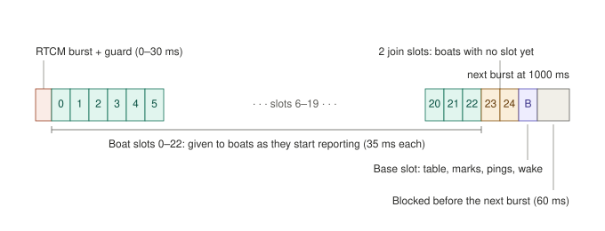
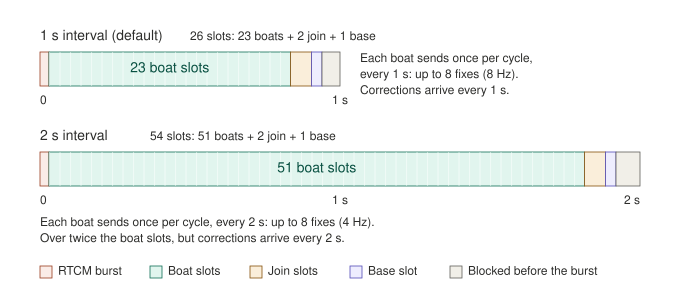
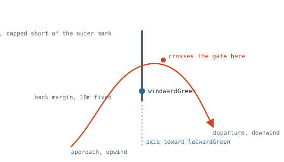

# Race Tracker — Boat Agent + Base Station

Reports GPS position from a boat (Pi Zero 2 W + simpleRTK2B LR) to a shore/
committee base station over a long-range telemetry radio (>2 mi), with
logging to microSD as a durable backup.

## Architecture

```
[simpleRTK2B LR]--UART-->[Pi Zero 2 W]--UART-->[Telemetry radio]==RF==>[Telemetry radio]--UART-->[Base station]--> race software
                              |
                              v
                    microSD (CSV, same fixes sent over radio)
```

For the complete rover → base → RegattaUp data flow - wire formats, Redis
keys, webhook payloads, RegattaUp's own entity fields - see
[`docs/telemetry-pipeline.html`](docs/telemetry-pipeline.html) (open in a
browser).

| Component | Notes |
|---|---|
| GPS | ZED-F9P, `UBX-NAV-PVT` binary messages (position, speed, heading, fix type, RTK carrier solution, satellite count) - no NMEA needed |
| Radio | Transparent-serial telemetry radio (RFD900x, SiK, etc). A compact 26-byte binary frame (`src/protocol.js`) minimizes airtime - batched 8 at a time by default (delta-coded, 83 bytes), see `TX_BATCH_SIZE` below |
| SD log | Logged exactly when a fix clears the `TX_DISTANCE_M`/`TX_INTERVAL_S` gate - same gate as the radio send, so the SD record mirrors what actually transmitted rather than a separate full-rate trace |

## Wiring notes

Default config uses the Pi's own dedicated hardware UART (`/dev/ttyAMA0`,
GPIO 14/15 - avoid the mini-UART, its clock is tied to the core clock and
can glitch), leaving the one USB/OTG port free for the telemetry radio
alone.

```
sudo raspi-config   # Interface Options -> Serial Port
                     # "login shell over serial" = No
                     # "serial port hardware enabled" = Yes
```

- Prefer the simpleRTK2B's own USB port (`/dev/ttyACM0`) instead? Set
  `GPS_PORT=/dev/ttyACM0` (and matching `GPS_BAUD`) - simpler wiring, but
  needs a USB hub since the radio then needs its own USB-to-serial adapter.
- Any Pi with onboard Bluetooth (Zero 2 W, 3A+/3B+, 4, ...) puts GPIO14/15
  on the glitch-prone mini-UART (`ttyS0`) by default, since Bluetooth
  occupies the real UART. Fix:
  ```
  # /boot/firmware/config.txt (Bookworm+) or /boot/config.txt (older)
  dtoverlay=disable-bt
  ```
  then disable `hciuart`/`bluetooth` services and reboot.
- Which physical UART (UART1 vs UART2) your wiring reaches depends on the
  board - ArduSimple's simpleRTK2B routes UART2 to the XBee socket (used
  for RTCM correction radios, unrelated to this app), so a general
  breakout pin is more likely UART1 - verify, don't assume (see below).

### Radio sleep wiring (XBee SLEEP_RQ)

Optional - only needed for rover radio sleep mode (see "Radio sleep mode"
below). One extra wire from a Pi GPIO to the XBee's SLEEP_RQ pin, next to
the radio's UART wiring above:

| From | To | Notes |
|---|---|---|
| Pi **GPIO17** (header pin 11, 3.3 V) | XBee **pin 9** (SLEEP_RQ / DTR) | High = radio asleep, low = awake |
| Pi GND (header pin 9, right next to pin 11) | XBee GND | Shared ground, usually already there via the UART wiring |
| 10 kohm resistor | XBee pin 9 to GND | Pull-down, so the radio stays awake while the Pi is off or still booting |

- **Why GPIO17:** GPIO9-27 are pulled *down* at boot, whereas GPIO0-8 are
  pulled *up* and would put the radio to sleep during every Pi boot. GPIO17
  also isn't claimed by anything this app uses or by a default overlay (UART
  GPIO14/15, I2C GPIO2/3, SPI GPIO7-11, 1-wire GPIO4, PWM/PCM GPIO12/13/18/19),
  and sits on header pin 11 with GND on pin 9 beside it, so one short
  cable can carry the UART (pins 8/10) and this wire. Any other free GPIO
  from 9-27 works; set `RADIO_SLEEP_GPIO` to its BCM number.
- **XBee setting:** the radio must be in pin-sleep mode - `ATSM1`, then `ATWR`
  (for example from XCTU). `xbee_configure_at.py` does not set this. Do it only
  once the wire and pull-down are in place, because in `SM=1` a pin driven
  high puts the radio to sleep and it cannot be reached over the UART until
  the pin goes low again.
- **If the radio is on a USB-serial bridge** whose DTR line is also wired to
  XBee pin 9 (needed only for serial firmware updates), use a jumper or
  solder bridge so just one of the two drives the pin - never both.
- Optional: XBee ON_SLEEP (pin 13) to a spare Pi GPIO input, or an LED, to
  see the radio's actual sleep state. The app doesn't read it.
- `RADIO_SLEEP_GPIO=17` tells the rover app which pin to drive. Unset (the
  default), a real rover ignores sleep commands. It uses Raspberry Pi OS's
  `pinctrl` command to drive the pin.

### GPS backup battery (V_BCKP)

Not a wire - a factory option on the ArduSimple board. It keeps the GPS's
satellite data alive so the rover restarts hot instead of cold. Whether your board
needs it is something to check, not assume: see "Checking and fitting the GPS
backup battery" under "Radio sleep mode".

## GPS configuration (one-time, via u-center or ubxtool)

Each UART is configured independently - a GPIO-wired UART may still be at
factory defaults (NMEA on, UBX off) even after USB's been configured.
Verify first:

```
stty -F /dev/ttyAMA0 <baud> raw -echo
cat /dev/ttyAMA0        # Ctrl-C to stop
```
Try common bauds (9600, 19200, 38400, 57600, 115200) until you see clean
`$GNGGA`/`$GNRMC`/... text.

```
sudo apt update
sudo apt install -y gpsd gpsd-clients python3-gps
sudo systemctl disable --now gpsd.socket gpsd   # stop it grabbing the port
```

At the confirmed baud, enable `UBX-NAV-PVT` and disable NMEA (try `UART1`
first, `UART2` if nothing changes):
```
ubxtool -f /dev/ttyAMA0 -s 115200 -P 27.11 -z CFG-MSGOUT-UBX_NAV_PVT_UART1,1,7
ubxtool -f /dev/ttyAMA0 -s 115200 -P 27.11 -z CFG-UART1OUTPROT-NMEA,0,7
ubxtool -f /dev/ttyAMA0 -s 115200 -P 27.11 -z CFG-RATE-MEAS,1000,7   # 1Hz
```
`,7` is a layer bitmask (`RAM=1, BBR=2, Flash=4`) - `7` writes to all
three, so the change is immediate and survives a power cycle. NMEA doesn't
need to be disabled - the app's UBX parser scans for UBX sync bytes and
skips interleaved NMEA text - disabling it just saves bandwidth.

### Verifying the connection

```
stty -F /dev/ttyAMA0 115200 raw -echo
cat /dev/ttyAMA0        # expect quiet gaps + a short binary burst ~1/sec
```
Then confirm this app itself decodes it (the check that actually matters):
```
GPS_PORT=/dev/ttyAMA0 GPS_BAUD=115200 npm run boat
```
Watch for `[gps]` lines with real `fixType`/`numSV` (see `GPS_LOG` in
"Tuning knobs"). Silence means `UBX-NAV-PVT` went to the wrong UART number
- undo (`CFG-MSGOUT-UBX_NAV_PVT_UARTx,0,7`) and try the other.

The simpleRTK2B LR's onboard radio (in the board's XBee socket) is a
**separate concern** - it carries RTCM3 correction data between RTK base
and this rover, not position telemetry. "LR" is ArduSimple's own kit name
("Long Range," ~10km), not a Digi product name - confirmed off the
module's label, the chip is a **Digi XBee SX** (Model XBSX, FCC ID
`MCQ-XBSX`); the step-up "XLR" kit uses a Digi XBee PRO SX for longer
range.

### RTK base GPS: enabling RTCM3 output (one-time)

`TMODE3` (fixed/survey-in position, set from this app's `npm run
rtk`/`basertk` dashboard) and RTCM3 *output* are separate config groups -
setting a fixed position doesn't turn sending RTCM on. Some kits ship with
only `1005` enabled and no observation messages, which looks like "locked
and working" on the dashboard while the rover receives nothing usable.

Check/enable on the base's correction-radio UART (`UART2` on the
simpleRTK2B LR - its onboard XBee SX is wired internally to UART2, not
something you'd jumper yourself):

| Message | Content |
|---|---|
| `1005` | Station coordinates (depends on the fixed position) |
| `1074`/`1084`/`1094`/`1124` | MSM4 observations: GPS/GLONASS/Galileo/BeiDou |
| `1230` | GLONASS code-phase biases (needed alongside `1084`) |

Send **one** observation set, MSM4, not MSM4 and MSM7 together. MSM7 carries
the same observations at higher resolution and about 1.5x the bytes; sending
both is duplicate traffic (an audit found a board doing exactly that - the
factory MSM4 plus an MSM7 set added on top - roughly 2.5x the bytes the rover
needs). MSM4 is also the better fit for this fleet's radios: a whole epoch is
about 400 bytes, and individual messages stay near the 100-byte radio packet
limit (MSM7 messages go well past it and get split in two over the air, and
losing either half loses the message).

```
ubxtool -f <base GPS port> -s <baud> -P 27.11 -z CFG-MSGOUT-RTCM_3X_TYPE1005_UART2,1,7
ubxtool -f <base GPS port> -s <baud> -P 27.11 -z CFG-MSGOUT-RTCM_3X_TYPE1074_UART2,1,7
ubxtool -f <base GPS port> -s <baud> -P 27.11 -z CFG-MSGOUT-RTCM_3X_TYPE1084_UART2,1,7
ubxtool -f <base GPS port> -s <baud> -P 27.11 -z CFG-MSGOUT-RTCM_3X_TYPE1094_UART2,1,7
ubxtool -f <base GPS port> -s <baud> -P 27.11 -z CFG-MSGOUT-RTCM_3X_TYPE1124_UART2,1,7
ubxtool -f <base GPS port> -s <baud> -P 27.11 -z CFG-MSGOUT-RTCM_3X_TYPE1230_UART2,1,7
```
`ubx_config_set.py --role base` (below) does all of this on both UART1 and
UART2 and also switches the MSM7 messages off, which these commands alone don't.
Only enable constellations you're actually tracking. `,7` saves to flash
immediately (bare `,1` is RAM-only, for testing before committing).

For visibility into corrections arriving rover-side, enable `UBX-RXM-RTCM`
on the rover's own GPS UART and set `RTCM_LOG=1` (off by default; `GPS_LOG_RTCM` is the old name and still works):
```
ubxtool -f /dev/ttyAMA0 -s <baud> -P 27.11 -z CFG-MSGOUT-UBX_RXM_RTCM_UART1,1,7
```
Watch `[rtcm]` lines (`type=1074 station=0 used=used`) - `used=not used` on
its own is normal (unused constellations), `CRC-FAILED` means a correction
arrived corrupted. Message counts/CRC failures are always tracked
internally (`GET /api/stats`) regardless of this flag.

### RTK base GPS: enabling the survey-in status card (optional)

If the "Base GPS survey-in" card shows "no base GPS, or not polled yet"
even with `GPS_PORT` set and TMODE3 configured for survey-in,
`UBX-NAV-SVIN` likely isn't enabled as an output:
```
ubxtool -f /dev/ttyAMA0 -s 115200 -P 27.11 -z CFG-MSGOUT-UBX_NAV_SVIN_UART1,1,7
```
Configuring TMODE3 itself for survey-in (vs. just reading it) is a
separate one-time step, typically done via u-center at setup - see
u-blox's ZED-F9P integration manual for survey-in parameters.

### Checking everything at once (gps_config_report.sh)

`gps_config_report.sh` (repo root) polls every setting the sections above
depend on - fix rate, UART baud, `UBX-NAV-PVT`/NMEA/`UBX-NAV-SVIN`/
`UBX-RXM-RTCM` output, TMODE3 mode, RTCM3 output types - in one pass,
instead of re-typing each `ubxtool -g` poll by hand or assuming a board's
still configured the way it was last time. Read-only (`-g`/poll only,
never `-z`/set):
```
./gps_config_report.sh -f /dev/ttyAMA0 -s 115200
```
A board acting as a rover should show the RTK-base rows (TMODE3, RTCM3
output) at 0/off; a board acting as the RTK base should show its own rows
enabled and `CFG-TMODE-MODE` non-zero.

No `gpsd`/`ubxtool` available (or can't install it)? `ubx_config_report.py`
reports the exact same settings, talking the UBX binary protocol directly
over `pyserial` instead - same reasoning as `xbee_configure_at.py`'s own
"why not a library" comment, no external CLI tool needed:
```
pip install pyserial
python3 ubx_config_report.py --port /dev/ttyAMA0 --baud 115200
```
Every key ID it polls is cross-checked against two independent open-source
references (SparkFun's u-blox GNSS library and pyubx2), not typed from
memory - see its own module comment.

`ubx_config_set.py` applies the fix, same no-`ubxtool`-needed approach:
```
python3 ubx_config_set.py --port /dev/ttyAMA0 --baud 115200 --role base
python3 ubx_config_set.py --port /dev/ttyAMA0 --baud 115200 --role rover
```
`--role base` makes the base's RTCM output clean: `1005`, the MSM4 observations
(`1074`/`1084`/`1094`/`1124` - GPS/GLONASS/Galileo/BeiDou) and `1230` on, the
MSM7 messages (`1077`/`1087`/`1097`/`1127`) explicitly off, RTCM3 allowed as an
output protocol, and `UBX-NAV-SVIN` on - on the ports named by `--rtcm-ports`
(default `uart2,usb`: UART2 is the onboard correction radio, USB the host
connection), with every other port's RTCM switched off so nothing is sent where
nothing reads it. Add `uart1` only if something reads the board on the Pi header
UART. `--constellations` (default all four) leaves constellations out to save
bytes - a left-out one has its MSM4 message off, and `1230` goes with GLONASS.
`--rtcm-interval N` (default 1) sends every enabled message every N seconds instead of every
second (it sets the messages' output rate; the receiver's own 1 Hz measurement rate is untouched):
`--rtcm-interval 2` halves the correction airtime, at the cost of rovers working from corrections up
to 2 s old and a lost message costing 2 s. Check that RTK still holds at speed before relying on it.
Run it with `--dry-run` first to see exactly what would change, and
`ubx_config_report.py` afterwards to confirm; it writes RAM+BBR+flash, so it
survives a power cycle.
```
python3 ubx_config_set.py --port /dev/cu.usbmodem101 --role base --dry-run
python3 ubx_config_set.py --port /dev/cu.usbmodem101 --role base --constellations gps,galileo,beidou
```

This replaces an earlier profile that added MSM7 on top of the board's factory
MSM4 (a live audit then found both sets going out the radio). The original gap
it was written for - `1005` station coordinates on and no observation message at
all, so a rover would never get a usable correction - is still covered. All four
constellations are on by default, not gated behind opt-in flags - this fleet
operates in the US, where all four have real satellites in view (including
BeiDou-3's global coverage, not just the old Asia-Pacific-only BeiDou-2), and more
satellites means better RTK fix reliability under real-world sky obstruction;
edit `BASE_SETTINGS` directly if you want fewer.
`--role rover` enables `UBX-NAV-PVT`
(required, or this app sees nothing from it), disables TMODE3 (a rover
isn't a stationary reference station), enables `UBX-RXM-RTCM` (for
`RTCM_LOG` visibility), and sets the fix rate to 10Hz (`CFG-RATE-MEAS`)
- not the ZED-F9P's 20Hz spec ceiling, to leave headroom. (An earlier version of
this note cited u-blox's "link latency under nav-period minus 50ms" rule; the
integration manual gives that rule for *moving-base* RTK only, not for a
stationary base like this one, so it isn't a reason for 10Hz here. For a
stationary base the manual's documented limit is that the rover stops using
corrections older than 60 s - `CFG-NAVSPG-CONSTR_DGNSSTO`.)
It also accepts RTCM3 as an input on UART2 (the correction radio's port),
makes sure GPS/GLONASS/Galileo/BeiDou tracking are all on (the rover can only
use corrections for constellations it tracks) and sets the differential mode to
3 = RTK fixed (2 would stop at float).

**Both roles** set UART2's baud (`--uart2-baud`, default 115200) - UART2 is the
port the onboard correction radio is wired to, so it **must equal that radio's
own baud** (the base's reads 115200). Only UART2 is touched, never the port the
script is connected through. If your correction radios aren't at 115200, pass
their baud instead of accepting the default.

Every write goes to
RAM+BBR+Flash (survives a power cycle) and is read back afterward to
confirm it actually stuck - a silently-failed write is worse than a loud
one. `--dry-run` shows what would change without writing anything.

## Radio configuration

Pair every radio (boat + base) on the same netid/frequency/baud, in
transparent-serial mode.

| | Factory default | This app's default |
|---|---|---|
| XBee baud | 9600 | **115200** |
| RFD900x/SiK baud | 57600 | **115200** |

At fleet sizes beyond a couple boats, the base↔radio serial link (every
boat's frames funnel through one port) becomes the bottleneck well below
the radio's actual RF capacity - hence 115200. Reconfigure **every**
radio's serial baud via XCTU (XBee) or RFD Modem Tools/Mission Planner
(RFD900x) before running with this default; a mismatch just means the
port opens but nothing decodes. Also confirm all radios share the same
Network ID (XBee `ID`).

**Don't raise this past 115200 without re-testing.** It's tempting to - a
100-boat `radio-congestion` run at 115200 measured the SERIAL link
saturating at ~11.2 KB/s, almost exactly 115200's own 8N1 ceiling (115200 ÷
10 bits/byte = 11,520 B/s), apparently well under an XBee-PRO 900HP 200K's
nominal RF capacity. Bumping to 230400 does relieve that serial ceiling
(the same test then pushed 15.4 KB/s, using only ~67% of 230400's own
~23 KB/s ceiling) but sync errors jumped from 0.2% to 10.4% - real
RF-level bit corruption (see `radioLink.js`'s own `sync-error` event), not
local serial buffering, since bandwidth used stayed well under the new
ceiling. This fleet's actual radios' real sustainable RF throughput tops
out around ~11-12 KB/s regardless of serial baud - 115200 was accidentally
already throttling right at that ceiling, not artificially limiting it.
`TX_BATCH_SIZE` (reduces actual RF bytes-per-fix, not just how fast the
serial link can be fed - see "Batching multiple fixes per send" below) is
already at its practical ceiling by default (4, `MAX_BATCH_COUNT`) - there's
no more headroom left there to reach for if you need still more real fix
throughput. Re-run the same `radio-congestion` test checking sync-error
rate, not just bandwidth headroom, before trusting any higher baud.

Running only 1-2 boats? Leave everything at factory defaults and set
`RADIO_BAUD` to match. Higher baud = faster delivery but shorter
range/reliability at a given power - tune on the water. **Antenna height
matters a lot for going over water at >2mi.**

### Configuring XBee radios (xbee_configure_at.py)

For XBee-PRO S3B (900HP/XSC) radios, `xbee_configure_at.py` (repo root)
automates the above instead of using XCTU by hand: DigiMesh delivery mode,
routing/relaying disabled on every node (single-hop fleet only), matching
Network ID/DH-DL/HP/MT/BD. Every command/value comes from Digi's XBee-PRO
900HP/XSC S3/S3B User Guide - not `MM`/`CH`/`CD`, which don't exist on
this module (confirmed live: both `ERROR`). No base-vs-rover split - every
radio gets identical config. Speaks plain AT Command Mode over `pyserial`
("+++", "ATxx<value>", "ATWR") - never leaves transparent mode.

```
pip install pyserial

python3 xbee_configure_at.py --port /dev/ttyUSB0             # every radio
python3 xbee_configure_at.py --port /dev/ttyUSB0 --dry-run    # read only
python3 xbee_configure_at.py --port /dev/ttyUSB0 --role rtcm  # an XBee-PRO 900HP as the RTK correction radio
```

| Flag | Default | Notes |
|---|---|---|
| `--connect-baud` | 115200 | The radio's CURRENT speed - pass its actual current baud if already reconfigured, or `9600` for a genuinely factory-fresh radio |
| `--target-baud` | 115200 | Applied last (changes how the script itself talks to the radio), matches `RADIO_BAUD` |
| `--mode` | `p2mp` | `p2mp` / `digimesh` / `digimesh-routing` |
| `--role` | `telemetry` | What the radio is for. `telemetry`: network ID `0x7FFF`, `HP` 0, `MT` 0 (the position link). `rtcm`: network ID `0x1985`, `HP` 1, `MT` 1 (each broadcast sent twice), no flow control - the RTK correction link on its **own network**, so a yacht's two XBee-PRO 900HP radios never hear each other's data. Set **both ends** of each link the same |
| `--network-id` / `--preamble-id` / `--mt` | from `--role` | Override a single value of the preset: `ID` (0 - 0x7FFF), `HP` (0 - 7), `MT` (0 - 5) |
| `--flow-control` | `cts` | `none` (D7=0, D6=0) / `cts` (D7=1, D6=0 - Digi's own factory default) / `rtscts` (D7=1, D6=1). CTS is an output the radio raises when its serial buffer is nearly full - harmless if the host ignores it. **RTS makes the radio stop sending to the app while RTS is held high**, so use `rtscts` only with an adapter whose RTS line is wired and driven, or the radio goes silent to the app. The app itself opens the port without hardware flow control today, so these settings only take effect once it (or the adapter's driver) honours them |

**Encryption (`EE`) is switched off** by the script (and `--dry-run` shows it as the `EE (Encryption)` row). With AES on, every RF packet loses 9 bytes of its 100-byte payload, so the marks frame (91 bytes) would still fit but the slot table (up to 97) and power (up to 95) frames would be split across two packets and lost if either half is. `EE` has to be the same on every radio in the network, so run the script on all of them (or check each with `--dry-run`).

The stock ArduSimple LR radio's settings, side by side with each preset above, are
recorded in [`docs/xbee-radio-settings.md`](docs/xbee-radio-settings.md).

**Not for the stock ArduSimple long-range radios.** Those are XBee SX modules
paired on their own network ID (`0x1985`); running this script for real on one
would change its settings (a dry run is safe and just reads them). `--role rtcm` is
for replacing *both* ends of the correction link with XBee-PRO 900HPs; try it on the
bench first (ZED to radio to radio to ZED, with `RTCM_LOG=1` on the rover) before
relying on it. `CM` (the channel mask) is still not set by this script, so two
900HP networks on one yacht still hop across the same frequencies.

Config values (network ID, DH/DL, etc.) live in the `CONFIG` dict at the
top of the script, not as flags, except those the flags above override. Channel selection (`CM`) isn't touched at
all - set by hand first if avoiding specific frequencies. Only one process
can hold a serial port - stop any running `npm run base`/`boat`/`radio-test`
or XCTU on that port first.

**Mode history**: DigiMesh (`TO=0xC0`) is confirmed-working and was the
long-time default. Point-to-Multipoint (`TO=0x40`, lower overhead, no
network header) failed traffic between two persistently-verified P2MP
radios on this hardware - a real incompatibility, not config/persistence.
As of this pass **P2MP is the new default** based on further review (one
open lead: DigiMesh's own broadcasts already reuse Directed-Broadcast wire
framing, not unique DigiMesh framing, since this app's traffic is 100%
broadcast - so the earlier "working" DigiMesh test never actually
exercised mesh-routing behavior). Fall back with `--mode digimesh` if P2MP
doesn't work on your hardware. A real (non-dry-run) run soft-resets (`FR`)
and reconnects to re-verify every parameter survives a reboot, not just
reads back correctly mid-session.

### Bench-testing the radios

```
RADIO_TEST_MODE=send   RADIO_PORT=/dev/cu.usbserial-A npm run radio-test
RADIO_TEST_MODE=listen RADIO_PORT=/dev/cu.usbserial-B npm run radio-test
```

`src/radioTest.js` exercises the real radio link directly (no GPS, Redis,
or simulation) using the exact same `RadioLink`/`protocol.js` code
production uses. One instance per radio (`ls /dev/cu.*` before/after
plugging in to find device paths on macOS). `RADIO_BAUD` and Network ID
(`ATID`) must match on both.

Sender transmits one frame every `RADIO_TEST_INTERVAL_MS` (default 500ms)
with a sequence number in the timestamp field. Listener logs received
frames and prints a running summary every 10s (received count, estimated
missed, loss %). Start close together to confirm connectivity, then
separate to find where the link degrades.

**Measuring radio latency and the slot guard (`radio-latency`).** A time-slot schedule needs a
*guard time* - how much a frame's arrival can vary - and that should be measured, not guessed.
Two radios on one machine, one sending and one listening, give one-way latency from "the app wrote
the frame" to "the other radio's app decoded it", with the send and receive times from the same clock:

```
LATENCY_TX_PORT=/dev/cu.usbserial-5 LATENCY_RX_PORT=/dev/cu.usbserial-0001 npm run radio-latency
```

1. Power the RTK base and let it send corrections (so there are RTCM bursts to measure against).
   With the base off the test still gives latency, just without the near-burst comparison.
2. Put two radios on the machine, both on the **same network** as the base (same `ID` and `HP`,
   115200 baud). `ls /dev/cu.*` before and after plugging each in to find their ports.
3. Stop anything else holding those ports (`cat`, miniterm, `npm run boat`, `rtcm_listen.py`).
4. Run the command above (about 80 seconds for 300 frames). Leave the radios alone while it runs.
5. Read the report: one-way latency percentiles (min, p50, p90, p99, max) and jitter (p99 - p50);
   latency and loss for frames sent *near* an RTCM burst versus *clear* of it; whether bursts that
   had a test frame near them came through incomplete more often than the others (that is what a
   telemetry transmission costs the corrections); and a suggested guard.
6. Repeat for a bigger frame and a longer run: `LATENCY_BATCH=8 LATENCY_FRAMES=600 ...` (an 83-byte delta frame of 8 fixes, the biggest a boat sends; `LATENCY_DELTA=0 LATENCY_BATCH=4` for the older 84-byte
   batch frame).
7. Swap which radio sends and which listens (the two ports) and run again, to see that the numbers
   don't depend on the radio.

Settings: `LATENCY_FRAMES` (300), `LATENCY_GAP_MS` (250, plus a random 0-40 ms so sends cover every
phase of the second), `LATENCY_BATCH` (1 = a 26-byte frame, 2-8 = a delta-coded frame of that many fixes - 8 is 83 bytes; `LATENCY_DELTA=0` sends the older batch frame instead, 2-4 fixes up to 84 bytes). The test fixes move, so every field of a delta frame is exercised, and the report counts frames that arrived with a good checksum but decoded to different values than were sent (radio corruption the additive checksum missed - it should be 0),
`LATENCY_FOCUS=1` (send only in a sweep from 80 ms before to 160 ms after each predicted correction burst, one frame per burst, to find exactly where sending hurts; needs the base running; 150 frames, about 150 s), `RADIO_BAUD` (115200). The guard it suggests is a starting point: one machine, two adapters. It does
not include a Raspberry Pi's own delays, so repeat it on a Pi before setting slot timing.

**Testing the transmit scheduler itself (`LATENCY_SCHEDULE`).** The same two-radio setup can run
the real `TxScheduler` instead of sending at random times, so you can see what the gate and the
slots do to the corrections. The sender radio listens for the base's bursts to learn the timing
(it waits for 3 bursts before sending), then each virtual boat sends through its own scheduler.

```
# A: no gate (baseline) - existing random-phase run, same load
LATENCY_BATCH=2 LATENCY_FRAMES=300 LATENCY_TX_PORT=<sender> LATENCY_RX_PORT=<listener> npm run radio-latency
# B: gate only - telemetry held out of the correction window
LATENCY_SCHEDULE=gate  LATENCY_BATCH=2 LATENCY_FRAMES=300 LATENCY_TX_PORT=<sender> LATENCY_RX_PORT=<listener> npm run radio-latency
# C: gate + slots - two virtual boats in slots 3 and 7, 35 ms apart (add LATENCY_BATCH=8 LATENCY_GAP_MS=1000 for one 83-byte frame per cycle, like a boat at 8 Hz)
LATENCY_SCHEDULE=slots LATENCY_SLOTS=3,7 LATENCY_SLOT_MS=35 LATENCY_TX_PORT=<sender> LATENCY_RX_PORT=<listener> npm run radio-latency
```

The report shows, per boat, when each frame was actually written relative to the burst start
(slot mode: it should sit at the slot's opening, `30 + slot x slot width` ms), how long frames were
held, frames written inside the conflict window (should be 0), arrivals from different boats within
15 ms of each other (should be 0; the closest gap is printed too - neighbouring slots give about 21 ms or more), and bursts that came through incomplete with and without a
frame near them. Compare the incomplete-burst rate in A against B and C. `LATENCY_BOATS` sets the
number of virtual boats (default 1 for `gate`, one per `LATENCY_SLOTS` entry for `slots`).

**Looking at the raw bytes on a radio's port (macOS).** Don't use `stty -f <port> 115200`
followed by `cat <port> | xxd`: macOS resets the port to its default 9600 baud when
`cat` reopens it, so a 115200 radio's output reads as noise. Use a tool that sets the
baud itself when it opens the port - `python3 -m serial.tools.miniterm <port> 115200 --raw`,
or `rtcm_listen.py`:

```
python3 rtcm_listen.py --port /dev/cu.usbserial-0001 --seconds 20
```

`rtcm_listen.py` decodes the stream rather than dumping hex: checksum-valid RTCM3
messages (with type and size), UBX frames and NMEA sentences, how many bytes it
couldn't recognise, and how wide each second's burst is. "No valid frames" there
means the bytes really are corrupted, unlike a wrong-baud `cat`.

### Congestion-testing the radio

`npm run fleet`'s `SIMULATE=1` link is UDP with no airtime limit, so it
can't show real congestion; running real `FLEET_SIZE` boats needs one real
radio *per boat*. `src/radioCongestionTest.js` instead runs one process,
one real radio, transmitting the *combined* frame traffic a whole
simulated fleet at speed would put on the air - same
`protocol.js`/`RadioLink` frames, same per-boat `TX_DISTANCE_M` cadence,
computed directly rather than from a live GPS track.

```
npm run base                                                   # real base, real radio - NOT SIMULATE=1
BOAT_COUNT=30 RADIO_PORT=/dev/cu.usbserial-A npm run radio-congestion
```

The base treats this synthetic traffic exactly like a real fleet's - real
(non-zero) lat/lon, real-format boat ids - so with a real regatta selected
it gets written into that regatta's own Redis data (and, if RegattaUp
reporting is live, could fire real lap/on-grid webhook posts too). Run the
base with `NO_REGATTA=1 npm run base` for a pure bench test instead: it
skips regatta auto-selection entirely for that run (no terminal prompt, no
closest-active-date auto-pick), so every received frame - real or
synthetic - is ignored and nothing is written anywhere. The admin
dashboard's own regatta dropdown still works normally if you want to
override it mid-run.

Watch the base's fleet dashboard (last-seen/frame counts) and its
`[radio] link quality` log line (sync errors) as `BOAT_COUNT` climbs.
`CONGESTION_SPEED_KN` (default 26.1, ≈ 30mph - this fleet's own reference
planning speed, land yachts rather than displacement sailboats; still in
knots like every other speed value in this app, so a bare `30` here means
30 *knots* instead) sets the assumed speed driving send rate. This tests
airtime/throughput load on the base's real receive
pipeline - it is **not** a test of real multi-transmitter RF collisions
(every frame still leaves one real antenna); that needs one real radio per
virtual boat.

**For real collisions**, run several of these at once, each on its own
physical radio, `BOAT_ID_OFFSET`-staggered so their boat ids don't overlap
(purely cosmetic for telling frames apart on the dashboard - the actual RF
collision behavior only depends on the radios being physically separate
transmitters, not on the ids). Split a target fleet size across them to
get realistic aggregate load *and* genuine multi-transmitter contention at
once, rather than choosing between the two:

```
BOAT_COUNT=7 BOAT_ID_OFFSET=0  RADIO_PORT=<radio1> npm run radio-congestion
BOAT_COUNT=7 BOAT_ID_OFFSET=7  RADIO_PORT=<radio2> npm run radio-congestion
BOAT_COUNT=7 BOAT_ID_OFFSET=14 RADIO_PORT=<radio3> npm run radio-congestion
BOAT_COUNT=7 BOAT_ID_OFFSET=21 RADIO_PORT=<radio4> npm run radio-congestion
```

Physically separate the transmitting radios rather than clustering them -
radios that can all hear each other collide differently (often more
politely) than ones spread across a real course, where some pairs are
hidden nodes to each other but both still reach the base. That hidden-node
case is usually where the ugliest real collision behavior actually shows
up, and clustering hides it entirely.

### Marking the base's own log from a rover

A real field test - walking/driving a rover to a new distance from the
base, checking an antenna, anything worth timestamping - needs a way to
say "right now" without cross-referencing two separate logs by wall-clock
time afterward. Every rover's own dashboard (`roverAdminServer.js`, any
mode - plain boat, markset, or mark) has a **Mark base log** card: type a
short note (20 characters, truncated beyond that) and tap **Mark**. It
sends over the same telemetry radio a position fix already goes out on
(`protocol.js`'s `encodeMarkLog`/`0x88`) - no GPS fix or WiFi needed, works
even before this device has ever gotten a position.

The base logs it unconditionally to its own console
(`=== MARK from boat=... : "<note>" ===`), and - when `LOG_RATE_STATS=1` is
also set (see "Congestion-testing the radio" above) - appends it as its
own row in that same `base_station_rate_stats_<date>.csv`, numeric fields
blank, note filled in, landing inline with the fix-rate/error-rate time
series at the exact moment it was sent.

`radio-congestion` runs its own copy of this same dashboard too - same
port as any other rover's own admin dashboard (`ADMIN_PORT`, default 8092;
8093 under `SIMULATE=1`, same as `boatAgent.js`) - purely to reach this
card from a browser during a bench test. Every other card on
it (course marks, GPS fix, uploads, scheduled shutdown) just shows its own
honest "nothing yet" state, since this script tracks none of that; only
Mark base log actually does something. Tagged `boat=MARKS` on the base's
own console/CSV so it's never confused with one of the virtual boats' own
sequential ids.

### Batching multiple fixes per send (TX_BATCH_SIZE)

`TX_BATCH_SIZE` (default **8**) packs that many consecutive fixes from one
boat into a single radio transmission instead of sending each on its own -
fewer, larger over-the-air transmissions instead of many small ones. Set
`TX_BATCH_SIZE=1` to go back to one frame per fix, this app's original
behavior (boatAgent.js never touches the batch frame type at all at that
setting). Whether batching is actually worth the added latency (fixes wait
to fill a batch, though never longer than `TX_INTERVAL_S` - see below)
depends on whether your bottleneck is per-transmission overhead or
per-byte airtime; see the XBee-PRO 900HP/XSC S3B's own `NP` command (max
RF payload - 256 bytes on the standard 900HP, but read-only and check it
yourself: the "900HP 200K" variant's higher RF data rate caps it much
lower, 100 bytes on this fleet's actual radios) for the ceiling a batch
frame stays comfortably under - the older batch frame (`MAX_BATCH_COUNT` in
protocol.js) is capped at 4 fixes (84 bytes) to fit that, and the delta-coded
frame described next carries 8 fixes in 83 bytes, which is why 8 is the default
(it was 4 before delta frames): this fleet's own congestion-testing (see
"Congestion-testing the radio" above) found batching comfortably improves
aggregate throughput at this hardware's real payload ceiling. A boat waits to
fill a batch only when no correction bursts are heard on its radio - in slot
mode it sends what it has gathered once per cycle instead (see "Sending in the
slot").

**Delta-coded frames (`TX_DELTA`, on by default).** Batches go out as *delta frames* (sync `0xE7`): the first
fix in full (19 bytes) and every later fix as its change from the one before (8 bytes), so a frame holds up to
**8 fixes in 83 bytes** (the older batch frame needed 84 bytes for 4). Sizes: 2 fixes 35 bytes, 4 fixes 51,
5 fixes 59, 8 fixes 83, against 46/84/111/168 as batch frames. Latitude, longitude and speed are exact; fixes
after the first in a frame have their time rounded to 2 ms and heading to 0.5 degree (the encoder works from
what the decoder will rebuild, so nothing drifts along a frame). A fix whose change does not fit - a GPS jump,
a gap over 510 ms, a turn of more than 63 degrees between two fixes, a 12 knot speed step - simply starts a new
frame, which always opens with a full fix, so frames are self-contained and a lost frame never corrupts the
next. A lone fix is the plain 26-byte frame. **Update the base before the boats**: the base decodes both
frame types, but a base that does not know `0xE7` ignores delta frames. `TX_DELTA=0` makes boats send the
older batch frame (4 fixes at most) for use with an old base; `TX_BATCH_SIZE` is then limited to 4 (up to 8 with
delta frames, the default).

Test it with the same tool "Congestion-testing the radio" above uses -
`radio-congestion` respects `TX_BATCH_SIZE` too, so you can compare real
transmission rates at different batch sizes (or against `TX_BATCH_SIZE=1`)
at your actual fleet size before ever touching a real boat:

```
BOAT_COUNT=30 TX_BATCH_SIZE=4 RADIO_PORT=/dev/cu.usbserial-A npm run radio-congestion
```

The console's own "X frames sent, Y tx/s actual average" line (and the
base's `[radio] link quality` log) reflect actual transmissions, not
fixes - with batching on, that number drops roughly in proportion to
`TX_BATCH_SIZE` for the same fix rate. No env var needs setting on a real
boat to get this - `TX_BATCH_SIZE=8` is already the default:

```
npm run boat
```

**Timestamps inside a batch.** A fix's time is always its own GPS
`timestamp` (the Redis sorted-set score), so a 2Hz simulator produces fixes
500ms apart even when 4 arrive in one batch frame. The base stores no
arrival time in a fix: it used to stamp each unpacked fix with `new Date()`
(a `receivedAt`), which gave every fix in a batch the identical value. Track
points returned from Redis still carry a `receivedAt` field for existing
consumers, but it is now just the GPS timestamp, including for fixes stored
before this change.

### RTCM on the shared radio (telemetry and corrections on one radio)

If the radio on a boat's/base's serial port is also the RTK correction link (every radio on
the same network ID and `HP` - see `docs/xbee-radio-settings.md`), the RTK base's RTCM3
messages arrive on that same serial port, mixed in with position frames, marks and the rest.

- **Recognised, never an error.** `radioLink.js` (and the UDP simulator) now treat an RTCM3
  message as its own frame type: `0xD3`, a 10-bit length, the payload, and a CRC-24Q that must
  check out (`protocol.js`'s `decodeRtcm`). Before this, RTCM bytes looked like noise: the same
  5-second test stream produced 965 sync errors, because payload bytes that happen to equal one
  of our own sync bytes (`0xAA`, `0xBB`, ...) were taken for the start of a frame; now it
  produces none, and the telemetry frames in between all decode. A false `0xD3` with an
  implausible length (over 300 bytes) is rejected straight away, so it can't make the scanner
  wait on a frame that never arrives. A corrupted RTCM message costs a couple of sync errors and
  nothing around it.
- **Counted.** The rover counts what arrives over the radio (`radioRtcm` in `GET /api/stats`:
  frames, bytes, forwarded, last type). That is separate from `rtcm`, which counts what the GPS
  receiver reports applying (`UBX-RXM-RTCM`). `RTCM_LOG=1` prints one tight line
  per second per source instead of a line per message:
  ```
  [rtcm-radio] 449B 6msg MSM4 1005:stn 1074:GPS8 1084:GLO7 1094:GAL3 1124:BDS7 1230:bias
  [rtcm] 6/6 used: 1005 1074 1084 1094 1124 1230
  ```
  The first is what arrived over the radio (bytes, message count, MSM level, and the number
  of satellites in each constellation's message, each tagged with its RTCM message number (`1074:GPS8` = message 1074, GPS, 8 satellites); `->GPS` is added when `RTCM_FORWARD` also
  wrote them to the receiver, and `!set changed (...)` appears if a burst's set of messages
  differs from the previous one). The second is what the GPS receiver reports applying; it
  names any message not used, and any with a CRC failure. `RTCM_LOG=2` prints a decoded line
  per message instead, e.g. `[rtcm-radio] 1074 GPS 8sv 12c 129B` (`c` = signal cells) and
  `[rtcm] 1074 used`. `GPS_LOG_RTCM` is the old name for this setting. A base's telemetry station hears the same RTCM and simply ignores it.
- **Forwarded to the GPS only if asked.** With `RTCM_FORWARD=1` the rover writes each message,
  byte for byte, to the GPS receiver's serial port, which is what makes the shared radio an RTK
  link. That needs the Pi's TX line wired to the receiver's RX (nothing in this app wrote to the
  GPS before), and `ubx_config_set.py --role rover` now also accepts RTCM3 as an input on UART1
  and USB. Nothing is forwarded while the rover is in radio sleep: a byte written to a sleeping
  receiver wakes it.

### Shared-radio transmit scheduling (keep clear of the correction burst; optional time slots)

With one radio for telemetry and corrections, a frame written into the base's once-a-second RTCM burst is
delayed and leaves the corrections incomplete (measured: 46% of bursts incomplete with a frame sent in the
conflict window, 1.8% otherwise - `docs/radio-latency-findings-2026-10-09.pdf`). This keeps writes clear of it.

- **Burst tracker** (`burstTracker.js`): times the first RTCM message of each burst as this radio decodes it,
  learns the period, predicts the next burst, and back-dates the start if the first messages of a burst were
  lost. It goes inactive after a few missed cycles.
- **Gate** (`txGate.js`): holds a write from 40 ms before a predicted burst start to 20 ms after it, plus a
  10 ms guard each side (a bigger frame starts blocking earlier: 0.087 ms per byte more) - about 80 ms of
  every second. While no bursts are heard it holds nothing, so a separate correction radio, or no base,
  behaves exactly as before.
- **Scheduler** (`txScheduler.js`): wraps the radio's `send()` on the boat, and `send()`/`broadcast()` on the base
  (where the gate holds everything and slot mode holds the base's own frames for its slot - see below). A held frame waits, in order, and goes out when the gate clears; at most
  `TX_GATE_MAX_QUEUE` wait, and one held longer than `TX_GATE_MAX_AGE_MS` is dropped, not sent stale
  (positions are already on the SD card).
- **Slot mode** (on by default, `TX_SLOT_MODE=0` turns it off; boats and base): position, batch and delta-batch frames are released
  only in this boat's slot of each cycle. A cycle starts at a burst; slot `i` opens `after + guard + i x TX_SLOT_MS` after
  it (30 ms + `i` x 35 ms by default), so boats in different slots never overlap. Other frames (hello, ping
  replies, set-mark, ...) are gated but not slotted. The three parts below say how a boat gets its slot, what
  it sends in it, and how big a slot should be.

What one cycle looks like (a 1 s correction interval, 35 ms slots; the *B* is the base's own slot):



**Slot assignment (the slot table).** Slot mode is on by default for the base and the boats (set `TX_SLOT_MODE=0`
on a node to turn it off there; like the gate, it does nothing until correction bursts are heard). The base keeps
a table of the boats it hears and broadcasts it every `TX_SLOT_TABLE_S` seconds (10), and straight away when it
changes, as slot-table frames (sync `0xA7`, up to 15 boats per frame; larger tables use several). A boat that
hears its own entry moves to that slot, so `TX_SLOT_MS` and `TX_SLOT_COUNT` only need setting on the **base**; a
boat with `TX_SLOT` set is pinned to that slot and ignores the table.

- **Who gets a slot.** Only boats that are *actively reporting*: either a single fix showing the boat under
  way (speed at or above `TX_SLOT_MOVING_KN`, 1 kn - the speed is in every fix, so a boat heading for the start
  line is assigned on its first fix), or `TX_SLOT_ACTIVE_FRAMES` fixes (2) within `TX_SLOT_ACTIVE_WINDOW_S`
  seconds (20), counting every fix in a batch. A boat sitting still sends one heartbeat fix a minute
  (`TX_INTERVAL_S`) at about zero speed, which never qualifies, so a fleet that is moored or not racing takes no
  slots even though the base can hear it. Hello frames don't count.
- **Parked on the start grid.** A boat inside the on-grid zone - the area behind the start line, between the
  pin and the committee mark, within `REGATTAUP_ONGRID_ZONE_M` of it (the zone the on-grid webhooks use) - is
  *parked*: the base gives it no slot however active it is, and frees one it had. The boat works out the same
  zone itself from the course marks it receives: it drops back to the shared join slots and reports only every
  `TX_PARKED_REPORT_S` seconds (15, with a random +-25% so a fleet that arrived together doesn't report
  together), sending just its latest fix (everything stays on its SD card). So a fleet queueing for a start
  neither uses up the slots nor swamps the join slots while another fleet is still racing. A boat is unparked
  after `TX_SLOT_UNPARK_FIXES` (3) fixes in a row outside the zone, so one jostling at the edge doesn't flip in
  and out; then its first moving fix earns a slot (the one it had, if it is still free). A boat that crosses the
  line early is outside the zone (it is leeward only) and is tracked at the full rate. Parking needs the course
  marks and slot mode with the bursts heard, and a boat pinned with `TX_SLOT` is not parked. On the dashboard
  the Slot column shows "parked" and the Transmit slots card counts them.
- **Which slot.** The next free slot in a spread-out order: slot 0, then halfway, then the quarters, and so on
  (three boats in 23 slots get 0, 16 and 8; the first 11 get exactly every other slot), so boats are only in
  neighbouring slots once the fleet is bigger than half the slots. A boat keeps its slot, and nobody else's slot
  ever moves.
- **Join slots.** The last `TX_SLOT_JOIN` (2) of the slots are never assigned. A boat with no slot of its own
  yet - newly active and waiting for the table, or left out because every slot is taken - sends in one of them,
  picking one at random each cycle, so it cannot land on a racing boat's slot (it can still collide with other
  joiners). A boat adopts the base's slot count, width and join slots from any table it hears, even one that
  doesn't list it. A fleet arriving while another races (for example boats moving to the start line) takes
  free slots as they fill and shares the join slots for the rest, instead of colliding with racing boats.
- **Giving a slot up.** When a boat has not been reporting actively for `TX_SLOT_STALE_S` (120 s), its slot is
  freed. A lone heartbeat fix does not count and does not hold a slot. The same happens at once when the
  boat is put to sleep from the dashboard's **Radio sleep** card (all boats, or the ones you list), so a fleet
  that has finished can hand its slots to the next one straight away.
- **Coming back.** A boat that stops and starts again gets the **same slot back** if nobody has taken it: the
  boat never stopped using it (it only changes slot when it hears a different one), and the base remembers the
  slot for `TX_SLOT_HOLD_S` (1800 s) and hands such slots to other boats last. If it was taken meanwhile and no
  other slot is free, the boat shares the join slots until one opens.
- **Dashboard.** The boat table has a **Slot** column (hover for the slot count and width; "parked" for a boat
  on the start grid; "shared (full)" for a boat that is waiting in the join slots because every slot is taken),
  shown only when the base runs the table. The base also lists the table under `slots` in its status (`GET /api/stats`) and logs each assignment
  as `[slots] <boat> -> slot N`.
- **The base's own slot.** The cycle has one more slot after the boats' (and the join slots): the slot table,
  marks, pings and sleep/wake frames from the base all wait for it, so the base never lands on a boat's frame.
  A frame goes out in the first ~12 ms of it and two fit (the table for up to 30 boats is two frames); anything
  more - a longer table, or the marks frame behind a full one - carries on in the next cycle's. These frames
  therefore wait up to a cycle or two (the table's 10 s rebroadcast and a join-triggered one are not
  time-critical, and a frame waits at most `TX_GATE_MAX_AGE_MS` before it is dropped). With no bursts heard they
  go out at once.

Slot width is fixed; it does not change with the number of boats. Separate fleets that race at the same time
should have their own base and radio network (`ID`/`HP`); that keeps one base from hearing the other fleet's
boats, though both still share the radio band.

**1 s against 2 s.** The same schedule at the two correction intervals, drawn to the same time scale - at 2 s
there are 54 slots instead of 26 (51 for boats instead of 23), and each boat sends once per cycle, so once every
2 s:



**How many slots.** `TX_SLOT_COUNT` is the number of slots for boats in a cycle, including the `TX_SLOT_JOIN`
join slots; the base's own slot comes after them. Leave it unset on the base and it works the count out once, at
startup, from `RTCM_INTERVAL_S` (default 1) - the correction interval the base's GPS is set to
(`ubx_config_set.py --rtcm-interval`): the cycle minus the time blocked around each burst, divided by the slot
width, less one for the base. With the default 35 ms slots that is 26 slots in all at a 1 s interval - 23 for
boats, 2 join slots and the base's - and 54 at 2 s (51 for boats; 40 ms slots: 22 and 47 in all). So when you
change the GPS to 2 s, set `RTCM_INTERVAL_S=2` on the base and restart it; the table then carries the larger
count from the first broadcast. If the corrections it hears arrive at a different interval, the base warns
once. Set `TX_SLOT_COUNT` to fix the count instead (it is also the count a boat assumes before it has heard a
table: 25 by default).

**Sending in the slot.** With the bursts heard, a boat holds its fixes and, just after its slot opens each
cycle, sends everything gathered in as few, full frames as it can (up to 8 fixes = one 83-byte delta frame),
instead of sending a batch whenever it happens to fill. Fixes are also capped at `TX_SLOT_MAX_HZ` (default 8)
per second over the cycle: at 8 Hz and a 1 s cycle a boat sends exactly one delta frame per slot, which is no
bigger than the 84-byte frame the 35 ms slot was measured with; a faster GPS rate is thinned evenly (the newest
fix is always kept; all of them stay on the SD card). `0` removes the cap, and a boat above 8 Hz then needs a
second frame and a bigger slot. A fix can wait up to a cycle, and the cap scales with it: at a 2 s correction
interval 8 Hz is 16 fixes, two frames, so use `TX_SLOT_MAX_HZ=4` to keep one frame per cycle. With
`TX_DELTA=0` (older batch frames, 4 fixes) set `TX_SLOT_MAX_HZ=4` too.
Without bursts heard, batching is the ordinary `TX_BATCH_SIZE` behaviour. Two safeguards in the scheduler: a
frame is held to the next cycle if it would start so late in the slot that its air time plus the guard would
not fit before the next slot opens (for an 84-byte frame in a 35 ms slot, anything after the first ~14 ms),
and frames beyond the slot's air-time budget (estimated at 8 ms per packet plus 0.04 ms per byte, less the
guard) wait for the next cycle.

**Slot size.** The 35 ms default holds one 84-byte frame per cycle (about 11 ms of air time plus the 10 ms
guard) with room to spare, which is what a boat sends at up to 8 Hz with delta frames (83 bytes). The
measurements below used 84-byte batch frames. Measured on two radios with four
virtual boats in neighbouring slots (`radio-latency`, see below): 0 frames in the conflict window, 0 incomplete
correction bursts, 0 spills, every frame written within 13 ms of its slot opening and heard about 25 ms after
it, with neighbouring boats' frames at least about 22 ms apart at the listener. That was one sender radio;
two boats on separate radios in neighbouring slots have not been tested. A slot too small for a boat's traffic
makes it log a warning and its frames wait for later cycles - raise `TX_SLOT_MS` (a boat above 8 Hz, or at 5 Hz with `TX_DELTA=0`, sends two frames
per cycle and needs about 40 ms). `TX_SLOT_COUNT x TX_SLOT_MS` plus the blocked time must fit
inside the correction interval (a boat warns if not). A slotted frame can be up to one cycle old on arrival.

The timing comes from this radio's own view of the burst, so no GPS time or clock sync is involved. What
limits it is the serial/USB delay on the host: the measurements behind the defaults were taken on one Mac
with two adapters (`radio-latency`); repeat them on a Pi before trusting a 10 ms guard.

**Trying it without hardware:** a `SIMULATE=1` base broadcasts a synthetic RTCM burst (six valid messages the size of a real epoch), every `SIM_RTCM_INTERVAL_S` seconds (default 1; `0` turns it off); run boats with `SIMULATE=1` (slot mode is on by default).
The unit tests (`npm test`, in virtual time) check the tracker, the gate, that two boats in different
slots never transmit in a blocked window or on top of each other, the slot table (frame, allocation,
following, join slots, parking) and the delta-coded frame.

The boat reports what the scheduler is doing under `txGate` in `GET /api/stats` (frames submitted, passed
through, held, longest hold, dropped, expired, slotted, spilled, and the tracker's state).


### Link health (is the radio link working?)

The base dashboard's **Link health** card answers that from what the base already receives (no extra radio
traffic): one colour for the whole fleet - OK, Needs a look, or Problem - then the boats that need attention,
worst first, with the reason. It is also in `GET /api/stats` as `linkHealth`. Per boat, over the last minute:

| Measure | What it means | Warn / bad |
|---|---|---|
| RTK fixed % | share of the boat's fixes that were RTK fixed - the outcome that matters; a boat sliding to float has incomplete corrections | under 90% / under 50% |
| Gaps | a boat that is moving (2 kn or faster, not parked on the start grid) skipped more than 2 s of fixes - a lost frame or more; gaps over a minute are out of range or asleep, not counted | 1 / 3 or more |
| Last heard | for a boat that was moving | 5 s / 10 s |
| Fixes/s | fixes received over the last 10 s (for reading, not judged) | |

Fleet-wide, the card shows the share of radio frames that failed their checksum (sync errors) over the last
minute, once at least 20 frames have been seen: warn at 1%, bad at 3%. A boat sitting still (heartbeat only) is
shown as idle, not as a problem, and a boat not heard for 2 minutes drops off the card. When a boat or the
fleet turns bad the base also logs one `[health] WARNING: ...` line with the reasons, and `[health] ... recovered`
when it clears - never repeated while it stays bad. The thresholds are constants at the top of `src/linkHealth.js`.

Where to look when it does go wrong: RTK fixed % falling with clean frames points at the corrections (the boat's
own `[rtcm] n/6 used` line, `radioRtcm` and CRC counts in its `/api/stats`); gaps or silence with rising sync
errors point at the radio link or collisions (the boat's `txGate` dropped/expired/spilled counts say whether it
is held back or overloaded); a boat missing entirely is out of range, asleep or off.

### Radio frame reference

Every frame type on the telemetry radio starts with its own sync byte, so a radio hearing everything on the
network can tell them apart; all multi-byte numbers are little-endian, and the checksum is the sum of every
byte after the sync byte, modulo 256 (RTCM3 has its own CRC-24Q). The layouts live in `src/protocol.js`.
The radio's payload limit on this fleet is 100 bytes (`NP`); the marks broadcast is 91 (so it stays one packet even with
the radio's 9-byte encryption overhead), the slot table can reach 97 and the power frame 95.

| Sync | Frame | Direction | Size (bytes) | What it carries |
|---|---|---|---|---|
| `0xAA` | position | boat to base | 26 | one fix: boat id, time, lat, lon, speed, heading, status |
| `0xBB` | marks | base to boats | 91 | the course marks, regatta name (16 chars), and the base's upload address |
| `0xCC` | ping | base to boats | 6 | "report your position now" |
| `0xDD` | hello | boat to base | 7 | "my radio is up", before a GPS fix |
| `0xEE` | batch | boat to base | 27 to 84 (7 + 19 per fix + 1) | 1 to 4 full fixes (`TX_DELTA=0`) |
| `0xE7` | delta batch | boat to base | 35 to 83 (26 + 8 per later fix + 1) | 2 to 8 fixes, first in full, the rest as changes |
| `0xFF` | set mark | boat to base | 17 | "set this mark to my position" |
| `0x88` | mark log | boat to base | 27 | a short text note (20 characters) typed on the rover's dashboard, which the base prints on its console and, when rate-stats logging is on, adds as a timestamped line to its rate-stats log - no position, just a text line marking that moment |
| `0x99` | power | base to boats | 5 to 95 | radio sleep / wake, for all boats or up to 18 listed |
| `0xA7` | slot table | base to boats | 7 to 97 | which transmit slot each boat has |
| `0xD3` | RTCM3 | base to boats | variable | the RTK corrections (standard RTCM3, see above) |

**Slot table frame (`0xA7`).** Sent by the base, in the base's own slot, every `TX_SLOT_TABLE_S` seconds and
whenever the table changes, as many frames as needed (up to 15 boats each; every frame also carries the slot count, width and join
slots, so a boat that finds no entry for itself still learns where the join slots are).

```
[0]      0xA7
[1]      version      uint8  - bumps whenever an assignment changes (diagnostic only)
[2]      slotCount    uint8  - slots for boats in a cycle, including the join slots (the base's own slot follows)
[3]      slotWidthMs  uint8  - width of each slot
[4]      joinSlots    uint8  - how many of the last slots are never assigned
[5]      count        uint8  - entries in this frame (0 to 15)
[6..]    entries      count x (boat id, 5 ASCII bytes + slot, uint8; slot 0 to slotCount - joinSlots - 1)
[last]   checksum
```

**Delta batch frame (`0xE7`).** One boat's consecutive fixes, oldest first. Only the first fix is in full; each
later fix is its change from the one before, so 8 fixes take 83 bytes. A fix whose change does not fit starts a
new frame (see "Delta-coded frames" above), and a lone fix is sent as the plain `0xAA` frame.

```
[0]      0xE7
[1]      count        uint8  - fixes in this frame (2 to 8)
[2..6]   boat id      5 ASCII bytes
[7..25]  first fix    19 bytes, as in the 0xAA frame: time s (uint32), time ms (uint16), lat x 1e7 (int32),
                      lon x 1e7 (int32), speed 0.1 kn (uint16), heading 0.1 deg (uint16), status (uint8)
then count - 1 later fixes of 8 bytes each:
  +0  dt        uint8  - time since the previous fix, in 2 ms units (0 to 510 ms)
  +1  dlat      int16  - change in lat, 1e-7 degrees (about 1.1 cm), so up to 364 m
  +3  dlon      int16  - change in lon, 1e-7 degrees
  +5  dspeed    int8   - change in speed, 0.1 knot units
  +6  dheading  int8   - change in heading, 0.5 degree units, the short way round (63.5 degrees either way)
  +7  status    uint8  - fix status: bit 0 fix OK, bits 1-2 carrier solution, bits 3-7 satellites
[last]   checksum
```

The status byte is `fixOk | carrSoln << 1 | numSV << 3`. The position frame (`0xAA`) lays out the same 19
fix bytes after its 5-byte boat id, followed by the checksum.

### Radio sleep mode (base sleeps/wakes rovers to save power)

The base can put rovers' radios to sleep and wake them again over the radio
link itself, using one frame type (`protocol.js`'s `encodePower`, sync
`0x99`, base to boats). From the base dashboard's **Radio sleep** card, or
`POST /api/fleet-sleep` with `{ "action": "sleep" | "wake", "boatIds": [...],
"cycleS": 10 }` - leave `boatIds` empty for every rover in range.

```
[0] 0x99   [1] action (1 sleep, 2 wake)   [2] sleepS   [3] count (0 = all)   [4..] boatIds x count   [last] checksum
```

- **Sleep:** the rover powers its radio down (the XBee's SLEEP_RQ pin, see
  "Radio sleep wiring") and wakes it for `SLEEP_LISTEN_MS` every `cycleS`
  seconds to listen for a wake frame. Nothing is transmitted while it is
  asleep, but GPS fixes keep logging to the SD card.
- **Wake:** a sleeping rover's listen windows aren't synchronised with the
  base, so a single wake frame would almost always be missed. The base
  repeats it every `WAKE_REPEAT_MS` for one full cycle plus a listen window.
  A wake naming specific rovers stops early once they've all answered;
  "all" runs the full duration. A woken rover immediately reports its
  position (or a hello if it has no fix yet).
- **"Asleep" on the dashboard** is the base's belief: it is set when the
  command is sent and cleared the first time that rover is heard again.
- A list frame carries up to 18 ids (95 bytes, under the fleet's NP=100
  limit); longer lists are split across several frames.
- **Power:** the radio draws about 29 mA receiving and about 2.5 uA asleep
  (Digi datasheet). Sleeping 10 s with a ~1 s listen window saves roughly
  90 mW of the radio's ~96 mW, which is small next to the Pi Zero 2 W
  (~0.5 W) - so measure whole-rover current before relying on it. The GPS
  board sleeps too, see "GPS sleep and cold starts" below.
- **Try it in simulation:** `SIMULATE=1` boats and base use a UDP "radio"
  that really goes deaf while asleep - start `npm run base` and a boat or
  `npm run fleet`, then use the Radio sleep card. `SLEEP_CYCLE_S=4` keeps
  the wait short.

#### GPS sleep and cold starts

When a rover sleeps, its GPS board sleeps with it (`gpsSleep.js`) - for the
whole sleep, not each 10 s listen window, because every wake costs a
reacquisition. The base's wake frame wakes the radio, and the rover then wakes
the GPS; the first fresh fix is sent straight away (not the stale pre-sleep
one), and the idle-shutdown timer ignores a sleeping rover's silence.

- **How:** a `UBX-RXM-PMREQ` command (`ubxParser.js`'s `encodePmreq`) puts the
  ZED-F9P in *software backup mode* with a UART RX edge as the wake source;
  any byte written to it wakes it. The rover also sends one such byte when it
  starts, so a rover restarted while its GPS slept recovers. Backup mode is
  not available on UART2, and the receiver refuses it while its USB port is
  connected - set `GPS_SLEEP_FORCE_USB=1` to force it (that disables the
  receiver's USB).
- **Power:** software backup draws about 1.4 mA (ZED-F9P-04B datasheet,
  `I_SWBCKP`) against about 68 mA at 3.0 V tracking (ZED-F9P product summary) -
  roughly 4 mW instead of 200 mW at the chip. The 45 uA figure in the same
  datasheet is *hardware* backup (main supply removed), which this is not.
  The ArduSimple board's own draw on 5 V is unmeasured.
- **Staying hot:** the receiver keeps its ephemeris, almanac, position, time
  and saved configuration in battery-backed RAM (BBR), which survives as long as
  its `V_BCKP` pin is supplied. Software backup leaves the main supply on, so
  this should hold without a battery *if* the board feeds `V_BCKP` from its
  3.3 V rail (u-blox: "if no backup supply voltage is available, connect the
  V_BCKP pin to VCC"). ArduSimple offers an optional `V_BCKP` backup battery
  (its hand-soldering service) and its Budget user guide does not say whether
  the pin is otherwise tied to the rail - ask them, or check the schematic,
  for your SKU. u-blox's own manual is not explicit about BBR in software
  backup, and others have reported losing it, so **measure it**: the rover
  logs `[gps] first valid fix N.Ns after waking` and `[gps] RTK fixed N.Ns after
  waking` after every wake. A hot start is a few seconds; 20-40 s means a
  cold start (a warning is logged past 15 s). If it is cold, fit the
  `V_BCKP` battery - see "Checking and fitting the GPS backup battery" below.
- **Expected non-failures:** ephemeris is only good for about 4 hours, so a
  rover asleep longer than that warm-starts (18-36 s to download ephemeris).
  And a hot start does not shortcut RTK: reaching an RTK fix needs fresh
  observations and correction data either way, so expect the RTK-fixed line to
  come well after the first-fix one.
- **Receiver configuration** must live in flash/BBR, not just RAM, to survive the
  restart - the `ubxtool ... ,7` commands above write all layers.
- Optional extra check: `UBX-MON-SYS` `bootType` reads 5 (software backup)
  after a proper backup wake.
- **In simulation** the simulated boat keeps moving but reports nothing while
  asleep, then stays silent for `GPS_SIM_WAKE_DELAY_MS` (3000) after waking,
  standing in for a hot start.

##### Checking and fitting the GPS backup battery (V_BCKP)

The receiver's backup supply pin, `V_BCKP`, is what keeps its satellite data
(and so a fast restart) alive. Sleep mode may not need a battery, but anything
that fully removes power does: the scheduled shutdown, a battery swap, or a
rover simply switched off. Without a backup supply every power-up is a cold
start, so a first fix takes 20-40 s and RTK longer. Do these steps once on one
rover, then on a sample from each batch of boards.

1. **Find out what your board does with `V_BCKP`.** Read the SKU off the board
   (for example `AS-RTK2B-F9P-L1L2-NH-03`) and ask ArduSimple whether `V_BCKP`
   is fed from the board's 3.3 V rail and whether a backup battery is fitted.
   ArduSimple lists a "Hand Soldering Service" option on its simpleRTK2B boards
   that mounts the backup battery - confirm it is offered for your SKU. The
   Budget board's user guide does not say either way.
2. **Test sleep/wake.** With the rover on and an RTK fix, sleep it from the base
   dashboard's Radio sleep card, wait a minute, wake it, and read the log:
   `[gps] first valid fix N.Ns after waking`. A few seconds = hot start, the
   backup data survived. 20 s or more = cold start.
3. **Test a full power-off.** Switch the rover off for about a minute and
   switch it on again, with a clear sky view. Time how long until the `[status]`
   line shows a fix. Get a baseline to compare against by forcing a cold start
   first:
   ```
   ubxtool -f /dev/ttyAMA0 -s 115200 -P 27.11 -p COLDBOOT
   ```
   (stop the app first so nothing else is using the port; `-p HOTBOOT` forces
   the opposite). The power-off restart should be clearly faster than the
   forced cold start.
4. **If either test is cold,** have the battery fitted (step 1). Before
   re-testing, run the rover with a clear sky view for several minutes so the
   receiver has real data to keep, then repeat steps 2 and 3.
5. **Fleet:** when ordering boards for the fleet, specify the backup battery option
   up front, and keep the sleep and power-off tests above as the acceptance
   check for each board.

This is a hardware change on the GPS board itself - nothing in the wiring above
or the carrier board changes.

### What happens when a send fails (and why it never retries stale data)

A boat never queues-and-retries a fix that fails to go out - it's always
"try again with whatever's current on the next real GPS fix," never "hold
onto this one and resend it later." `lastTxPosition`/`lastTxTime` only
advance once `radio.send()` actually reports success (or there's
deliberately no radio at all, `RADIO_ENABLED=0`) - on failure they stay
put, so the movement/interval gate re-clears on the very next fix and
tries again with a position that's actually still true. The frame that
didn't go out isn't lost either way - it's already on the SD card by the
time `radio.send()` is even called.

`send()` reports failure for two different reasons, and only one of them
used to be detected:

- **The serial port isn't open** - disconnected, or hasn't finished
  connecting yet. Always handled this way.
- **The port IS open, but its local write buffer is still full** - real RF
  congestion (a saturated shared channel, collisions with other boats'
  transmissions) doesn't close the port, the radio just can't drain what
  it's handed as fast as it's handed it. `RadioLink` is a standard Node
  `Writable` stream underneath, so this is the same backpressure signal any
  Node stream gives (`write()` returning `false`, a later `'drain'` event
  once there's room) - `send()` now checks it *before* writing, not just
  after, so a fix never gets queued on top of an already-backed-up buffer.
  Without this, congestion would otherwise make things worse, not better:
  stale bytes already queued get transmitted first (FIFO), pushing fresher
  positions further behind them, right when a congested link most needs to
  be carrying current data, not old data it's already too late for.

Both cases now log the same way - `[radio] not connected, dropped a frame
(still logged to SD)` for a closed port vs. `[radio] backed up (congested
link?), dropped a frame (still logged to SD)` for the backpressure case -
so an operator watching the console can actually tell a cable/connection
problem apart from a genuinely saturated radio link, instead of both
looking identical.

## Running

Six modes, each its own `npm run` script:

| Mode | Command | Runs on | What it does |
|---|---|---|---|
| Boat | `npm run boat` | Each boat's Pi | Reads GPS, transmits over radio, logs to SD, serves rover dashboard |
| Base | `npm run base` | Shore/committee machine | Receives telemetry, tracks course/fleet/laps, reports to RegattaUp, serves fleet dashboard. Optional own GPS for planting course marks at a surveyed position - not RTK control |
| RTK-only | `npm run rtk` | Machine with just the RTK correction-source GPS | Monitors/configures TMODE3/survey-in, small dedicated dashboard - no telemetry, course, fleet, or RegattaUp |
| Base + RTK combined | `npm run basertk` | One machine, both roles | Everything `base` does + RTK-only's TMODE3/survey-in controls, one process/dashboard |
| Mark-set | `npm run markset` | Any boat's Pi, used for mark-setting duty | Identical to `boat` (real GPS, real radio, tracked as a normal boat) - only difference: its own rover dashboard's `/map` page shows a "Set" button per course mark, sending this device's own current position over the radio on each tap - see "Mark-set mode and Mark mode" below |
| Mark | `npm run mark` | A device permanently attached to one course mark | Identical to `boat` otherwise - the difference: it auto-sends its assigned mark's position over the radio whenever it drifts, no operator action needed - see "Mark-set mode and Mark mode" below |

Run `base` + `rtk` together on one machine (`basertk`) when simplest, or
split them (plain `base` + separate `rtk`) when the telemetry base and
correction GPS aren't the same box - see the mode sections below.

Boat (Pi Zero 2 W):
```
cd race-tracker
npm install
RADIO_PORT=/dev/ttyUSB0 npm run boat
```
(GPS defaults to `/dev/ttyAMA0`; add `GPS_PORT=/dev/ttyACM0` for the
simpleRTK2B's own USB port instead.)

`BOAT_ID` doesn't need to be set by hand: with none in the environment,
the app generates a random 5-character id, writes it to
`race-config/boat_id.txt`, and reuses it on every later run from that
device. An explicit `BOAT_ID` (exactly 5 characters - fixed-width wire
protocol field) always overrides this and never touches the file - useful
for a fleet that would otherwise need ids flashed by hand.

Base station (another Pi, or a laptop with a USB radio):
```
RADIO_PORT=/dev/ttyUSB0 npm run base
```
On macOS: a USB-to-serial radio adapter shows up as
`/dev/cu.usbserial-XXXX`, a GPS module's native USB as
`/dev/cu.usbmodemXXXX`:
```
RADIO_PORT=/dev/cu.usbserial-0001 GPS_PORT=/dev/cu.usbmodem1101 npm run base
```
Run `ls /dev/cu.*` before/after plugging in each device to find its path.

### Auto-start on boot (systemd)

```
sudo ./install-service.sh MODE [EXTRA_ARG]
```
`MODE` is one of `boat base rtk basertk markset mark` (Linux only). Named
units: `boat-agent`/`base-station` for those two,
`rtk-station`/`basertk-station`/`markset-station`/`mark-station` for the
rest.

| Mode | `EXTRA_ARG` |
|---|---|
| `boat` | `BOAT_ID` - omit to auto-generate/persist; a plain number (`7`) zero-pads to `00007` |
| `base`, `basertk` | `REGATTAUP_REGATTA_ID` - omit to use `regatta-id.txt` or auto-pick the nearest active/future regatta |
| `mark` | `MARK_NAME` - omit to start unassigned |
| `rtk`, `markset` | none |

Also forces `GPS_LOG=0` for every mode (stdout isn't a TTY under systemd,
so in-place overwrite doesn't apply and every fix would become a permanent
journal entry). Nothing else is overridden - edit the generated unit
directly for other per-machine overrides. Safe to re-run any time
`EXTRA_ARG` changes.

| Script | Does |
|---|---|
| `./service-logs.sh MODE` | Follows logs (`journalctl -u <unit> -f`) |
| `sudo ./service-restart.sh MODE` | Restarts, prints status |
| `sudo ./service-stop.sh MODE` / `service-start.sh MODE` | Stop/start without touching autostart |
| `sudo ./service-autostart.sh MODE [on\|off]` | Controls autostart-on-boot separately; no arg shows status |

### RTK-only mode

```
GPS_PORT=/dev/ttyACM0 npm run rtk
```
`src/rtkStation.js` - a small entry point that only opens the base GPS and
serves Base GPS / Base GPS survey-in / manual-fixed-position cards (same
underlying code `basertk` uses, not a second copy - see
`src/baseGps.js`/`src/rtkAdminCards.js`). No radio, course, fleet, Redis,
or RegattaUp. Unlike plain `base` (GPS only opens if `GPS_PORT` is
explicit), this mode always opens one, falling back to the boat GPS
defaults. Same `ADMIN_PORT` (8092) as other dashboards - run one mode per
machine unless overridden. Has its own filtered `GET /config`.

**Map (`GET /map`, linked from the dashboard):** shows where the base thinks
it is - the live antenna fix (blue, with its accuracy circle) and the
reference position the receiver is using (red): the fixed TMODE3 position, or
the survey-in result so far. It also shows the distance between them, which
is the number to check before trusting corrections (a survey still wandering,
or a typed-in fixed position off from where the antenna really is). With no
fix, the last known position is shown in grey with a warning, since the
receiver keeps reporting a remembered position it may not currently have. It
updates in place every 2 s and needs an internet connection for the Leaflet
library and satellite tiles (the readout still works without).

### Base + RTK combined

```
RADIO_PORT=/dev/ttyUSB0 GPS_PORT=/dev/ttyACM0 npm run basertk
```
`src/baseRtkStation.js` - a thin wrapper (not a second `baseStation.js`)
that sets `RTK_CONTROLS_ENABLED=1` before requiring it: `base`'s full
dashboard plus RTK-only's TMODE3/survey-in cards and
`/api/gps/survey/...` routes. `GET /config` shows the union of both.

Plain `base` still opens `GPS_PORT` when set, but only for the ordinary
"Base GPS" fix card (map's "plant a mark at my position" feature) - no
TMODE3/survey-in cards, and `/api/gps/survey/mode`/`/api/gps/save-config`
404. Use `basertk` when this machine's GPS should actually control RTCM
broadcast to the fleet, not just supply a one-off reading.

### Mark-set mode and Mark mode

Both are ordinary `boatAgent.js` rovers (real GPS, real telemetry radio,
transmit their own position, show up on the fleet table like any other
boat) with one extra capability layered on top - but the two capabilities
are opposite workflows, not two settings of the same thing:

|  | `npm run markset` | `npm run mark` |
|---|---|---|
| Entry point | `src/markSetStation.js` (`MARKSET_MODE=1`) | `src/markStation.js` (`MARK_MODE=1`) |
| Workflow | Manual - an operator walks/sails to a mark, opens `/map`, taps "Set" for it | Continuous - this device permanently represents ONE mark and auto-reports as it drifts |
| Which mark(s) | Any of them, one tap at a time, no assignment | Exactly one, picked from the dashboard's "This device represents" card (or `MARK_NAME`) |
| How often it sends | Once per tap, using whatever position this device is at right now | Automatically, whenever the fix moves `MARK_DISTANCE_M` (default 1m) from the last position sent for that mark |

Deliberately **not** available on a plain `npm run boat` - an accidental
tap (or an unintended assignment) during racing shouldn't be able to move
a live course mark, so either capability only appears on a device
explicitly launched this way. The dashboard and map both show a
**MARKSET MODE** or **MARK MODE (‹markName›)** badge so it's obvious at a
glance which devices have which, and which mark a mark-mode device is
currently acting as.

Both send the exact same way: a Set-Mark radio frame (`protocol.js`'s
`encodeSetMark`/`0xFF`) carrying this device's own current GPS fix - see
"Setting a mark over the radio" above, under "Editing mark positions from
the map". Neither writes to Redis directly or needs WiFi; the base applies
the change (`setMarkLocation`) and its own next mark-broadcast is what
confirms it landed, picked up the normal way by every rover's `Course
marks` card.

**Mark mode assignment** persists to `race-config/mark-name.txt` (same
"survives a restart, MARK_NAME env var wins if set" pattern as `BOAT_ID`/
the selected regatta) - set it once via `MARK_NAME=windwardBlack npm run
mark`, or leave it unset and pick one from the device's own dashboard
after it starts. Reassigning always resets the movement gate, so the very
next fix sends a fresh position rather than waiting out
`MARK_DISTANCE_M` from wherever the previous mark happened to be.

### Scheduled shutdown (boat, battery-saving)

Set from the rover dashboard's "Scheduled shutdown" card (time, idle
threshold, speed threshold - no restart needed), or pre-configure via
`ROVER_SHUTDOWN_AT` (e.g. `21:00`) before the process starts. Shuts the Pi
down once BOTH the clock has passed that time AND the boat has been idle
(stationary or no fresh fix) for `ROVER_SHUTDOWN_IDLE_MIN` continuous
minutes (default 10) - the idle gate stops a race running late from being
killed mid-track. Disabled by default. Settings persist to
`race-config/power-schedule.txt`. **Linux-only** - refuses to arm on
macOS, so a leftover schedule never shuts down a dev machine.

**Only handles powering DOWN, never back up** - a Pi has no built-in way
to power itself back on; that needs a physical re-power or dedicated wake
hardware this repo doesn't drive.

Requires passwordless `shutdown` for the service's user:
```
echo "jycadmin ALL=(ALL) NOPASSWD: /sbin/shutdown, /usr/sbin/shutdown" | sudo tee /etc/sudoers.d/boat-shutdown
sudo chmod 440 /etc/sudoers.d/boat-shutdown
```
(swap `jycadmin` for the actual service user). Without this, the attempt
fails loudly in the journal and the Pi stays on.

WiFi setup, no desktop needed:
```
sudo ./set-wifi.sh "<SSID>" "<PASSWORD>"
sudo ./set-wifi.sh                     # saves every default network (JYC RC, Rustybit, Bondi-Van, JYC Outer)
./set-wifi.sh -list                    # lists saved networks (no sudo needed)
```
Prefers `nmcli` to *save* credentials as a connection profile - the
network doesn't need to be in range, NetworkManager auto-joins once it is,
so a no-arg run saves every default network in one pass. Falls back to
`raspi-config`'s helper (older Pi OS) if `nmcli` isn't installed - also
range-independent. Blank password = open network. Only adds/updates given
networks, existing ones untouched. If nothing associates, set a WiFi
country code: `sudo raspi-config nonint do_wifi_country <CC>` (one-time).

## Simulation mode (no hardware)

`SIMULATE=1` runs `boat`/`base` with no GPS or radio hardware:
- `src/simGps.js` fakes a landsailer racing a windward-leeward course
  (beating upwind on alternating tacks, running downwind on alternating
  gybes, randomized leg lengths) in place of the real UBX-NAV-PVT parser.
  Races whichever mark pair `SIM_COURSE_MARKS` picks (default `BB`).
- `src/simRadioLink.js` replaces the serial link with a shared UDP
  broadcast carrying the same frames (`protocol.js`) - real
  encode/decode/checksum path exercised end to end, works the same over a
  real LAN as localhost.

```
# terminal 1 - base station
SIMULATE=1 npm run base

# terminal 2 - boat agent
SIMULATE=1 npm run boat
```
For multiple boats, run more instances with different `BOAT_ID`s, or:
```
FLEET_SIZE=5 npm run fleet
```
Spawns `FLEET_SIZE` (default 3) boats as one command, each with a unique
auto-generated `BOAT_ID` and its own dashboard port, output prefixed per
boat. Each exits on its own once it finishes laps
(`SIM_EXIT_ON_FINISH=1`, auto-set); `fleetSim` reports done once the last
one exits. `SIMULATE=1` is assumed; any other `SIM_*` var passes through
to every boat.

Ctrl+C always stops every boat cleanly. Killing by PID also works, but
only the real `fleetSim` `node` process - `npm run fleet`'s outer `npm`
wrapper does not reliably forward the signal. Use `pkill -f
'src/fleetSim.js'` or Ctrl+C.

By default (`SIM_HOLD_FOR_START=1`) the whole fleet gets on the grid and
holds - press SPACE in the fleet's terminal to release everyone at once
(same for a standalone boat, its own terminal). Set
`SIM_HOLD_FOR_START=0` to auto-depart after `SIM_PRESTART_DWELL_S`
seconds instead.

### Simulated GPS with real radio hardware

`SIMULATE_GPS=1` fakes just the GPS track, using real radios on both ends
- for bench-testing range/loss/antenna placement without a GPS fix or
being outdoors. `SIMULATE=1` implies this.

```
# terminal 1 - base station, real radio
RADIO_PORT=/dev/cu.usbserial-A npm run base

# terminal 2 - boat agent, fake GPS + real radio
SIMULATE_GPS=1 RADIO_PORT=/dev/cu.usbserial-B npm run boat
```
A boat has no Redis access, so its simulated GPS won't start until the
base broadcasts marks - with real radio hardware and no `SIMULATE=1` on
the base, Redis needs marks already published first.

CSV logs land in the usual places (`base-logs`/`boat-logs`) regardless of
mode.

| Var | Default | Purpose |
|---|---|---|
| `SIM_PORT` | 41234 | Shared UDP port every simulated boat/base uses |
| `SIM_GPS_HZ` | 2 | Fake GPS fix rate |
| `SIM_UPWIND_SPEED_KN` / `SIM_DOWNWIND_SPEED_KN` | 30 / 55 | Landsailer speed beating vs. running |
| `SIM_CENTER_LAT` / `SIM_CENTER_LON` | 40.8970 / -118.3821 | Course center - only takes effect on a fresh course (nothing published in Redis) |
| `SIM_PACKET_LOSS` | 0 | % chance (0-100) each frame is dropped |
| `SIM_COURSE_LENGTH_NM` | 1 | leewardBlack↔windwardBlack distance (nm). Green marks always sit halfway to center, so short course = half this. Fresh-course-only, like `SIM_CENTER_*` |
| `SIM_START_LINE_POSITION` | 50 | Where start/finish sits along the beat, 0-100% (0=leewardBlack, 100=windwardBlack). Fresh-course-only |
| `SIM_COMMITTEE_GAP_M` | 6 | Gap between `committeeStart`/`committeeFinish` (two independent committee boats). `0` = single shared mark, disables the committee-gap foul. Fresh-course-only |
| `SIM_COURSE_MARKS` | `BB` | Which mark pair to race - 2 letters, windward first, `G`/`B` each |
| `SIM_LAP_COUNT` | 2 | Laps before stopping |
| `SIM_START_ONLY` | unset | `1` = sit forever at start position, emitting a stationary fix stream, instead of racing |
| `SIM_PRESTART_DWELL_S` | 15 | Seconds sitting at start before departing (non-hold mode). `0` = depart immediately |
| `SIM_HOLD_FOR_START` | 1 (on) | Holds fleet at start indefinitely until SPACE is pressed; overrides the dwell timer. `0` = old auto-depart behavior |
| `SIM_FOUL` | unset | `1` = this boat sails upwind then loops back through start/finish/committee-gap the wrong way, for testing `foulWatcher.js`. One boat at a time |
| `SIM_FOUL_WINDWARD_M` | 150 | Distance upwind before the `SIM_FOUL` boat turns back |

Once `SIM_LAP_COUNT` laps complete, simulated GPS stops but the process
keeps running so its upload client can flush any pending log chunk.
Ctrl+C to stop.

## Connecting to your race committee software

`src/baseStation.js` currently:
1. Logs every decoded fix to console + CSV
2. Records every fix to Redis (see below)
3. Re-broadcasts locally over UDP (port 10110, NMEA-over-UDP convention) -
   synthetic `UBX-NAV-PVT` by default (`GPS_OUTPUT_FORMAT=nmea` for
   `$GPGGA` instead). `boatAgent.js` does the same independently, on the
   same port, unthrottled, for onboard instruments.

Once you pick your race software (TracTrac, YB Tracking, RaceQs, Predict
Wind, in-house), `outputFrame()` is the one place to change - swap it for
whatever that software expects (usually an HTTP POST with a per-boat auth
token).

## Lap events -> RegattaUp

Lap detection lives on the base station, not the boat - a rover has no
Redis access, so it only sends raw position. `src/finishLineWatcher.js`
(one instance per boat) watches every fix against the committee/finish
marks and detects a lap the way a real committee would: crossing the
committee↔finish segment while heading upwind (committee to port, finish
to starboard). Unavailable (logged once, not retried) if committee/finish
marks aren't in Redis at startup.

```json
{
  "mode": "lap",
  "regatta_id": "6a44a2531e401d60c28afcd8",
  "decoded": { "tranCode": "51", "rtcTime": 1785337740000000, "strength": 2 },
  "receivedAt": "2026-07-29T15:09:00.604Z"
}
```

| Field | Meaning |
|---|---|
| `mode` | Always explicit `"lap"` - real MyLaps hardware never sends this field |
| `regatta_id` | Current regatta id, omitted if none selected |
| `tranCode` | Boat's ID (string), matched to its RegattaUp transponder code |
| `rtcTime` | Lap timestamp, ms → µs |
| `strength` | Fix's `carrSoln` at crossing, standing in for signal strength |
| `receivedAt` | Base's wall-clock time, fallback timestamp |

### Durable retry queue

A failed webhook POST isn't dropped - `src/lapWebhookQueue.js` durably
records every lap (sqlite via `sql.js`, WASM, no native build) *before*
the first send attempt, removed only once RegattaUp accepts it - survives
a base restart mid-retry. Every lap/on-grid/mark-rounding/foul event is
always queued first; one shared loop drains at most one POST per
`REGATTAUP_POST_INTERVAL_MS` tick across all queues, round-robin, so a
burst (a whole fleet going on-grid at once) doesn't fire concurrent
requests. Failed sends retry with capped exponential backoff (2s, 4s, 8s,
... up to `REGATTAUP_MAX_BACKOFF_MS`), indefinitely.

| Var | Default | Purpose |
|---|---|---|
| `REGATTAUP_WEBHOOK_URL` | `https://regattaup.com/api/functions/mylapsWebhook` | Override for a mock endpoint |
| `REGATTAUP_WEBHOOK_ENABLED` | unset (on) | `0` = skip sending, still detected/logged |
| `REGATTAUP_QUEUE_DB` | `race-config/lap_webhook_queue.sqlite` | Retry queue file |
| `REGATTAUP_POST_INTERVAL_MS` | 500 | Drain-loop interval, all queues combined |
| `REGATTAUP_MAX_BACKOFF_MS` | 300000 (5 min) | Backoff cap per event |

### Testing the lap -> webhook path

```
TEST_LAP_NUMBER=3 npm run base
```
`0` (default) = off. Any positive value sends one synthetic lap straight
into the queue (reported as that lap number) and exits - no radio/GPS/
finish-line detection involved, just the queue → RegattaUp path. Always
exactly one lap, regardless of the number. `TEST_LAP_BOAT_ID` (default 1)
is the attributed boat.

## On-grid detection -> RegattaUp

Separate from laps: `src/onGridWatcher.js` (one per boat) watches every
fix against the **start** side - the pin↔committee segment.


On-grid requires all of:
- Between pin and committee (1m slack at either end for float/projection noise)
- Within `REGATTAUP_ONGRID_ZONE_M` (default 10m) of the line
- Leeward side only (derived from the windwardGreen↔leewardGreen bearing - the only wind direction this app knows)
- Not inside either corner's exclusion triangle (below)

**Corner triangles**: both ends of the box are angled off, not just
committee's. A boat finishing upwind on starboard tack near committee
briefly reads as "on-grid" by the checks above; a boat rounding leeward
mark close past pin can do the same on that side. Each excluded triangle's
hypotenuse starts at that corner's mark and runs `HYPOTENUSE_ANGLE_DEG`
(55°) down into the zone to its leeward edge. The committee-side cut only
applies when `committeeFinish` is within `SAFE_FINISH_SEPARATION_MULTIPLE`
(2 zone-widths) of `committeeStart`; the pin-side cut is always on. Both
are capped at `COMMITTEE_TRIANGLE_MAX_FRACTION` (50%) of the actual
pin↔committee distance, so an aggressively short test course never lets
the two cuts overlap past the line's midpoint.

```json
{ "mode": "ongrid", "regatta_id": "6a44a2531e401d60c28afcd8", "decoded": { "tranCode": "51", "rtcTime": 1785337740000000 } }
{ "mode": "offgrid", "regatta_id": "6a44a2531e401d60c28afcd8", "decoded": { "tranCode": "51", "rtcTime": 1785337745000000 } }
```

`onGridWatcher.check()` re-fires `'ongrid'` on every fix while a boat
stays in the zone, following `TX_DISTANCE_M`'s transmit cadence.
`baseStation.js` throttles what's actually **sent**: only the genuine
zone-entry transition sends by default, but a boat sitting on-grid
continuously for `ONGRID_RESEND_INTERVAL_MS` (30s, not yet its own env
var) gets a fresh send anyway, so a long dwell still reads as "alive."
`offgrid` only sends once, on exit. The same reconnect detection that
triggers a marks re-broadcast (`BOAT_RECONNECT_GAP_MS`, 10s gap) also
clears this latch, so a restarted boat/fleet with a reused `BOAT_ID`
doesn't inherit stale state; "Ping fleet" clears it too.

Same durable-queue mechanics as laps - `src/onGridWebhookQueue.js`, own
sqlite file (`REGATTAUP_ONGRID_QUEUE_DB`), same
`REGATTAUP_POST_INTERVAL_MS`/`REGATTAUP_MAX_BACKOFF_MS`.
`REGATTAUP_WEBHOOK_ENABLED=0` disables lap and on-grid together (no
separate switch). Editing pin/committee from the map clears every boat's
watcher.

Test without a boat sailing off the line:
```
SIM_START_ONLY=1 SIMULATE=1 npm run boat
```

## Mark-rounding detection -> RegattaUp

On by default; `REGATTAUP_MARK_ROUNDING_ENABLED=0` to disable
independently (`REGATTAUP_WEBHOOK_ENABLED=0` still gates everything).



`src/markRoundingWatcher.js` (one per boat per mark - windward/leeward
have no second mark to form a gate). Detects a rounding by cumulative
turning angle (sign-agnostic) while within
`REGATTAUP_MARK_ROUNDING_EXTENSION_M` (default 50m) of the mark, not by a
synthesized crossing line - a real rounding sweeps ~125° almost entirely
on one side of the course axis (which side depends on approach tack), so
no fixed line catches both directions. A boat merely transiting past
turns at most ~80° (one ordinary tack); `ROUNDING_MIN_SWEEP_DEG` (100)
sits between the two with margin. Watched at all four
windward/leeward marks regardless of which course is sailed.

The green (inner) marks' rounding radius is capped to half the actual
green↔black distance (`OUTER_MARK_SAFETY_FRACTION`), measured fresh each
time a watcher is built, so a black-mark rounding stays clear of the green
radius. Only applies to green marks - black marks are outermost.

```json
{ "mode": "mark", "mark": "windwardGreen", "regatta_id": "6a44a2531e401d60c28afcd8", "decoded": { "tranCode": "51", "rtcTime": 1785337740000000 } }
```
`mark` is which mark was rounded; other fields match laps/on-grid.
`rtcTime` is the interpolated crossing instant, same upsampling as
finish-line laps.

Same durable-queue mechanics - `src/markRoundingWebhookQueue.js`, own
sqlite file (`REGATTAUP_MARK_ROUNDING_QUEUE_DB`). Editing any mark clears
every boat's mark-rounding watchers.

## Foul detection -> RegattaUp

On by default; `REGATTAUP_FOUL_ENABLED=0` to disable independently
(`REGATTAUP_WEBHOOK_ENABLED` still gates it).

`src/foulWatcher.js` (one per boat) watches the three start/finish
segments: `pin↔committeeStart` (start line), `committeeStart↔committeeFinish`
(gap between committee boats), `committeeFinish↔finish` (finish line).
Start/finish each have one legal (upwind) crossing direction; the middle
segment has none - any crossing there is a foul.

```json
{ "mode": "foul", "reason": "downwind finish line", "regatta_id": "6a44a2531e401d60c28afcd8", "decoded": { "tranCode": "51", "rtcTime": 1785337740000000 } }
```

| `reason` |
|---|
| `downwind start line` |
| `downwind finish line` |
| `through committee gap` |
| `downwind pin boundary` (only while the pin boundary gate, below, is on) |

Same durable-queue mechanics - `src/foulWebhookQueue.js`, own sqlite file
(`REGATTAUP_FOUL_QUEUE_DB`).

**Not yet handled on RegattaUp's side** - `mylapsWebhook` doesn't branch
on `mode: "foul"` yet; falls into the "unknown mode" catch-all
(`skip_reason: "unknown mode: foul"`, safe no-op). A `Foul` entity and
matching webhook branch are being built separately on the RegattaUp
platform.

### Testing with SIM_FOUL

```
# terminal 1 - base station
SIMULATE=1 npm run base

# terminal 2 - the boat, in foul-test mode
SIMULATE=1 SIM_FOUL=1 npm run boat
```
Holds on the grid (press SPACE to release), sails `SIM_FOUL_WINDWARD_M`
upwind, loops back through start line, finish line, committee gap (if a
real gap exists), and the pin boundary (if the gate was on when the boat
started) - each the wrong way. Watch terminal 1 for orange
`[baseStation] boat=... foul - ...` lines, followed by
`[regattaup] foul webhook sent...`. Add `REGATTAUP_WEBHOOK_ENABLED=0` to
see detection without posting.

To include the pin-boundary line, turn the gate on (checkbox on `/map`,
or `curl -X POST http://localhost:8092/api/pin-boundary -H 'Content-Type:
application/json' -d '{"enabled": true}'`) *before* starting the boat -
the simulator reads the flag once at startup.

Missing crossings? Confirm both processes started fresh against the
course you expect - `SIM_COMMITTEE_GAP_M=0` means no committee-gap
crossing (nothing to cross), and the pin-boundary crossing only appears
if the gate was already on when the boat started.

### Pin boundary gate

Optional, off by default: a checkbox on the base admin map that makes the
entire pin side of the course illegal to sail through downwind,
indefinitely - without it, a boat can legally escape past the pin end of
the line. On: the whole port side stops being an option downwind; a boat
must come back through the finish gate.

No position to set, just on/off. Toggling persists to Redis immediately,
re-broadcasts, and draws a dashed red line continuing the
committeeStart→pin bearing far past pin (`getPinBoundaryFarPoint` - 50x
the start line's length, floored at 500m). The line is a visual
convenience only - the actual rule has no far edge; a boat can only clear
it by turning back through the finish gate. `simGps.js` treats this as a
hard constraint once on (tack selection, line-clearing, and the
finished-boat parking route all account for it, parking east of finish
regardless of the gate).

`npm run reset-course` always turns this back off, same as every other
mark. Synced to RegattaUp with no backend changes: on, `baseStation.js`
publishes a computed `mark:pinBoundary` entry that RegattaUp's generic
`mark:*` scan picks up automatically; off, the key is simply absent.

## File layout

Everything lands in one of four git-ignored directories, all relative to
the repo root by default. **A boat and a base never share a directory**,
even on the same machine:

```
race-config/                                 - small per-device identity/state (fixed location, not redirectable)
  boat_id.txt                                  this device's own persistent BOAT_ID, auto-generated if unset
  mark-name.txt                                this device's mark assignment, if any
  regatta-id.txt                               this base's default regatta selection
  power-schedule.txt                           this boat's scheduled-shutdown settings
  course_marks.json                            a boat's local cache of the last-broadcast course
  lap_webhook_queue.sqlite                      RegattaUp webhook retry queues
  ongrid_webhook_queue.sqlite
  mark_rounding_webhook_queue.sqlite
  foul_webhook_queue.sqlite

boat-logs/                                   - BOAT ONLY: this boat's own chunked SD-card log (BOAT_LOG_DIR to redirect, e.g. an SD card mount)
  boat<boatId>_<chunk>.csv

base-logs/<regattaId>/                       - BASE ONLY: base's own received-fix CSV log, nested per regatta (BASE_LOG_DIR to redirect)
  base_station_received_<date>.csv

base-uploads/<regattaId>/<boatId>/           - BASE ONLY: each boat's uploaded SD-card logs, nested per regatta then per boat (BASE_UPLOAD_DIR to redirect)
  boat<boatId>_<chunk>.csv
```

| Dir | Redirectable | Regatta-nested | Notes |
|---|---|---|---|
| `race-config/` | No (fixed) | No | Small, low-write identity/state; survives independent of wherever raw log data is pointed (e.g. a swapped SD card) |
| `boat-logs/` | `BOAT_LOG_DIR` | No | A boat can't reliably know a regatta boundary - it only sees fixes and broadcasts |
| `base-logs/` | `BASE_LOG_DIR` | Yes (`none` if unselected) | Switching regattas starts fresh local history |
| `base-uploads/` | `BASE_UPLOAD_DIR` | Yes | Base-only even though uploaded *from* boats |

`npm run clear-base-logs` clears the active regatta's `base-logs/` +
`base-uploads/` only, never `boat-logs/`. `npm run clear-boat-logs` clears
`boat-logs/` only. `npm run boat` never writes `base-logs/` or
`base-uploads/`.

## Redis track storage

Every fix the base decodes is recorded via `src/redisStore.js`
(`REDIS_URL`, default `redis://127.0.0.1:6379`). **Everything lives under
`regattas:<regattaId>:...`** - one self-contained namespace per regatta,
no exceptions, so multiple regattas (or base stations) can share one
Redis instance without collisions. Which regatta is selected is never
itself stored in Redis (see "Selecting a regatta at startup"). `<regattaId>`
is `none` for anything recorded with no regatta selected.

| Key | Contents |
|---|---|
| `regattas:<id>:mark:<name>` | Hash: `lat`/`lon`, plus `assignedBoatId`/`assignedAt` while a mark-mode rover actively posts it |
| `regattas:<id>:course:pin_boundary_enabled` | On/off flag; when on, also publishes `mark:pinBoundary` (computed) for RegattaUp's generic scan |
| `regattas:<id>:course:on_grid_zone` | JSON array of `{lat, lon}` - the exact polygon `OnGridWatcher` tests against, republished on every marks broadcast |
| `regattas:<id>:boat:<boatId>:track` | Sorted set per boat, scored by fix timestamp. `getBoatTrack(boatId, fromMs, toMs, regattaId)` |
| `regattas:<id>:all:track` | Sorted set, every boat's fixes for the regatta. `getAllTrack(fromMs, toMs, regattaId)` |
| `regattas:<id>:boats:known` | Set of boat IDs that reported in. `knownBoatIds()` |
| `regattas:<id>:boats:start_slots` / `:start_slot_counter` | Assigned start-line slots. `getOrAssignStartSlot` |

Each stored fix: decoded frame (`boatId, timestamp, lat, lon, speedKnots,
headingDeg, gnssFixOk, carrSoln, numSV`) + `receivedAt`. If Redis is
unreachable, `baseStation.js` logs and keeps running - console/CSV/UDP
unaffected.

### If Redis runs out of space

- **Auto-expiry**: track keys get a TTL (`REDIS_TRACK_RETENTION_HOURS`,
  default 48h) set once, on the first write of each day - not refreshed
  per-write, so a day's races age out together ~2 days after that day's
  *first* fix. Marks/regatta selection/on-grid zone/pin boundary never
  expire.
- **Graceful degradation**: a failed track write is caught in
  `redisStore.js`, never thrown - console/CSV/UDP and lap/on-grid/
  mark-rounding/foul detection (in-memory watchers + sqlite queues, not
  live Redis reads) are unaffected. Only new track history stops
  accumulating. Rate-limited console warnings (once, then ≤1/30s) and an
  amber Redis-status dot on the dashboard.

The "Redis memory" card shows usage against `REDIS_MEMORY_LIMIT_MB`
(default 250) - set to your actual plan size; a managed instance typically
won't report its own limit via `CONFIG GET`.

**Eviction policy**: for proactive eviction before writes fail, set
`volatile-ttl` on the instance (via the provider's console, not this app)
- only evicts keys with a TTL (i.e. only track history, oldest day first).
Avoid `allkeys-lru`/`allkeys-random` - those can evict an in-progress
race's own track key.

### Switching between Redis servers

`REDIS_URL`, if set, wins outright over `REDIS_ENV` (not merged).
`REDIS_ENV` picks a preset in `config.js` (default `local`,
`127.0.0.1:6379`; `production` points at Redis Cloud - credentials go in
environment/`.env`, never source):

```
REDIS_ENV=production REDIS_PASSWORD=<password> npm run base
```

| Var | Default | Notes |
|---|---|---|
| `REDIS_USERNAME` | `default` | Redis Cloud's default ACL user |
| `REDIS_PASSWORD` | none | Required for `production` |
| `REDIS_TLS` | unset | `1` if the database requires TLS |

`REDIS_URL` works for anything outside the two presets - a full connection
string, overriding `REDIS_ENV` and making the three vars above irrelevant.
Every Redis-talking process (`base`, `reset-course`, `clear-base-logs`)
resolves identically via `config.redis`.

### Clearing boat data (`clear-base-logs` / `clear-boat-logs`)

```
npm run clear-base-logs
```
Deletes every boat-related Redis key (tracks, `all:track`, `boats:known`,
start-slot assignments) for the **currently selected regatta only** -
course marks untouched, other regattas untouched. Also clears this base's
own local files for that regatta
(`BASE_LOG_DIR/<regattaId>/base_station_received_*.csv`,
`BASE_UPLOAD_DIR/<regattaId>/`) plus anything left in the old
pre-regatta-nesting flat layout. Never touches `BOAT_LOG_DIR`. Respects
`REDIS_ENV`/`REDIS_URL`.

```
npm run clear-boat-logs
```
Run on the boat: deletes every chunked CSV (and `.uploaded` marker) under
`BOAT_LOG_DIR` - full local history reset. Doesn't touch `boat_id.txt` (no
new `BOAT_ID`) or `BASE_LOG_DIR`. No regatta scoping - a boat has no
regatta concept.

### Changing the course

Eight marks (`src/course.js`'s `MARK_NAMES`): `pin`, `committeeStart`,
`committeeFinish`, `finish` (start/finish complex, two independent
committee boats), plus green (short course) and black (long course)
windward/leeward pairs on the same axis. `SIM_COURSE_LENGTH_NM` sets the
black-pair length; green always sits halfway to center. `SIM_COURSE_MARKS`
picks which pair the simulator actually races.

```
npm run reset-course
```
Deletes all eight `mark:*` keys plus the on-grid zone and pin-boundary
flag for the currently-resolved regatta, then immediately republishes a
fresh course from current `SIM_*` defaults - one atomic command, never a
gap where marks are just gone. Prints every geometry parameter before
publishing. Never touches other regattas or boat tracks (pair with
`clear-base-logs` for that).

**This is the only thing that resets published marks.** Changing
`SIM_COURSE_LENGTH_NM`/`SIM_CENTER_LAT`/`SIM_CENTER_LON`/
`SIM_START_LINE_POSITION`/`SIM_COMMITTEE_GAP_M` does nothing to an
already-published course - `base` checks the actual published course
against requested values on startup and warns loudly rather than changing
anything, since this Redis can be the same one a real committee's course
is published on. Run `reset-course` first, then restart. (An older
single-mark/single-committee `course_marks.json` cache on a boat is
detected and ignored automatically, no crash.)

### Broadcasting marks to the rovers

A rover has no Redis access, so the base periodically radios the current
marks out using a second frame type (`protocol.js`'s
`encodeMarks`/`decodeMarks`, own sync byte). Each boat keeps marks in
memory and writes them to `race-config/course_marks.json`, so a
reboot/restart has a last-known course immediately. Best-effort, not
guaranteed sync - a missed broadcast just waits for the next one.

The marks frame is 91 bytes: the radios send at most 100 bytes as one RF packet (`NP`; see "Batching"), a longer
frame is split in two over the air and lost if either half is, and the XBee's encryption, if on, takes 9 of
those 100. The regatta name it carries is therefore truncated to 16 characters (`protocol.js`'s
`REGATTA_NAME_LEN`); the base logs a warning once if the selected regatta's name is longer. The full name is
still shown on the base's own pages. `protocol.js` refuses to load if the marks frame would exceed 91 bytes,
or any other frame's largest form the 100-byte limit. With slot mode on, the marks broadcast goes out in the
base's own slot (the same one as the slot table - see "Shared-radio transmit scheduling"), so a boat's frame
can't land on it.

The base broadcasts the moment marks resolve (polls Redis every 5s until
published, not a one-shot check) and again immediately whenever a
previously-unseen `boatId` is heard from. `MARKS_BROADCAST_INTERVAL_MS`
(default 60000) governs the ongoing heartbeat re-send as a safety net.

Works the same in `SIMULATE=1` - `simRadioLink.js` has every simulated
boat and the base bind the same shared UDP port (`SIM_PORT`), mirroring
real RF sharing (no per-boat host tracking), and works unchanged over a
real LAN, not just localhost.

A boat's very first start with `SIMULATE_GPS`/no real GPS closes a
chicken-and-egg gap itself: `boatAgent.js` sends one throwaway frame at
startup (before real marks exist) so the base hears the `boatId` and
broadcasts right away, using a best-guess position (last-known marks from
disk, or `SIM_CENTER_LAT`/`SIM_CENTER_LON`) rather than `(0,0)`, avoiding
a spurious crossing on the first real fix.

### Log rotation

CSV logs (boat SD log, base received-fix log) are pruned automatically:
anything older than `LOG_RETENTION_DAYS` (default 7) is deleted, checked
at startup and on every write. See `src/logRotation.js`.

| | Location | Segmented by |
|---|---|---|
| Boat log | `BOAT_LOG_DIR` (default `boat-logs/`) | Per boat + time chunk (`boat<id>_<YYYY-MM-DDTHH-MM>.csv`, `LOG_CHUNK_MINUTES` wide, default 10min). Keyed by the fix's own GPS timestamp, not wall-clock write time - a restart resumes the current chunk |
| Base log | `BASE_LOG_DIR` (default `base-logs/`) | Per day, nested per regatta (`none` if unselected) - switching regattas starts a fresh file even same-day |

Neither prunes rows within a file still being written, only whole aged-out
files. The webhook retry queues aren't touched here - they self-clean on
delivery.

### Disk space

Both dashboards show a "Disk space" card (free/total, green **OK**/red
**ALERT** below 10% free) for the filesystem holding that side's log
directory. See `src/diskSpace.js`.

If free space drops to **5%** despite age-based pruning, both sides run an
independent check every 60s (`pruneForDiskSpace`) that starts **deleting
the oldest CSV log files** (one at a time, re-checking after each) until
back above 5% or nothing's left. Last-resort safety valve, logged loudly
each time. Never touches `base-uploads`, webhook queues, or the other side
of the radio link.

### Uploading boat logs to the base over WiFi

A boat's SD card log is the durable backup if the radio drops - if the
boat's WiFi reaches the base (dockside, at the trailer), it also pushes
completed chunk files there as an off-boat copy
(`src/uploadServer.js`/`src/uploadClient.js`).

**Discovery**: the base doesn't need to be configured into the boat - it
publishes its own LAN IP and upload port alongside the marks broadcast
(auto-detected, override with `BASE_IP` if wrong interface picked). A boat
that's never received a broadcast (or got `0.0.0.0`) just doesn't attempt
uploads yet.

`UPLOAD_ENABLED` (default on) only gates the file transfer - the periodic
health-check ping (also how the base learns a boat's IP/admin port) always
runs.

**Fault tolerance**:
- Boat polls (`UPLOAD_CHECK_INTERVAL_MS`, 15s) rather than holding a connection
- Each attempt times out (`UPLOAD_TIMEOUT_MS`, 5s)
- Base writes to `.part` and only renames on full arrival - a dropped connection never leaves a truncated real file
- Boat only marks a file uploaded (`<file>.csv.uploaded` marker) after a 200 - a lost ack just means a harmless re-upload
- The chunk currently being written is never a candidate
- One file at a time, oldest first

Lands in `BASE_UPLOAD_DIR` (default `base-uploads`, separate from
`base-logs`), nested `<regattaId>/<boatId>/`. **Not** pruned by
`LOG_RETENTION_DAYS` or emergency low-disk cleanup - meant to be the
durable centrally-collected copy. `UPLOAD_ENABLED=0` skips uploads only
(health-check ping still runs).

The boat gzips each file before sending (small files, but a better chance
of finishing inside a marginal WiFi window); the base decompresses on
arrival, so `base-uploads` holds plain readable `.csv` files.

### Admin dashboard

Live-stats page on the base station (`src/adminServer.js`, default port
8092, `http://<base-ip>:8092`): boats seen, tracks recorded, tracks/laps
per boat, radio link quality, upload activity. Reloads every 5s; `GET
/api/stats` for the same data as JSON. Applies to both `npm run base` and
`npm run basertk` (`rtk`'s own smaller dashboard is separate, see
"RTK-only mode").

In-memory only (`src/stats.js`) - resets on restart. Durable records are
Redis (tracks) and `base-uploads` (files); the dashboard reflects both
plus things Redis doesn't track (link quality, upload counts).

**Radio frames card**'s "Frames/sec" row is the same live, rolling-1s-window
rate the bandwidth card below uses (last *completed* second, not a
lifetime average) - the card's own big number is still the all-time
cumulative count.

**Radio bandwidth card**: live bytes/sec in each direction (↓ in, ↑ out),
plus a small scrolling sparkline of the last 60 seconds. Both
`RadioLink`/`SimRadioLink` emit a `bytes` event on every real read/write -
counting every byte that actually crossed the link (corrupted/resynced
ones included, on the real-radio side - not just successfully-decoded
frames), never bytes that were only *attempted* (a send skipped due to
backpressure, or `SIM_PACKET_LOSS`, doesn't count - see "What happens when
a send fails" above). Sampled into 1-second buckets independently of the
page's own 5s reload, so the window a page load embeds is always a true
continuous 60s history, not one resampled to match reload timing. Under
`SIMULATE=1` this reflects real UDP traffic with no real airtime ceiling
to compare against (same caveat as `radio-congestion`'s own docs); under
`RADIO_ENABLED=0` the card just shows "no radio."

**Regatta card**: picks which RegattaUp regatta this base reports for
(`POST /api/functions/getActiveRegattas`, refreshed every
`REGATTAUP_REGATTAS_REFRESH_INTERVAL_MS`), persisted to `regatta-id.txt`.
Shows a warning if nothing's selected. The whole regatta object is stored,
so a regatta that later drops off RegattaUp's "active" list still gets
reported for until its own `end_date` passes, then auto-clears with a
console warning.

### Selecting a regatta at startup

Resolved before touching the course at all, logged as
`[baseStation] regatta: ...`. Never stored in Redis - a shared Redis
instance would otherwise have every base fighting over one global value;
selection is entirely local to this process/machine.

| Order | Source | Notes |
|---|---|---|
| 1 | `REGATTAUP_REGATTA_ID` env var | Persisted to `regatta-id.txt` immediately, must match an active/future regatta |
| 2 | `regatta-id.txt` | Whatever was last used (env var or a pick) |
| 3 | Interactive terminal prompt | Only with a real TTY attached; lists active/future regattas, re-prompts on invalid input |
| 4 | Auto-pick nearest active/future regatta | Only with no TTY (systemd/piped) - 0 distance if currently running, else distance to nearer boundary |

If nothing resolves (no TTY and an empty active/future list), the base
starts with no regatta selected - pick one from the dashboard. Whichever
gets selected, by any path, persists to `regatta-id.txt` on this machine
only; a different base keeps its own independent selection.

**Ping fleet** button: broadcasts a request for every boat to report its
position now (`POST /api/ping-fleet`, `protocol.js`'s `encodePing`) -
useful for a boat stationary since before the dashboard came up (past its
one-time `TX_DISTANCE_M` clear, waiting on the 60s `TX_INTERVAL_S`
heartbeat). Each boat replies after a random `PING_RESPONSE_JITTER_MS`
delay (default 3000) so a full fleet doesn't key up at once. Also clears
every boat's on-grid dedup latch, so the reply's on-grid status is
actually sent to RegattaUp.

### Boat startup announcement ("hello")

Opposite direction from Ping fleet: a boat announces itself the moment its
radio connects (`protocol.js`'s `encodeHello`/`decodeHello`,
`boatAgent.js`'s `startHelloAnnounce`) - a cold GPS start can take
minutes, and without this the base had no way to know a boat's radio was
alive until its first real fix. Carries just the boat's id, sent after a
random `HELLO_STARTUP_JITTER_MS` delay (default up to 3s - same reasoning
as Ping fleet's own jitter above: a whole fleet's radios connecting
together, e.g. everyone powering on right before a start, would otherwise
announce in lockstep and keep colliding on every retry), then retried
every 5s (`HELLO_RETRY_MS`, inheriting that same random offset) until the
first real fix transmits. Base-side, only updates the Fleet table's "last
seen" - never written to CSV/Redis/RegattaUp. Not gated on a regatta being
selected.

**Base GPS card** (when `GPS_PORT` is set): the receiver's ordinary
NAV-PVT fix - fix quality, position, altitude (both MSL and WGS84
ellipsoid), satellite count, h/v accuracy, DOP (labeled
excellent/good/fair/poor), ground speed, satellite-derived UTC clock.

**Base GPS survey-in card** (`rtk`/`basertk` only): current TMODE3 mode
(disabled/survey-in/fixed), and while surveying, progress against both
completion conditions - elapsed vs. `GPS_SVIN_MIN_DUR_S`, accuracy vs.
`GPS_SVIN_ACC_LIMIT_MM` (e.g. `27835s / 60s, ±19.83m / 2.00m`). Once
`fixed`, shows the position TMODE3 is actually fixed to (read back from
the poll, reflecting reality regardless of what configured it). Polled
once on connect and every 15s (`UBX-CFG-TMODE3`); NAV-SVIN streams on its
own once enabled.

| Button | Does |
|---|---|
| Survey-in | (Re)starts survey-in with `GPS_SVIN_MIN_DUR_S`/`GPS_SVIN_ACC_LIMIT_MM`, RAM only |
| Survey-in & save | Same, persisted immediately - fixes a receiver that reboots back into a bad `Fixed` position |

Manual-position form: no separate "lock to my current fix" button - the
three fields prefill from whatever's known (fixed position → completed
survey → live fix), so "click Set and save" with the prefill *is* that.
Validated client-side (fast) and server-side in `setBaseGpsFixed` (lat
±90°, lon ±180°, height -500-9000m). Confirm dialog spells out the exact
numbers being sent.

Every button POSTs `/api/gps/survey/mode` (only registered under
`rtk`/`basertk`) with `{"mode": "survey-in"}` or `{"mode": "fixed", lat,
lon, heightM}`.

**No standalone "save" button** - saving is always a modifier on the
action ("& save" variants), since raw `UBX-CFG-TMODE3` only changes live
RAM config; without saving, TMODE3 silently reverts on restart (the exact
mechanism behind a receiver stuck rebooting into a stale `Fixed`
position). Any "& save" sends a follow-up `UBX-CFG-CFG`, persisting to
both BBR and flash - ArduSimple boards typically rely on BBR (supercap or
coin cell backed), targeting flash too is harmless when absent. BBR
persistence only lasts as long as its backup power does.

A boat's "pending uploads" figure rides on the same health-check ping used
for reachability - the base has no other way to see what's unsent on an
SD card.

**Map** (`GET /map`, linked as "map ↗" once marks are known): all seven
marks over Esri World Imagery satellite tiles (no street basemap - these
courses are dry lake beds), black marks outlined for contrast, start/finish
lines drawn in, auto-fit to the course. Needs internet access in the
viewing browser (not the base's own connectivity). Any boat heard this
session gets a dot (green within the last minute, gray otherwise) - sourced
only from in-memory `stats.js`, never `base-uploads` history.

"Auto-refresh boats (5s)" checkbox (on by default, `localStorage`) polls
`GET /api/positions` (leaner than `/api/stats`, no Redis track-count
query) without reloading the page, so panning/zooming isn't undone. A
boat's own `GET /map` has the same toggle, polling `GET /api/position`
for just its own marker.

#### Editing mark positions from the map

"Edit marks" checkbox reveals a column of all eight marks with "Set"
buttons. What "Set" actually sends differs by which map you're on:

- **Base's own map** (`adminServer.js`) - a fixed crosshair at map center.
  Workflow: walk/sail to the mark, snap the map to your position,
  fine-tune by panning (crosshair always shows `map.getCenter()`), tap
  "Set" - confirms first, then writes directly to Redis in-process (no
  network hop at all) and re-broadcasts.
- **A boat's own map** (`roverAdminServer.js`), **markset mode only** (see
  "Mark-set mode and Mark mode" below - `npm run markset`, not a plain
  `npm run boat`, and not mark mode either - see that section for how a
  mark-mode device sends instead, automatically rather than via this
  button) - no crosshair. Tap "Set" and it sends *this boat's own
  current GPS position* to the base over the **telemetry radio itself**
  (see `protocol.js`'s `encodeSetMark`/`decodeSetMark`, `boatAgent.js`'s
  `sendSetMark`, `baseStation.js`'s `radio.on('set-mark', ...)`) - the same
  link a position fix already goes out on, so it works with zero
  WiFi/network connectivity to the base at all, not something to count on
  at a real venue. The base applies it with
  the exact same `setMarkLocation` the base's own map uses (persists to
  Redis, clears finish-line watchers, re-broadcasts) - just triggered by a
  radio frame instead of a local call. Workflow in the field: walk/sail to
  the mark you just placed, open this boat's own `/map` on its touchscreen,
  tap "Set" - no fine-tuning step, since it's always exactly wherever this
  boat's own GPS says it is right now. No ack frame exists for this (or
  anything else in this protocol) - the base's own re-broadcast of the
  updated course, picked up the normal way, is what actually confirms it
  landed; nothing repaints instantly, reload after the next broadcast.
  Requires a course already published at the base and a regatta selected.

Either way, tapping "Set" confirms first, since it immediately updates the
live course and re-broadcasts to the whole fleet. Checkbox state persists
across reloads; the confirm step is what guards against accidental edits.

The base's edit column has one more control at the bottom (not on a
boat's map): the pin boundary gate checkbox (see above) - plain on/off,
its own confirm, no crosshair.

Each GPS-recenter button has a live coordinate readout above it, updated
continuously while edit mode is on (`watchPosition()`,
`enableHighAccuracy: true`) rather than a blind one-shot lookup - the
readout doubles as proof it's working. RTK-based readouts (base/boat GPS)
also show fix quality and `hAcc`. On the base's own map these also move
the crosshair its "Set" reads from; on a boat's own map they're just
navigation (panning/zooming to look at something) - a boat's "Set" always
sends its live GPS fix directly, regardless of where the map itself is
currently centered.

| Recenter button | Source |
|---|---|
| Recenter on my GPS | Viewing device's location (browser Geolocation API) - needs a secure context (HTTPS/localhost), may be blocked over plain HTTP on a LAN |
| Recenter on marks | Snaps back to fit the whole course |
| Recenter on base GPS (base map only) | GPS wired to the base machine (`GPS_PORT`/`GPS_BAUD`) - for planting a mark with RTK precision, not tracking the base |
| Recenter on boat GPS (boat map only) | That boat's own already-flowing fix |

Fleet table sorts most-recently-seen first; boats never heard from this
session sink to the bottom, ordered by ID.

Both dashboards also have:
- **config** (`GET /config`) - fully-resolved config, same data as `npm
  run print-config`, overridden rows called out (`src/configReport.js`)
- **console** (`GET /console`) - last 100 log lines, refreshes every 5s,
  works the same under systemd (`src/logBuffer.js` ring buffer, fed from
  the shared `console.log`/`warn`/`error` wrapper)

Each boat runs its own matching dashboard (`src/roverAdminServer.js`,
also port 8092, `8093` under `SIMULATE=1` to coexist with a local base):
"Last fix" and "Fix quality" cards (same row-per-field format as the
base's "Base GPS" card), course-received status, frames sent, "Base
station" card (address, dashboard link, upload port, last health check),
upload history, and its own `GET /map` (plots that boat's own position
too). The dashboards link to each other automatically - each learns the
other's IP/port at runtime (boat reports its own on the health-check
ping; base reports its own on the marks broadcast) - a link only appears
once that information has arrived.

## Tuning knobs (env vars)

`npm run print-config` prints the fully-resolved config - every default
plus overrides via environment/`.env` - one place to check what a run will
actually use. Redis password is redacted.

| Var | Default | Purpose |
|---|---|---|
| `SIMULATE` | unset | `1` = no GPS/radio hardware - fake GPS + UDP radio stand-in |
| `SIMULATE_GPS` | unset | Fake GPS only, real radio on both ends. Implied by `SIMULATE=1` |
| `GPS_OUTPUT_FORMAT` | `ubx` | Local UDP broadcast format: `ubx` (synthetic NAV-PVT) or `nmea` (`$GPGGA`) |
| `UDP_PORT` / `UDP_BROADCAST_ADDR` | 10110 / `255.255.255.255` | Local UDP broadcast target, both roles |
| `GPS_PORT` / `GPS_BAUD` | `/dev/ttyAMA0` / 115200 | GPS UART. Boat always opens it unless `SIMULATE`/`NO_GPS`. `rtk`/`basertk` always try it. Plain `base` only if explicitly set and not `SIMULATE=1` |
| `GPS_LOG` | unset (off) | `0` = silence the per-fix `[gps]`/`[baseGps]` console line |
| `GPS_LOG_REPLACE` | unset (on) | In-place overwrite of the console line on a real TTY (a real radio-send commit still scrolls). `0` = always scroll |
| `RTCM_LOG` | unset (off) | Boat only - `1` = one tight line per second per source (`[rtcm-radio]` for RTCM arriving over the telemetry radio, `[rtcm]` for what the GPS receiver reports applying - that message must also be enabled on the receiver); `2` = a decoded line per message. Old name `GPS_LOG_RTCM` still works; no GPS needed; independent of `GPS_LOG` |
| `RTCM_FORWARD` | unset (off) | Boat only - `1` = write RTCM3 messages that arrive over the radio to the GPS receiver's serial port (shared-radio setup; needs the Pi's TX wired to the receiver's RX) - see "RTCM on the shared radio" |
| `TX_GATE` | on | `0` = never hold telemetry back around a correction burst (see "Shared-radio transmit scheduling") |
| `TX_GATE_BEFORE_MS` / `TX_GATE_AFTER_MS` / `TX_GATE_GUARD_MS` | 40 / 20 / 10 | The blocked window around a burst start (measured conflict window plus a guard each side) |
| `TX_GATE_MAX_QUEUE` / `TX_GATE_MAX_AGE_MS` | 12 / 5000 | Most frames held at once (oldest dropped beyond it); a held frame older than this is dropped |
| `TX_SLOT_MODE` | on | Boat: send position/batch frames only in this boat's slot of each correction cycle. Base: keep and broadcast the slot table that assigns the boats their slots. `0` turns it off (needs `TX_GATE` on; only acts once correction bursts are heard) |
| `TX_SLOT` | assigned by the base's slot table | Boat only - pin this boat to a slot number, 0 to `TX_SLOT_COUNT - 1`, ignoring the table (unpinned and not yet assigned, a boat shares the join slots) |
| `TX_SLOT_COUNT` / `TX_SLOT_MS` | 25 / 35 | Slots for boats per cycle (including the join slots; the base has one more of its own) and each slot's width in ms (the base's values are broadcast to the boats). On the base, leaving `TX_SLOT_COUNT` unset works the count out from `RTCM_INTERVAL_S` |
| `RTCM_INTERVAL_S` | 1 | Base only, slot table - the correction interval the base GPS is set to, used to size the slot count |
| `TX_SLOT_MAX_HZ` | 8 | Boat, slot mode - most fixes per second sent in the slot (8 = one 83-byte delta frame per 1 s cycle; faster GPS rates are thinned, all still on SD); `0` = no cap. Use 4 with `TX_DELTA=0` |
| `TX_DELTA` | on | Boat - send batches as delta-coded frames (up to 8 fixes in 83 bytes); `0` = the older batch frame (4 fixes in 84). Update the base first |
| `TX_SLOT_TABLE_S` / `TX_SLOT_STALE_S` | 10 / 120 | Base only - how often the slot table is rebroadcast, and how long a boat that has stopped actively reporting keeps its slot |
| `TX_SLOT_JOIN` | 2 | Base (broadcast to boats) - how many of the last slots are never assigned and are shared by boats that have no slot yet |
| `TX_SLOT_HOLD_S` | 1800 | Base only - how long a slot a boat gave up is kept for it (and handed to other boats last) |
| `TX_SLOT_ACTIVE_FRAMES` / `TX_SLOT_ACTIVE_WINDOW_S` | 2 / 20 | Base only - a boat gets a slot only after this many position fixes within this many seconds, so idle boats (one heartbeat fix a minute) take none |
| `TX_PARKED_REPORT_S` | 15 | Boat, slot mode - while inside the start-grid zone, report at most this often (+-25%) in the join slots, latest fix only; `0` = no throttle |
| `TX_SLOT_UNPARK_FIXES` | 3 | Base and boat - fixes in a row outside the start-grid zone before a parked boat is treated as racing |
| `TX_SLOT_MOVING_KN` | 1 | Base only - a single fix at or above this speed (knots) counts as active on its own, so a boat under way gets a slot on its first fix; `0` turns it off |
| `SIM_RTCM_INTERVAL_S` | 1 | `SIMULATE=1` base only - broadcast a synthetic RTCM burst every N seconds so the gate/slots work in simulation (`0` = no bursts, so nothing is gated or slotted) |
| `GPS_SVIN_MIN_DUR_S` | 60 | `rtk`/`basertk` only - minimum survey-in duration (s) |
| `GPS_SVIN_ACC_LIMIT_MM` | 2000 | `rtk`/`basertk` only - required survey-in accuracy (mm) |
| `RADIO_PORT` / `RADIO_BAUD` | `/dev/ttyUSB0` / 115200 | Telemetry radio UART - 115200 is NOT the factory default, every radio must be reconfigured |
| `RADIO_TEST_MODE` / `RADIO_TEST_INTERVAL_MS` | unset / 500 | `radio-test` only - `send`/`listen`, send interval |
| `BOAT_COUNT` / `CONGESTION_SPEED_KN` | 30 / 26.1 | `radio-congestion` only - simulated boat count, assumed speed (knots; 26.1 ≈ 30mph) |
| `BOAT_ID_OFFSET` | 0 | `radio-congestion` only - shifts this instance's boat ids up by this many, so several instances on separate real radios can run at once with disjoint ranges - see "Congestion-testing the radio" above |
| `RADIO_ENABLED` | unset (on) | `0` = skip opening the radio port entirely |
| `NO_GPS` | unset | Boat only - `1` skips any GPS source, real or simulated |
| `BOAT_ID` | auto-persisted | Exactly 5 chars, overrides this device's persisted id |
| `MARK_NAME` | unset | `mark`/`markset` - which mark this device auto-posts, persisted to `mark-name.txt` |
| `MARK_DISTANCE_M` | 1 | `mark`/`markset` - movement gate before posting a mark update |
| `TX_DISTANCE_M` | 1 | Movement gate for radio send + SD log. Keep smaller than the finish-gate width - lap detection only sees transmitted positions |
| `TX_FINISH_APPROACH_ZONE_M` | 0 (off) | Boat only - within this many meters of the finish line, closing on it while sailing upwind, `TX_DISTANCE_M` is replaced by `TX_FINISH_DISTANCE_M` below for much more frequent reporting right at a close finish. `0` disables this entirely (`TX_DISTANCE_M` applies everywhere) - off by default until the rover's actual achievable fix spacing at real finish speeds is validated in the field |
| `TX_FINISH_DISTANCE_M` | 0.3 | Boat only - the tightened movement gate itself, only in effect inside `TX_FINISH_APPROACH_ZONE_M` |
| `TX_INTERVAL_S` | 60 | Heartbeat alongside `TX_DISTANCE_M` - always sends at least this often. `0` disables (distance gate only) |
| `TX_BATCH_SIZE` | 8 | How many consecutive fixes to pack into one radio transmission - defaults to 8 as delta-coded frames (`MAX_DELTA_COUNT`), or 4 with `TX_DELTA=0` (`MAX_BATCH_COUNT`), within this fleet's 100-byte radio payload limit, see "Batching multiple fixes per send" above; `1` sends one frame per fix, this app's original behavior |
| `ROVER_SHUTDOWN_AT` | unset (off) | Boat only - 24h local time (`"HH:MM"`) after which shutdown can trigger |
| `ROVER_SHUTDOWN_IDLE_MIN` | 10 | Boat only - continuous idle minutes required after `ROVER_SHUTDOWN_AT` |
| `ROVER_SHUTDOWN_SPEED_KN` | 0.5 | Boat only - speed below which a fix counts as stationary |
| `ROVER_SHUTDOWN_CHECK_INTERVAL_MS` | 30000 | Boat only - shutdown gate re-check interval |
| `PING_RESPONSE_JITTER_MS` | 3000 | Boat only - max random delay replying to "Ping fleet" |
| `RADIO_SLEEP_GPIO` | unset | Boat only - BCM number of the Pi GPIO wired to the XBee's SLEEP_RQ pin (17 recommended) - without it a real rover ignores sleep commands; simulation always supports sleep |
| `SLEEP_CYCLE_S` | 10 | Seconds a sleeping rover stays asleep between listen windows (1-255). The base's value rides in the sleep frame |
| `SLEEP_LISTEN_MS` | 1500 | Boat only - how long the radio stays on each cycle listening for a wake frame - must cover the real XBee's wake-up time |
| `GPS_SLEEP_FORCE_USB` | unset | Boat only - force the GPS into backup mode even with its USB port connected (disables its USB) - see "GPS sleep and cold starts" |
| `GPS_SIM_WAKE_DELAY_MS` | 3000 | `SIMULATE` only - how long the simulated GPS reports nothing after a wake (a stand-in hot start) |
| `WAKE_REPEAT_MS` | 250 | Base only - gap between repeats of a wake frame |
| `HELLO_STARTUP_JITTER_MS` | 3000 | Boat only - max random delay before the first hello announcement (and, since the retry interval inherits it, every retry after) - see "Boat startup announcement" above |
| `MARKS_BROADCAST_INTERVAL_MS` | 60000 | Base only - course re-broadcast heartbeat |
| `LOG_RECEIVED_FIXES` | unset (off) | Base only - `1` = console-echo every received frame. CSV/Redis/detection always run regardless |
| `LOG_RATE_STATS` | unset (off) | Base only - `1` = log fix rate and sync-error rate every 10s, unconditionally (unlike the always-on 30s `[radio] link quality` line, which only logs on a CHANGE) - both to the console AND to its own CSV (`base_station_rate_stats_<date>.csv` in `BASE_LOG_DIR`, same date/regatta rotation as the per-fix log) for a field session's own time series |
| `BASE_LOG_DIR` | `./base-logs` | Base only - received-fix CSV location |
| `BOAT_LOG_DIR` | `./boat-logs` | Boat only - SD-card CSV location |
| `LOG_RETENTION_DAYS` | 7 | CSV files older than this are auto-deleted |
| `LOG_CHUNK_MINUTES` | 10 | Boat only - CSV chunk width |
| `UPLOAD_ENABLED` | unset (on) | Boat only - `0` skips log uploads (health-check ping still runs) |
| `UPLOAD_LOG` | unset (off) | Both roles - `1` logs each successful upload |
| `UPLOAD_PORT` | 8090 | Base only - log-upload HTTP server port |
| `BASE_UPLOAD_DIR` | `base-uploads` | Base only - uploaded boat logs location |
| `BASE_IP` | unset (auto) | Base only - override auto-detected LAN IP |
| `UPLOAD_CHECK_INTERVAL_MS` / `UPLOAD_TIMEOUT_MS` | 15000 / 5000 | Boat only - base-reachability poll interval/timeout |
| `ADMIN_PORT` | 8092 (boat: 8093 under `SIMULATE=1`) | Every mode - dashboard port |
| `REDIS_ENV` | `local` | Base only - `local`/`production` preset. Ignored if `REDIS_URL` set |
| `REDIS_USERNAME` / `REDIS_PASSWORD` / `REDIS_TLS` | `default` / unset / unset | `production` preset credentials - never hardcode |
| `REDIS_URL` | unset | Base only - full connection string, wins over `REDIS_ENV` and the credential vars |
| `REDIS_MIN_MOVEMENT_M` | 1 | Base only - skip a Redis track write below this movement |
| `REDIS_TRACK_RETENTION_HOURS` | 48 | Base only - track key TTL |
| `REDIS_MEMORY_LIMIT_MB` | 250 | Base only - "Redis memory" card's usage denominator |
| `REGATTAUP_WEBHOOK_URL` | RegattaUp's lap webhook | Base only - independent of `REGATTAUP_ACTIVE_REGATTAS_URL` |
| `REGATTAUP_WEBHOOK_ENABLED` | unset (on) | Base only - `0` disables all four webhook types |
| `REGATTAUP_ACTIVE_REGATTAS_URL` | `.../getActiveRegattas` | Base only - regatta-selector fetch source |
| `REGATTAUP_REGATTA_ID` | unset | Base only - selects at startup, persists to `regatta-id.txt` |
| `NO_REGATTA` | unset (off) | Base only - `1` = skip regatta auto-selection entirely for this run (no default, no prompt, no closest-date auto-pick) - see "Congestion-testing the radio" above. Never persisted; dashboard override still works |
| `REGATTAUP_REGATTAS_REFRESH_INTERVAL_MS` | 300000 (5 min) | Base only - active-regattas background refresh |
| `REGATTAUP_LOG_ACTIVE_REGATTAS` | unset (off) | Base only - `1` logs each successful background refresh |
| `REGATTAUP_QUEUE_DB` / `POST_INTERVAL_MS` / `MAX_BACKOFF_MS` | see "Durable retry queue" | Lap webhook queue tuning; interval/backoff shared with on-grid and mark-rounding |
| `REGATTAUP_ONGRID_ZONE_M` | 10 | Base only - on-grid zone width (m) |
| `REGATTAUP_ONGRID_QUEUE_DB` | `race-config/ongrid_webhook_queue.sqlite` | On-grid retry queue file |
| `REGATTAUP_MARK_ROUNDING_ENABLED` | unset (on) | Base only - `0` disables independently |
| `REGATTAUP_MARK_ROUNDING_EXTENSION_M` | 50 | Base only - rounding-gate radius (m), capped to half the green↔black distance |
| `REGATTAUP_MARK_ROUNDING_QUEUE_DB` | `race-config/mark_rounding_webhook_queue.sqlite` | Mark-rounding retry queue file |
| `REGATTAUP_FOUL_ENABLED` | unset (on) | Base only - `0` disables independently |
| `REGATTAUP_FOUL_QUEUE_DB` | `race-config/foul_webhook_queue.sqlite` | Foul retry queue file |
| `TEST_LAP_NUMBER` | 0 | `base` only - positive value sends one synthetic lap and exits |
| `TEST_LAP_BOAT_ID` | 1 | `base` only - attributed boat for the synthetic lap |

## What still needs real-hardware testing

- Radio sleep mode on real hardware: the `pinctrl`-driven SLEEP_RQ pin, how long
  the XBee takes to wake after the pin drops (sets the minimum useful
  `SLEEP_LISTEN_MS`), and whole-rover current with the radio asleep. Only
  the simulated UDP radio has been exercised so far.
- GPS sleep on a real ZED-F9P: that `UBX-RXM-PMREQ` actually enters backup on
  your board, that a byte on UART1 RX wakes it, and above all the time to first
  fix after a wake (the rover logs it) - i.e. whether `V_BCKP` is supplied.
- Actual achievable baud/range tradeoff for your specific radio model
- Whether the Pi's hardware UART (`/dev/ttyAMA0`) holds up as reliably over
  a full race day as the simpleRTK2B LR's own USB port did before this
  wiring change
- UBX checksum/frame-sync robustness over a long noisy USB-serial run (the
  parser resyncs on bad frames, but untested against real RF noise)
- The actual ingestion format for whichever race software you land on
- The "Base GPS survey-in" dashboard card (`UBX-NAV-SVIN`/`UBX-CFG-TMODE3`
  parsing, ECEF-to-lat/lon conversion, TMODE3 poll) - verified against
  synthetic UBX frames only, never a real ZED-F9P running survey-in
